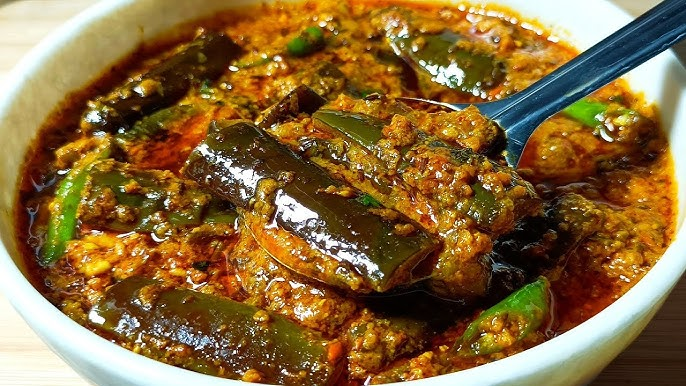

# Kayan Thee Hnut

*A Burmese aubergine stir-fry: cubed aubergine fried silky-soft, folded into a quick masala of fried onion, garlic, chilli, fish sauce and crushed peanuts.*

**Serves:** 4 as a side

**Prep Time:** 10 minutes (plus 20 minutes salting)

**Cook Time:** 25 minutes

## Overview
Cubed aubergine salts for 20 minutes to draw out water; squeezes dry. Onion fries dark-gold; garlic, ginger and turmeric briefly. The aubergine adds, fries for 8 minutes until silky-soft. Fish sauce, chilli powder, a touch of palm sugar; toasted crushed peanuts at the end.

## Ingredients

- 600 g aubergine (cut into 3 cm cubes)
- 1 ½ teaspoons salt (for sweating)
- 4 tablespoons vegetable oil
- 1 onion (large, chopped)
- 6 garlic cloves (sliced)
- 1 thumb fresh ginger (julienned)
- 1 teaspoon ground turmeric
- 1 teaspoon Kashmiri chilli powder
- 2 tablespoons fish sauce
- 1 tablespoon palm sugar (or brown sugar)
- 60 ml hot water
- 3 tablespoons unsalted peanuts (lightly toasted, roughly crushed)
- 2 tablespoons crispy fried shallots (to finish)
- 1 small handful fresh cilantro (chopped)

## Method

### Stage 1 - Salt the aubergine
1. Toss cubed aubergine with salt in a colander; set over the sink.
1. Leave 20 minutes - water will drip out.
1. Squeeze handfuls hard over the sink to remove more water. Pat dry.

### Stage 2 - Fry aubergine
1. Heat 3 tablespoons of oil in a wide pan over medium-high heat.
1. Add the aubergine in a single layer; fry 8-10 minutes, turning occasionally, until deeply soft and lightly golden. The aubergine should collapse and absorb the oil.
1. Tip into a bowl.

### Stage 3 - Fry aromatics
1. Wipe the pan. Heat the remaining oil.
1. Add onion; fry 8 minutes until deep gold.
1. Add garlic, ginger, turmeric and chilli powder; cook 1 minute.

### Stage 4 - Combine
1. Return the aubergine to the pan.
1. Add fish sauce, sugar and hot water; toss together.
1. Cook 3-4 minutes, stirring, until the sauce reduces and clings.

### Stage 5 - Finish
1. Off the heat, stir in half the crushed peanuts.
1. Tip into a serving bowl.
1. Top with the remaining peanuts, fried shallots and cilantro.

### Stage 6 - Serve
1. Eat with white rice and a side of curry.

## Notes
- **Salt the aubergine:** Without this, the cubes drink an alarming amount of oil and the texture is mushy. Twenty minutes is enough.
- **Toast the peanuts whole:** Then crush. Buying pre-roasted is fine; pre-crushed loses crunch.
- **Si byan style:** Burmese cooks often add more oil than seems right. Resist the urge to skimp.

## Storage
- Refrigerate 3 days; reheats well.
- Add peanuts and fresh garnish fresh - the topping goes soft in storage.
