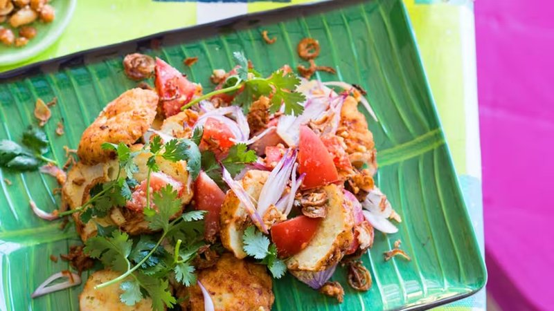

# Nga Hpe (Burmese Fish Cakes)

*Burma's teashop fish cakes: white fish minced with shallot, garlic, fish sauce, lime, chilli and curry leaves, shaped small and shallow-fried gold.*

**Serves:** 6 as a starter (makes 18 small cakes)

**Prep Time:** 25 minutes

**Cook Time:** 20 minutes

## Overview
The Burmese fish cakes that arrive at lahpet-thoke salad tables and street snack stalls alike, bright with lime and curry leaf. You cube skinless firm fish fillets and pulse them in a food processor with shallot, garlic, ginger, lime, fish sauce and a small egg into a sticky paste. A spoon of beaten cornflour binds it. Curry leaves, sliced spring onion, chopped cilantro and a fresh chilli go in for fragrance and bite. Patties form by hand (keep your hands slightly damp so the mixture doesn't stick), then shallow-fry in batches at 170°C for two or three minutes per side until they're deep gold and crisp at the edges. Eaten warm with a sour-sweet tamarind dipping sauce.

## Ingredients

- 500 g firm white fish fillets (cod, haddock, hake or pollock, skin and bones removed, cubed)
- 4 shallots (or 1 small red onion - finely chopped)
- 4 garlic cloves
- 1 thumb fresh ginger (grated)
- 1 lime (juice)
- 2 tablespoons fish sauce
- 1 egg (small)
- 3 tablespoons cornflour
- ½ teaspoon ground turmeric
- 1 small handful fresh curry leaves (chopped, or 1 small handful cilantro if curry leaves unavailable)
- 4 spring onions (sliced thin)
- 1 small handful fresh cilantro (chopped)
- 2 green chillies (finely chopped)
- ½ teaspoon ground black pepper
- ½ teaspoon salt
- 200 ml vegetable oil for shallow frying

### To serve
- Lime wedges
- Sweet chilli sauce (or sahawiq-style green sauce)
- Sliced cucumber

## Method

### Stage 1 - Process
1. Place the fish, shallot, garlic, ginger, lime juice, fish sauce and egg in a food processor.
1. Pulse to a coarse paste - some texture is welcome. Don't run it smooth.

### Stage 2 - Mix in herbs
1. Tip into a bowl. Stir in cornflour, turmeric, curry leaves, spring onions, cilantro, green chillies, pepper and salt.
1. Mix thoroughly with a spoon to a sticky, holding mixture.

### Stage 3 - Shape
1. Wet your hands. Form into 4 cm patties (about 2 tablespoons each); place on a tray.
1. Refrigerate 10 minutes to firm up.

### Stage 4 - Fry
1. Heat 1 cm of oil in a wide pan to 170°C.
1. Fry the patties in batches of 5-6, 2-3 minutes per side, until deep gold.
1. Drain on kitchen paper.

### Stage 5 - Serve
1. Stack on a plate. Serve hot with lime, sweet chilli or green sauce, and cucumber.

## Notes
- **Don't over-process:** A textured paste is right. Smooth fish paste gives a rubbery, bouncy cake; chunky paste gives a flakier, more interesting one.
- **Curry leaves:** The Burmese signature. If you can't find them, use a small handful more cilantro; the dish is fine but less distinctively Burmese.
- **Damp hands:** The mix is sticky; wet hands handle it cleanly.

## Storage
- Best fresh. Refrigerate 2 days; re-crisp at 200°C 6 minutes.
- Freeze uncooked patties 2 months; fry from frozen, adding 2 minutes per side.
