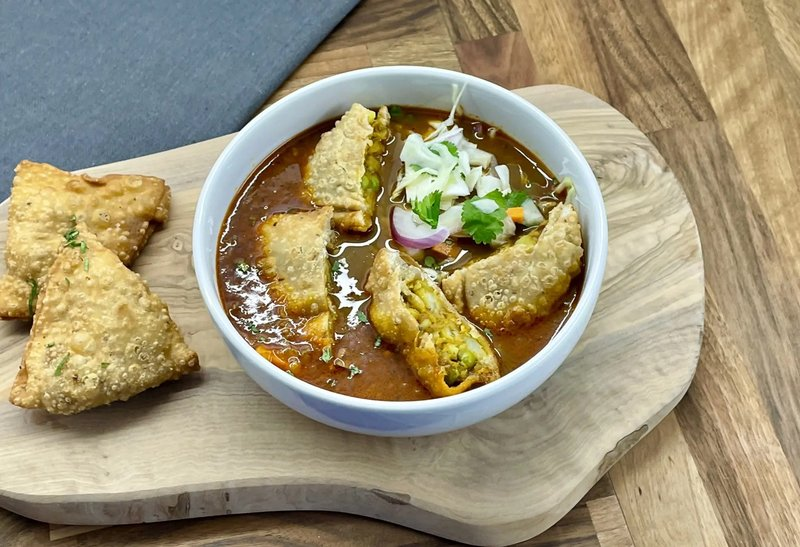

# Samusa Thoke

*The Burmese street salad: broken samusas tossed in a thick yellow split-pea broth with crispy bits, raw onion, lime and coriander. A meal in a bowl.*

**Serves:** 4

**Prep Time:** 30 minutes (plus 4 hours soaking lentils)

**Cook Time:** 1 hour 30 minutes

## Overview
A Yangon street-stall snack and the lunch office workers queue for at midday: broken samosas tossed in a hot yellow-pea soup at the bowl with raw onion, lime and crispy bits. You cook yellow split peas with turmeric and salt into a thick soup, season it with fried sliced onion, garlic, paprika and fish sauce. Small Burmese samosas (filo or thin pastry triangles with a lamb mince filling) are pre-fried or warmed. The construction in the bowl is fast: a heap of broken samosa, a ladle of hot pea soup, a tangle of raw red onion, a small mound of crispy gram-flour bits, chopped fresh coriander, a wedge of lime, chilli to taste. Toss at the table and eat while everything is hot.

## Ingredients

### Yellow pea soup
- 250 g yellow split peas (chana dal or yellow split peas, soaked 4 hours, drained)
- 1.4 litres water
- 1 ½ teaspoons ground turmeric
- 1 ½ teaspoons salt
- 4 tablespoons vegetable oil
- 1 onion (large, chopped)
- 6 garlic cloves (crushed)
- 1 tablespoon paprika
- 2 tablespoons fish sauce
- 1 dried red chilli (broken)

### Samusas
- 12 Burmese-style samusas (small, use the keema-samosa recipe, scaled down, OR buy frozen Indian / Burmese mini samosas)
- 500 ml vegetable oil for frying

### Crispy bits (sin-don)
- 80 g gram (chickpea) flour
- 60 ml water
- ½ teaspoon salt
- ¼ teaspoon ground turmeric

### Garnish
- 1 red onion (small, sliced thin)
- 1 small handful fresh coriander (chopped)
- 2 spring onions (sliced)
- 2 limes (cut into wedges)
- 1 teaspoon dried chilli flakes
- 1 tablespoon crispy fried shallots (optional)

## Method

### Stage 1 - Pea soup
1. Place soaked split peas in a pot with the water, turmeric and salt.
1. Bring to a boil; reduce to simmer; cover partially.
1. Cook 50 minutes-1 hour until peas are very soft and breaking down.
1. Whisk to break the peas into a thick soup. Keep warm.

### Stage 2 - Onion masala for the soup
1. In a wide pan, heat the oil; soften onion 8 minutes.
1. Add garlic and paprika; cook 1 minute.
1. Stir into the pea soup along with the fish sauce and dried chilli.
1. Simmer combined 10 minutes; adjust salt.

### Stage 3 - Crispy bits (sin-don)
1. Whisk gram flour with water, salt and turmeric to a thick smooth batter.
1. Heat 1 cm of oil in a small pan to 175°C.
1. Drizzle the batter through your fingers or a fork into the hot oil in random shapes.
1. Fry 2 minutes until deep gold and crisp. Lift onto paper.

### Stage 4 - Samusas
1. If using frozen, fry or oven-bake according to packet.
1. If made fresh, fry at 170°C 3-4 minutes until deep gold.

### Stage 5 - Assemble
1. In each wide bowl, break 3 samusas into bite-sized pieces.
1. Ladle hot pea soup over the top (about 200 ml per bowl).
1. Top with a small handful of crispy bits, sliced red onion, spring onion and fresh coriander.
1. Sprinkle with chilli flakes.
1. Place a lime wedge alongside.

### Stage 6 - Eat
1. Toss everything at the table with a fork; squeeze in lime; eat hot.

## Notes
- **Soup texture:** The pea soup should pour but be thick enough to coat a spoon, like a loose dal.
- **Don't pre-mix:** Bring the components to the table separately so the textures stay distinct, crispy bits go soggy if mixed in advance.
- **Salad or soup?** Neither, it's a Burmese category of its own. Some bowls are wet and soupy; others are drier and more salad-like. Adjust the soup to noodle ratio to taste.

## Storage
- Pea soup keeps 4 days; reheats well.
- Crispy bits keep 1 week in a sealed jar.
- Samusas keep 2 days refrigerated; re-crisp at 200°C 6 minutes.
- Assemble fresh.
