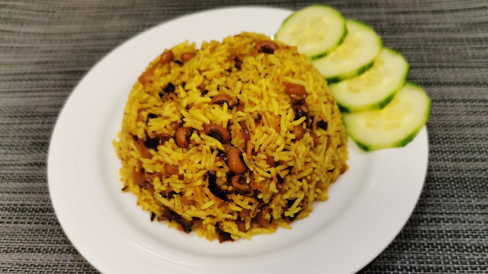

# Shwe Htamin

*Burma's golden rice: turmeric-tinted rice lightly fried with sliced onion, then cooked absorption-style with salt. The everyday side for stronger curries.*

**Serves:** 4

**Prep Time:** 5 minutes

**Cook Time:** 25 minutes

## Overview
The Burmese golden rice, the everyday turmeric-stained rice that turns up alongside curries and stews on the home table. You toast long-grain rice briefly in oil with a chopped onion, turmeric and a small handful of cashews (optional but traditional). Water and salt go in, the pot covers tightly, and the rice cooks undisturbed for eighteen minutes. A five-minute rest off the heat finishes the steam. The grains come out the colour of pale gold, perfumed faintly with onion and turmeric, ready to soak up whatever curry sauce hits the plate.

## Ingredients

- 400 g long-grain rice (jasmine or basmati - rinsed thoroughly)
- 3 tablespoons vegetable oil
- 1 onion (small, very finely chopped)
- 1 ½ teaspoons ground turmeric
- 1 teaspoon salt
- 700 ml hot water
- 2 tablespoons cashew halves (lightly toasted, optional)
- 2 tablespoons crispy fried shallots (to finish)

## Method

### Stage 1 - Rinse
1. Rinse the rice in 3 changes of cold water; drain well.

### Stage 2 - Toast
1. Heat the oil in a heavy pot over medium heat.
1. Soften the onion 5 minutes until pale gold.
1. Stir in the turmeric; sizzle 10 seconds.
1. Add the rice; toast 1 minute, stirring, until each grain is coated yellow.

### Stage 3 - Cook
1. Pour in the hot water; add salt; stir once.
1. Bring to a boil; reduce heat to the lowest setting.
1. Cover tightly; cook 18 minutes undisturbed.

### Stage 4 - Rest
1. Remove from heat (lid on); rest 5 minutes.
1. Fluff with a fork.

### Stage 5 - Serve
1. Top with toasted cashews and crispy fried shallots.
1. Eat alongside any Burmese curry.

## Notes
- **Turmeric staining:** Mind your hands and your wooden spoon - turmeric stains permanently.
- **Don't lift the lid:** Steam does the cooking. Lifting it bleeds it away.
- **Cashews:** A Burmese-Indian crossover touch; not in every household but lovely with stronger curries.

## Storage
- Refrigerate 3 days; reheat covered with a splash of water.
- Doesn't freeze well.
