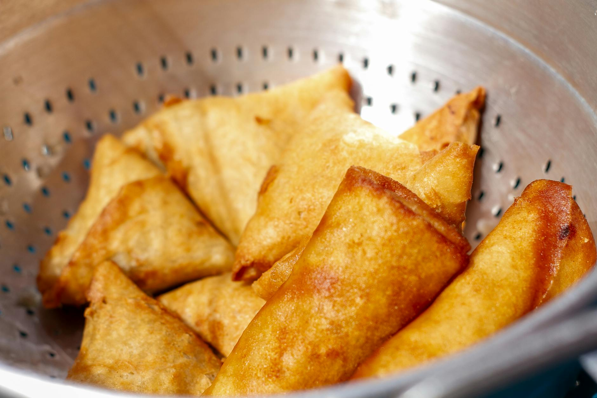

# Burmese Samosa

*Burma's lighter samosa: paper-thin pastry around a gently spiced potato-and-pea filling. Eaten at teashops with raw onion and a green chilli on the side.*

**Serves:** 4 (makes 12 samosas)

**Prep Time:** 40 minutes

**Cook Time:** 25 minutes

## Overview
The Burmese take on the South Asian samosa, with a thinner, crisper pastry and a milder filling than its Indian cousin. You make a hot-water dough that rolls out very thin so the fried shell ends up glassy and crisp rather than bready. The filling is mild by Indian standards: turmeric, ginger, fried onion and a whisper of cumin folded into mashed potato and peas, finished with crushed peanuts for the nuttiness that marks the Burmese version. The triangles fry at moderate heat until amber and crackling, the pastry blistering as it goes. Eaten hot dipped in tamarind sauce, or torn into chunks for a samusa-thoke salad later.

## Ingredients

### Pastry
- 250 g plain flour
- ½ teaspoon salt
- 2 tablespoons vegetable oil
- 130 ml hot water (just off the boil)
- 1 tablespoon plain flour mixed with 1 tablespoon water (for sealing)

### Filling
- 400 g floury potatoes (Maris Piper or King Edward)
- 2 tablespoons vegetable oil
- 1 onion (small, finely diced)
- 2 garlic cloves (grated)
- 2 cm ginger (grated)
- 1 long green chilli (finely chopped)
- ½ teaspoon ground turmeric
- ½ teaspoon ground cumin
- ¼ teaspoon ground white pepper
- 80 g frozen peas
- 1 teaspoon salt (or to taste)
- 2 tablespoons roasted peanuts (roughly crushed)
- 2 tablespoons coriander leaves (chopped)
- ½ lime (juice)

### For frying
- 750 ml neutral oil

### To serve
- 1 red onion (small, very thinly sliced)
- 2 long green chillies (whole)
- Lime wedges

## Method

### Stage 1 - Dough
1. Combine the flour and salt in a bowl. Stir in the oil with a fork until the flour looks like damp sand.
2. Pour in the hot water in a slow stream, stirring; bring together into a shaggy mass.
3. Tip onto a clean surface; knead 5 minutes until smooth and pliable. The dough should be firm but not stiff.
4. Wrap in clingfilm; rest 30 minutes at room temperature.

### Stage 2 - Filling
1. Peel and chop the potatoes into 1 cm dice. Boil in salted water 10-12 minutes until just tender; drain and let steam dry.
2. Heat the oil in a frying pan over medium heat. Add the onion; cook 5 minutes until soft.
3. Stir in the garlic, ginger and chilli; cook 1 minute.
4. Add the turmeric, cumin and white pepper; toast 30 seconds.
5. Add the potatoes, peas and salt. Cook 3-4 minutes, breaking the potato slightly with the back of a spoon. You want a chunky, dryish mix, not a puree.
6. Off the heat, stir in the peanuts, coriander and lime juice. Spread out on a plate to cool to room temperature.

### Stage 3 - Shape
1. Divide the dough into 6 equal balls; cover with a damp cloth.
2. Roll one ball into a thin oval about 18 cm long, 12 cm wide and 1 mm thick. Burmese samosa pastry is thinner than Indian.
3. Cut the oval in half across the short axis to give two semicircles.
4. Take one semicircle. Brush the straight edge with the flour paste. Fold it into a cone, overlapping the straight edge by 1 cm. Press to seal.
5. Hold the cone open; spoon in 1 ½ tablespoons of filling. Don't overfill.
6. Brush the top edge with flour paste. Press the opening shut, folding one corner over the other to make a tidy triangle. Crimp the seal with a fork.
7. Repeat with the rest. Keep finished samosas under a dry cloth.

### Stage 4 - Fry
1. Heat the oil in a wok or deep pan to 160°C. A scrap of dough should rise slowly and bubble gently.
2. Fry 4 samosas at a time, 6-7 minutes, turning once, until evenly amber and crisp. Slow frying gives the thin shell time to cook through.
3. Lift onto kitchen paper.

### Stage 5 - Serve
1. Pile onto a plate; scatter the sliced red onion alongside, lay the whole chillies and lime wedges on the side.
2. Eat hot, biting a corner off and squeezing in a little lime.

## Notes
- **Hot-water dough:** The boiling water partly gelatinises the starch, which is why the fried pastry stays crisp and translucent rather than bready. Don't substitute cold water.
- **Roll thin, fry slow:** The defining difference from Indian samosa is the wafer pastry. Too thick and you lose the character; too hot an oil and the outside colours before the layers cook.
- **Filling must be cold:** Hot filling steams inside the pastry and makes it soggy. Let it cool fully.
- **Vegetarian by default:** Burmese samosas are usually meat-free at teashops. A minced-chicken version exists but is less common.

## Variations
**Split pea filling:** Replace the potato with 250 g cooked yellow split peas, lightly mashed and seasoned the same way. Drier, nuttier, traditional in upper Burma.
**Samosa soup (samusa thoke):** A famous Burmese street dish where leftover or fresh samosas are broken into a chickpea-flour broth with cabbage, onion and tamarind. Worth seeking out.

## Serving
Serve with: a saucer of sliced raw onion and whole green chillies (the classic teashop accompaniment), or a small bowl of tamarind chutney.
Garnish with: lime wedges.

## Storage
- Best eaten within 30 minutes of frying.
- Re-crisp in a 190°C oven for 6-7 minutes.
- Uncooked, shaped samosas freeze well for 2 months; fry from frozen, adding 2 minutes to the cook time.
