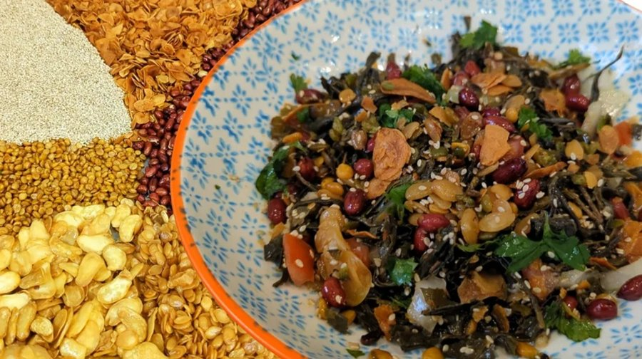

# Burmese Tea-Leaf Snack Mix

*Burma's teashop snack tray: fermented tea leaves, fried garlic, peanuts, split peas, sesame and dried shrimp, eaten a pinch at a time.*

**Serves:** 6 as a snack

**Prep Time:** 10 minutes

**Cook Time:** 15 minutes

## Overview
The older, more ceremonial form of lahpet, the version that predates the salad. Unlike lahpet thoke (the salad), there's no cabbage, no tomato, no fresh dressing, the fermented tea leaves stay pungent and concentrated, and the fried elements supply texture and salt. You keep all the components separate on a divided plate until they reach the table, so the crispy bits don't soften, and each guest builds their own bite from the spread. Eat as an afternoon teashop snack with a small cup of green tea, or traditionally at the close of formal meals as a sign of welcome and reconciliation, a Burmese custom that dates back centuries and still turns up at weddings.

## Ingredients

### Tea leaf base
- 120 g fermented tea leaves (lahpet; sold vacuum-packed at Burmese / SE Asian grocers; brands such as Yoma or Pyi Gyi Khin are reliable)
- 1 tablespoon sesame oil
- 1 tablespoon fish sauce (or to taste)
- 1 tablespoon lime juice
- 1 garlic clove (small, grated)

### Fried components
- 4 tablespoons vegetable oil
- 6 garlic cloves (thinly sliced)
- 80 g raw peanuts (skinned)
- 80 g yellow split peas (soaked 4 hours, drained, patted dry)
- 30 g dried shrimp (small; rinsed and patted dry)
- 2 tablespoons white sesame seeds

### To finish
- 2 long green chillies (finely sliced; optional)
- Wedges of lime
- A pinch of flaky salt

## Method

### Stage 1 - Prepare the tea leaves
1. Open the pack of fermented tea leaves. Smell them. If they taste very sharp or salty straight from the pack, rinse briefly in cool water and squeeze out by the handful. Most quality packs are ready to use.
2. Chop the leaves roughly; they should look like coarse damp parsley.
3. In a small bowl, mix the leaves with the sesame oil, fish sauce, lime juice and grated garlic. Set aside while you fry.

### Stage 2 - Fry the garlic
1. Heat the vegetable oil in a small frying pan over medium heat.
2. Add the sliced garlic; fry 1-2 minutes, stirring gently, until pale gold. Lift onto kitchen paper with a slotted spoon. The garlic keeps colouring on the paper; pull it just before it looks done.

### Stage 3 - Fry the peanuts
1. In the same oil, add the peanuts; fry 2-3 minutes until lightly golden and the skins (if any) are crisp. Lift onto kitchen paper.

### Stage 4 - Fry the split peas
1. Add the drained, dried split peas to the oil. Stand back: they spit at first.
2. Fry 4-6 minutes, stirring, until crisp and deep gold all through. Bite one to check: it should crunch, not chew.
3. Lift onto kitchen paper. Salt lightly while warm.

### Stage 5 - Toast shrimp and sesame
1. Reduce the heat to low. Add the dried shrimp; fry 1 minute until aromatic and slightly puffed. Lift out.
2. In the last of the warm oil, toast the sesame seeds 30 seconds until pale gold. Tip onto kitchen paper.

### Stage 6 - Plate
1. On a small wooden board or lacquered tray, place the dressed tea leaves in a heap in the centre.
2. Around them, arrange separate small piles of: fried garlic, fried peanuts, fried split peas, fried shrimp, toasted sesame, sliced chilli.
3. Set the lime wedges and flaky salt to one side.

### Stage 7 - Eat
1. Pinch a small amount of tea leaves between thumb and finger, then drag through one or two of the fried piles to pick them up. Eat in one bite. Repeat with different combinations.
2. A sip of strong tea or a cold lager between bites resets the palate.

## Notes
- **Fermented tea leaves are the heart of this:** No substitute really works. Vacuum-packed lahpet from a Burmese, Thai or pan-Asian grocer keeps in the fridge for months. Online specialists ship to the UK; the brands Yoma, Shan and Pyi Gyi Khin are widely available.
- **Buy the components or fry your own:** Pre-fried split peas and peanut snack packs (often labelled "pea cracker" or "Burmese snack mix") are sold at the same shops and save 15 minutes. Frying your own gives a fresher flavour.
- **Dried shrimp are optional but classic:** A vegetarian version drops them and adds an extra tablespoon of fried garlic. The flavour shifts but stays balanced.
- **Mind the caffeine:** Fermented tea leaves retain caffeine. A small bowl is a snack; a large one will keep you awake.

## Variations
**Sweet-soy version:** Some upper-Burma cooks finish the tea leaves with a teaspoon of brown sugar to balance the bitterness. Worth trying once.
**Festive plate:** For Burmese New Year (Thingyan) or a guest welcome, the same mix is served on a lacquered offering tray (lahpet ohk) with the fried components fanned out in 6 or 7 separate compartments.

## Serving
Serve with: hot black tea, milk tea, or beer. A small bowl alongside drinks before dinner is the classic teashop pairing.
Garnish with: extra lime wedges and a small dish of green chillies.

## Storage
- The fried components keep separately in airtight tins at room temperature for 5-7 days. Do not refrigerate; they soften.
- Dressed tea leaves keep 4-5 days covered in the fridge.
- Assemble only when serving so the crunchy elements stay crunchy.
