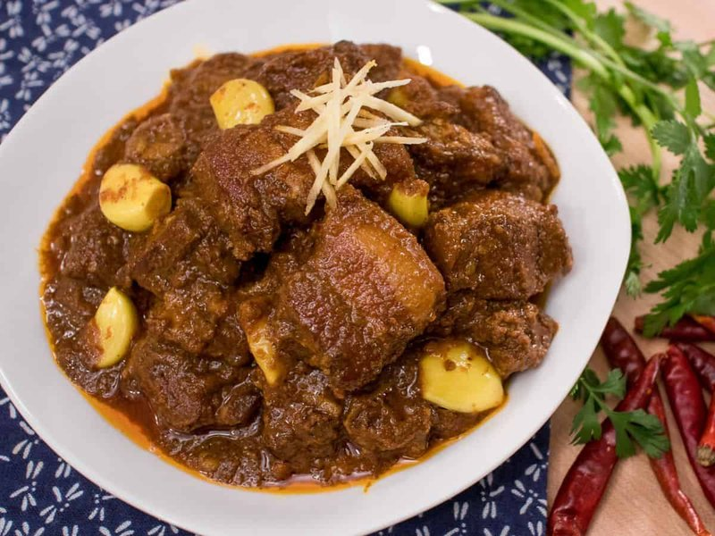

# Wet Tha Hin Lay

*Burma's pork curry: cubed pork shoulder slow-cooked in a deep aromatic gravy of turmeric, paprika, fried onion, garlic, ginger and fish sauce.*

**Serves:** 4

**Prep Time:** 20 minutes (plus 30 minutes marinating)

**Cook Time:** 1 hour 30 minutes

## Overview
Pork marinates briefly in turmeric, salt and a splash of fish sauce. Onions cook hard in oil until deep golden brown - this is the colour and depth of the curry. The pork browns in the same oil; garlic, ginger, paprika and chilli powder go in; tomato softens; water covers the meat and it simmers covered for an hour until tender, then uncovered to "return the oil" to the surface. Plate.

## Ingredients

- 800 g pork shoulder (cut into 4 cm cubes)
- 2 teaspoons ground turmeric (split)
- 1 ½ teaspoons salt (split)
- 2 tablespoons fish sauce
- 6 tablespoons vegetable oil
- 3 large onions (chopped)
- 6 garlic cloves (crushed)
- 1 thumb fresh ginger (grated)
- 2 tablespoons paprika
- 1 teaspoon Kashmiri chilli powder
- 1 dried bird's-eye chilli (broken) or 1 fresh chilli
- 2 large tomatoes (chopped) or 1 small tin chopped tomatoes
- 1 teaspoon dark soy sauce
- 500 ml hot water
- 1 stick lemongrass (bruised, optional)
- 1 small bunch fresh coriander (to finish)

## Method

### Stage 1 - Marinate
1. Toss the pork with 1 teaspoon turmeric, 1 teaspoon salt and the fish sauce.
1. Rest 30 minutes.

### Stage 2 - Onion paste
1. Heat 4 tablespoons of the oil in a heavy pot over medium-high heat.
1. Add the onion; cook 15 minutes, stirring often, until deep brown but not burnt. This is the curry's base; rushing makes a pale, weak gravy.

### Stage 3 - Pork and spices
1. Push the onion to the side. Add the remaining oil to the cleared part of the pot.
1. Brown the marinated pork in batches, 4-5 minutes per side.
1. Return all pork to the pot; mix with the onions.
1. Add garlic, ginger, paprika, remaining turmeric and chilli powder; toss together 1 minute.

### Stage 4 - Tomato
1. Stir in the chopped tomato; cook 5 minutes until soft.
1. Add the dark soy and dried chilli (or fresh).

### Stage 5 - Slow cook
1. Pour in the hot water; tuck in the lemongrass.
1. Bring to a simmer; cover; cook on low 1 hour.
1. Uncover; cook another 20 minutes - the sauce reduces and a slick of oil rises to the top (the "si byan" signal that the curry is ready).

### Stage 6 - Finish
1. Taste; adjust salt and fish sauce.
1. Scatter coriander.

### Stage 7 - Serve
1. Eat over white rice. A small dish of pickled mango or fresh sliced cucumber alongside.

## Notes
- **Brown the onions hard:** Burmese curry colour and depth come from this step. Most curries fail because the onions are pale. Push to dark brown but stop short of black.
- **"Si byan" - the oil returns:** When the curry is ready, the oil separates and floats on top. This is the Burmese sign that the curry has cooked through. Don't skim it - it's flavour.
- **Pork cuts:** Shoulder is right. Belly is too fatty; loin is too lean. Bone-in shoulder gives extra body.

## Storage
- Refrigerate 4 days; the curry improves overnight.
- Freezes 3 months.
