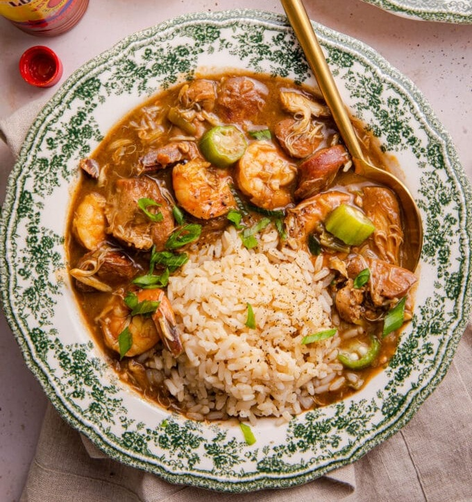

# Authentic Cajun Gumbo

*Louisiana's everything gumbo: chicken, andouille, crab and shrimp in a deep-chocolate roux base. The 30-minute stirred roux is what makes it Cajun.*

**Serves:** 8-10

**Prep Time:** 15 minutes

**Cook Time:** 1 hour 30 minutes

## Overview
The "everything" Louisiana gumbo: chicken thighs, andouille, lump crab and shrimp in one pot. The dish where technique matters more than the recipe. The roux is the defining step and the line between Cajun gumbo and every other stew on earth: a full cup of oil and a full cup of flour cooked at medium-low for around 30 minutes, stirred without stopping, till the colour goes from blond to peanut butter to milk chocolate to dark chocolate. The long-cooked roux gives a deeply nutty, slightly bitter, profoundly savoury base no shortcut can replicate. Around the roux: the Cajun "holy trinity" of onion, bell pepper and celery; filé powder (ground sassafras leaves) off heat; okra as a third thickener; four proteins each adding a layer. 30 minutes of unbroken stirring is the gateway; walk away or rush it and the roux burns. Origins run through French Louisiana settlers, the Choctaw (filé), West Africans (okra) and Spanish colonial traditions from the 1700s onwards.

## Ingredients

- 300 ml vegetable oil (divided: ¼ cup + 1 cup)
- 450 g boneless skinless chicken thighs (cubed)
- 3 teaspoons Creole Cajun seasoning (divided)
- 340 g andouille sausage (sliced into rounds)
- 1 onion (large, chopped)
- 2 green bell peppers (large, chopped)
- 3 celery ribs (chopped)
- 8 garlic cloves (minced)
- 1 cup plain flour
- 1 teaspoon ground white pepper
- 4 bay leaves
- 1.9 litres (64 oz) low-sodium chicken broth
- 450 g lump crab meat (picked through)
- 2 cups okra (fresh or frozen, sliced)
- 450 g raw large shrimp (peeled, deveined)
- 3 teaspoons gumbo filé powder
- Louisiana hot sauce, to taste
- Cooked white rice, scallions (or parsley), to serve

## Method

### Stage 1 - Brown the meats
1. Heat ¼ cup of the oil in a heavy pot over medium heat.
1. Sauté the chicken cubes 4-5 minutes per side until golden. Season with 1 teaspoon Cajun seasoning. Transfer to a plate.
1. Brown the andouille in the same pot 2-3 minutes per side. Set aside.

### Stage 2 - Holy trinity
1. In the same pot, cook the onion, bell pepper and celery 4-5 minutes until golden.
1. Add the minced garlic; cook 1 minute.
1. Transfer to a clean plate.
1. Wipe the pot nearly clean.

### Stage 3 - The roux
1. Pour the remaining 1 cup oil into the pot over medium-high heat.
1. Gradually sprinkle in the flour while stirring constantly with a wooden spoon.
1. Reduce heat to medium-low.
1. Stir continuously for approximately 30 minutes until the roux is the colour of dark chocolate. Don't stop stirring; don't walk away.

### Stage 4 - Build the gumbo
1. Return the chicken, sausage and vegetables to the pot.
1. Add the remaining 2 teaspoons Cajun seasoning, white pepper and bay leaves.
1. Slowly pour in the chicken broth while stirring constantly.
1. Bring to a simmer; cover; cook 20 minutes.

### Stage 5 - Seafood
1. Stir in the crab meat; simmer covered 15-20 minutes.
1. Add the okra and shrimp; reduce heat to low.
1. Cook 7-10 minutes until the shrimp turn pink and the okra is tender.

### Stage 6 - Finish
1. Sprinkle the filé powder and add hot sauce to taste.
1. Cook 5 minutes more.
1. Remove from heat; let sit briefly.
1. Taste; adjust seasoning.

### Stage 7 - Serve
1. Ladle into bowls; top with a small mound of cooked rice.
1. Garnish with scallions or parsley.

## Notes
- **The roux is the dish:** "chocolate" colour is the spec. Lighter rouxs give a different, paler gumbo. Patience and constant stirring; if you see black flecks, start over.
- **Filé is added off heat (mostly):** filé powder (ground sassafras leaves) is the traditional thickener. Adding it too early and at a hard boil makes the gumbo stringy.
- **Okra alternative thickener:** okra and filé both thicken; using both is traditional in some Cajun households, doubled up.

## Storage
- Keeps 3-4 days refrigerated; deepens overnight. Reheat gently.
- Freezes 3-4 months. Thaw overnight; reheat low and slow.
