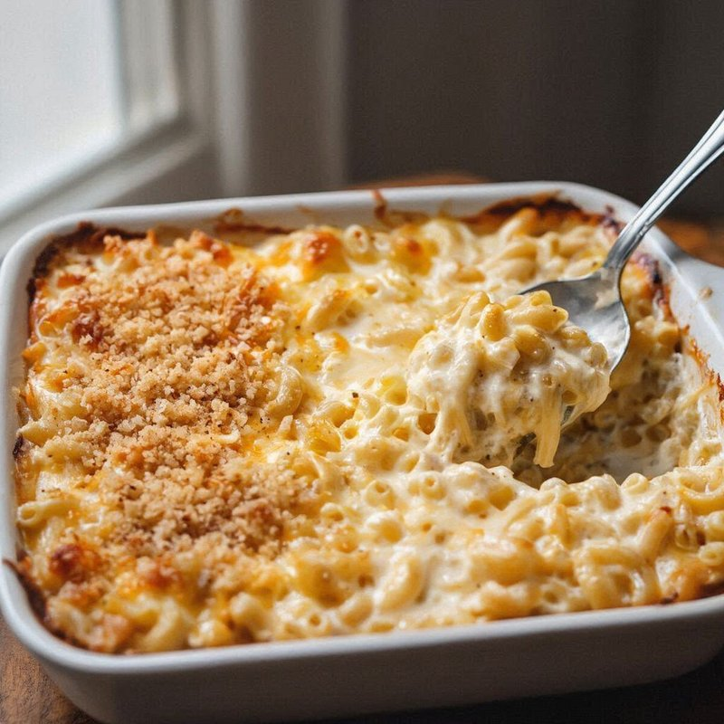

# Big Mike’s Mac ’n’ Cheese

*A Cajun take on mac and cheese: macaroni baked in a cheddar-and-cream sauce spiked with Cajun seasoning.*

**Serves:** 6 to 8

**Prep Time:** 10 minutes

**Cook Time:** 20 minutes

## Overview
The Cajun take on mac and cheese, with the Southern heat dial turned up to where you'd expect at a Louisiana cookout. You build a creamy béchamel base, fold in sharp white cheddar with a generous splash of hot sauce and a hit of Cajun seasoning, then toss the lot through hot pasta until every shape is coated. The whole thing goes into a baking dish, gets a topping of more grated cheese, and slides under a hot grill until the top is bubbling and freckled deep gold. Eaten as a side at a barbecue or as the centre of a weeknight plate with a green salad and a beer. Comfort food with backbone.

## Ingredients
### Pasta
- 1 lb (450 g) elbow macaroni, cooked and drained

### Dairy and binders
- 60 g (¼ cup) butter, melted
- 1 egg
- 240 ml  evaporated milk
- 120 ml (½ cup) whole milk
- 100 g (1 cup) white cheddar (sharp), plus extra for topping

### Seasonings
- 2 tsp  dry mustard
- 1 tbsp  hot sauce
- salt
- pepper

## Method

### Stage 1 - Preheat and prepare
1. Preheat oven to 175°C.
1. Grease a 9 × 13-inch (23 × 33 cm) casserole dish.

### Stage 2 - Mix ingredients
1. In large bowl, combine macaroni, butter, egg, evaporated milk, dry mustard, hot sauce, milk, cheese, salt, and pepper.
1. Mix well.

### Stage 3 - Bake
1. Pour into casserole dish; bake uncovered 20 mins.

### Stage 4 - Grill topping
1. Add extra cheese; grill a few mins for golden brown crust.

## Notes
- Use sharp Cheddar for best flavor.
- Adjust hot sauce for desired spice level.
- Can add cooked bacon or sausage for protein.

## Serving
- Serve hot as side dish or main with greens.
- Garnish with extra hot sauce or herbs.

## Storage
- Refrigerate leftovers 3-4 days in airtight container.
- Reheat in oven at 175°C until bubbly.
- Freezes well; thaw and reheat covered to avoid drying.