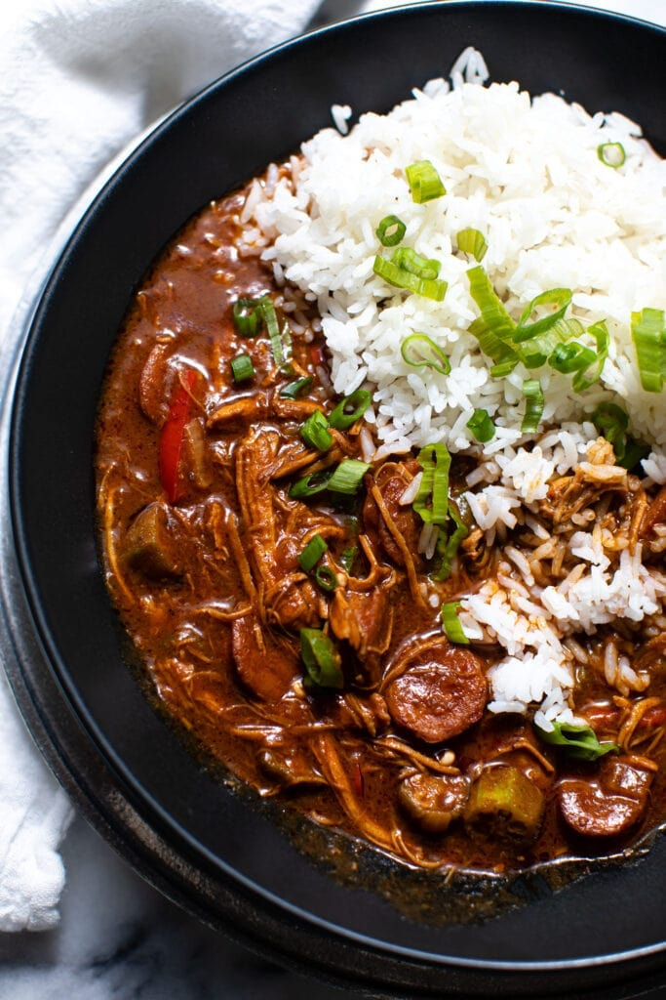

# Chicken and Sausage Gumbo

*The everyday Louisiana version of gumbo - no seafood, just chicken and andouille, simmered three hours in a deep mahogany roux with the holy trinity and a touch of tomato puree. Bacon fat (or duck fat) is the traditional roux medium; butter or oil work. Eats over white rice with hot sauce.*

**Serves:** 10-12

**Prep Time:** 20 minutes

**Cook Time:** 3 hours

## Overview
The everyday Cajun household gumbo, without the seafood and ceremony of its bigger cousin: just chicken and andouille in a deep mahogany roux, simmered three hours until everything has melted into the broth. Where the full Cajun gumbo demands a 30-minute dark-chocolate roux, this one wants 15-20 minutes at medium - the roux still goes dark, just not as obsessively so, and the duck fat or bacon fat (the traditional choice) gives it a richer base than vegetable oil would. Tomato paste and a splash of tomato puree push this slightly Creole (Cajun purists would call this version "off-the-bayou Creole"; the Cajun-vs-Creole distinction is real but blurry, and most Louisiana families have one foot in each tradition). Filé powder is the canonical thickener, added in two stages - half during the simmer to dissolve and thicken, half at the end for the characteristic sassafras flavour. Smell is dark roux and smoked sausage, with thyme and bay drifting through. Genuinely a once-a-week or once-a-Sunday family meal across south Louisiana, where the rotisserie-chicken shortcut is now the practical way home cooks build this without spending a full day at the stove. Eats over white rice with hot sauce and the gumbo deepens spectacularly overnight.

## Ingredients

- 180 ml duck fat or bacon fat (or butter / oil)
- 1 cup plain flour
- ¼ cup tomato paste
- 1 medium yellow onion (chopped)
- ½ cup red bell pepper (chopped)
- ½ cup green bell pepper (chopped)
- 3 garlic cloves (finely chopped)
- 1.4 litres chicken stock
- 240 ml tomato puree
- 3 cups cooked shredded chicken (rotisserie is convenient)
- 340 g andouille sausage (sliced into 1 cm rounds)
- 4 teaspoons gumbo filé powder (divided)
- 1 teaspoon dried oregano
- ¼ teaspoon sweet paprika
- 1 teaspoon salt
- 3 bay leaves
- 4 sprigs fresh thyme
- ¾ cup diced celery
- Hot sauce, to taste
- 2 cups okra (cut into 1 cm rounds)
- Steamed white rice, to serve

## Method

### Stage 1 - The roux
1. Heat the fat in a heavy pot over medium heat.
1. Gradually whisk in the flour.
1. Stir continuously 15-20 minutes until the roux is a rich chocolate brown.

### Stage 2 - Trinity
1. Stir the tomato paste into the roux until dissolved, 1-2 minutes.
1. Add the onion, peppers and garlic.
1. Cook 2-3 minutes, stirring.

### Stage 3 - Base
1. Pour in the chicken stock and tomato puree.
1. Increase heat; bring to a simmer.
1. Cook 3-5 minutes until thickened.

### Stage 4 - The long simmer
1. Add the cooked shredded chicken, sliced andouille, 2 teaspoons of the filé, oregano, paprika, salt, bay leaves, thyme sprigs and diced celery.
1. Reduce heat to low.
1. Simmer 2 hours, stirring occasionally.

### Stage 5 - Finish
1. Add hot sauce to taste.
1. Stir in the okra and the remaining 2 teaspoons of filé.
1. Cook 10 minutes more.
1. Remove the bay leaves and thyme sprigs.
1. Taste; adjust seasoning.

### Stage 6 - Serve
1. Ladle over steamed white rice in deep bowls.
1. More hot sauce at the table.

## Notes
- **Duck fat or bacon fat for the roux:** the rendered animal fat gives a richer base than vegetable oil. Save bacon drippings for this dish.
- **Filé in two stages:** half goes in the long simmer, half at the end. The first half dissolves and thickens; the second half adds the characteristic sassafras flavour.
- **Rotisserie chicken hack:** save the carcass, use it for the stock you make for next week's gumbo.

## Storage
- Keeps 4 days refrigerated; flavours intensify overnight.
- Freezes well 3-4 months. Reheat low and slow.
