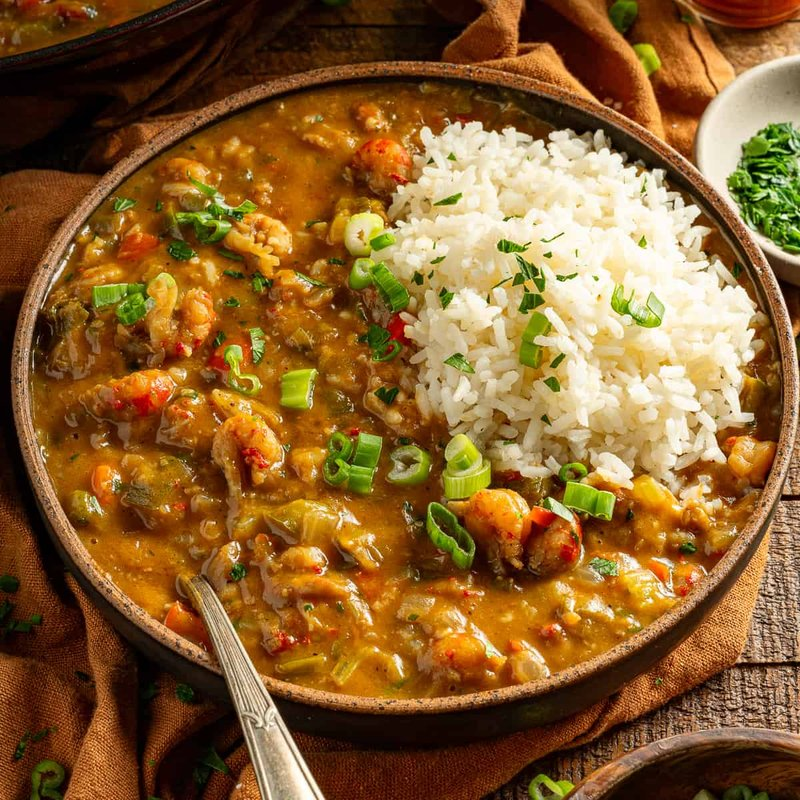

# Crawfish Étouffée

*Cajun shellfish smothered in a blond-roux gravy with the trinity (onion, celery, pepper), garlic, Cajun spice and a long simmer. "Étouffée" means "smothered"; the dish is exactly that - crawfish (or shrimp, prawns) buried in a thick, deeply-flavoured sauce, served over white rice. Quintessential Cajun home cooking.*

**Serves:** 4

**Prep Time:** 15 minutes

**Cook Time:** 45 minutes

## Overview
A Louisiana classic, the dish whose name means "smothered" in French, and that's exactly what's happening at the table: tender crawfish tails smothered in a rich gravy spooned over white rice. You start with a blond roux (butter and flour cooked just to the colour of peanut butter, lighter than gumbo's nearly-burnt mahogany), then soften the Cajun trinity of onion, celery and bell pepper in it until everything goes glossy. Tomato paste, Cajun spice and stock loosen the mixture, and the lot simmers down to a thick velvety gravy. Crawfish tails (or prawns if you can't find them) go in near the end and cook just briefly so they stay tender rather than turning rubbery. Spring onion and parsley scatter over at the finish. Ladled over white rice in a bowl, with crusty bread and a glass of cold beer alongside.

## Ingredients

### Blond roux and trinity
- 80 g unsalted butter
- 60 g plain flour
- 1 onion (large, chopped)
- 3 celery sticks (chopped)
- 1 green pepper (chopped)
- 6 garlic cloves (crushed)

### Sauce
- 2 tablespoons tomato paste
- 1 tablespoon Cajun seasoning (or 1 tsp paprika + ½ tsp each cayenne, garlic powder, oregano, thyme, salt, pepper)
- 700 ml seafood, chicken (or vegetable stock)
- 2 bay leaves
- 1 tablespoon Worcestershire sauce
- 1 tablespoon hot sauce (Crystal or Tabasco)
- ½ teaspoon salt
- ½ teaspoon black pepper

### Shellfish
- 500 g crawfish tail meat (cooked, peeled; or 500 g raw shelled prawns)

### To finish
- ½ lemon (juice)
- 4 spring onions (sliced)
- A small bunch of flat-leaf parsley (chopped)

### To serve
- Cooked white rice
- Hot sauce

## Method

### Stage 1 - Roux
1. Melt the butter in a heavy pot over medium heat.
1. Whisk in the flour; cook 8-10 minutes, stirring constantly, until the mixture is the colour of peanut butter.

### Stage 2 - Trinity
1. Add the onion, celery and green pepper to the roux; stir to coat.
1. Cook 8-10 minutes until softened (the heat will drop while the vegetables release water).
1. Add the garlic; cook 1 minute.

### Stage 3 - Sauce
1. Stir in the tomato paste and Cajun seasoning; cook 2 minutes.
1. Pour in the stock gradually, stirring to dissolve the roux.
1. Add the bay, Worcestershire, hot sauce, salt and pepper.
1. Bring to a simmer; reduce to medium-low.
1. Cook 25-30 minutes, stirring occasionally, until thickened to a gravy that coats the spoon.

### Stage 4 - Shellfish
1. Add the crawfish (or prawns); stir gently.
1. For pre-cooked crawfish: cook 3-4 minutes until just heated through.
1. For raw prawns: cook 4-5 minutes until pink and just-set.

### Stage 5 - Finish
1. Discard the bay leaves.
1. Stir in the lemon juice, half the spring onions and half the parsley.
1. Taste; adjust salt and hot sauce.

### Stage 6 - Serve
1. Spoon over white rice; top with the remaining spring onions and parsley.
1. Pass extra hot sauce.

## Notes
- **Blond roux for étouffée:** Lighter than gumbo's dark roux - about the colour of peanut butter, which is lighter than the rich brown roux gumbo wants. The lighter roux thickens better and lets the shellfish flavour shine.
- **Don't overcook the crawfish:** They go rubbery. Pre-cooked crawfish only need to heat through; raw prawns need 4-5 minutes max.
- **Cajun seasoning is variable:** Some store-bought blends are very salty; reduce added salt if using.

## Storage
- Sauce keeps 4 days refrigerated; better day 2.
- Add fresh shellfish to reheated sauce; don't reheat shellfish multiple times.
