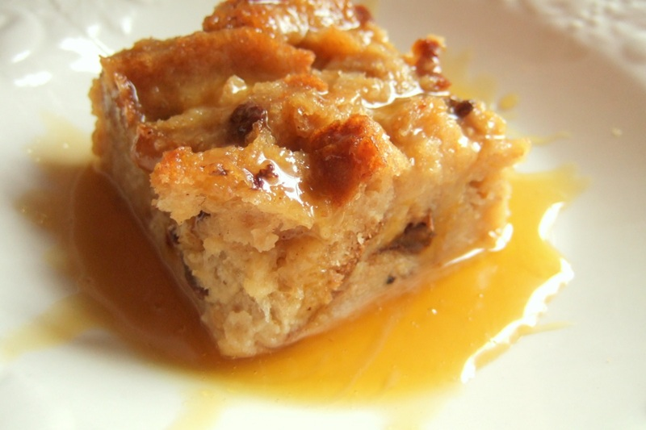

# Bread Pudding with Bourbon Sauce

*A New Orleans classic: thick slices of stale French bread soaked in an eggy cinnamon custard with raisins and pecans, doused in hot bourbon-butter.*

**Serves:** 8

**Prep Time:** 20 minutes (plus 30 minutes soaking)

**Cook Time:** 50 minutes

## Overview
The New Orleans bread pudding, the warm dessert that lands on the table at the end of every Cajun Sunday lunch with a slug of bourbon sauce poured over it. You tear a French baguette or stale brioche into chunks and soak them in a custard of whole eggs, double cream, milk, brown sugar, vanilla, cinnamon and nutmeg until they're saturated. Raisins (often rum-soaked the night before) and toasted pecans fold in for sweetness and crunch. The pudding bakes in a buttered dish at moderate heat until the top has crisped to deep bronze and the middle is just set but still soft and quivering. While it bakes you build the bourbon sauce: butter, sugar, an egg yolk and a generous slug of bourbon whisked over low heat into a glossy, silky pour. Spooned hot over the pudding at the table, the sauce running down the sides and pooling on the plate. A small scoop of vanilla ice cream alongside if you're feeling ambitious.

## Ingredients

### Pudding
- 500 g day-old French bread (or brioche, about 1 large baguette or ½ a brioche loaf), torn into 3 cm chunks
- 500 ml whole milk
- 300 ml double cream
- 4 eggs (large)
- 150 g soft light brown sugar
- 50 g caster sugar
- 2 teaspoons vanilla extract
- 1 ½ teaspoons ground cinnamon
- ½ teaspoon ground nutmeg
- ¼ teaspoon fine salt
- 100 g raisins (soaked 30 minutes in 3 tablespoons bourbon or hot water)
- 75 g pecans, toasted and roughly chopped
- 25 g butter, for greasing the dish

### Bourbon sauce
- 100 g unsalted butter
- 150 g caster sugar
- 1 egg yolk (large)
- 80 ml bourbon
- Pinch of salt

## Method

### Stage 1 - Prep
1. Heat the oven to 175°C (155°C fan).
2. Butter a 23 x 30 cm baking dish (about 5 cm deep).
3. Tear the bread into chunks; place in a large bowl.

### Stage 2 - Soak
1. In a separate bowl, whisk together the milk, cream, eggs, both sugars, vanilla, cinnamon, nutmeg and salt.
2. Pour over the bread.
3. Press gently with a spatula so all the bread is submerged or coated.
4. Let stand 30 minutes, pressing down a couple of times, until the bread is fully softened and has absorbed most of the custard.
5. Stir in the soaked raisins (with any unabsorbed soaking liquid) and toasted pecans.

### Stage 3 - Bake
1. Tip the mixture into the buttered dish; spread evenly.
2. Bake on the middle shelf 45-55 minutes until the top is deep golden and slightly crusty and a knife inserted in the centre comes out with thick, moist custard (not raw liquid).
3. The pudding should be set but still soft; it will firm up a little as it rests.
4. Rest 10 minutes before serving.

### Stage 4 - Bourbon sauce
1. Melt the butter and sugar together in a small heavy-bottomed saucepan over low heat, stirring until the sugar has dissolved (about 4 minutes).
2. Remove from the heat for 30 seconds (so the egg won't scramble).
3. Whisk in the egg yolk vigorously until the sauce is smooth and silky.
4. Return to very low heat; whisk in the bourbon and salt.
5. Cook 1 minute, whisking, until glossy and slightly thickened.
6. Do not let it boil.
7. Keep warm.

### Stage 5 - Serve
1. Spoon a generous portion of bread pudding onto each plate.
2. Pour 2-3 tablespoons of hot bourbon sauce over each.
3. Serve immediately.

## Notes
- **Stale bread:** The drier the bread, the better the texture. Fresh bread turns gluey. If yours is too fresh, tear it onto a tray and dry in a 130°C oven for 15 minutes first.
- **Brioche vs French bread:** Both work. Brioche gives a richer, more custardy result; French bread keeps the slight chew of a classic Louisiana pudding.
- **The bourbon sauce:** Off-heat egg yolk addition is critical - too hot and you get scrambled egg. Whisk constantly.
- **Sauce non-alcoholic:** Replace the bourbon with 60 ml of strong cold espresso or 60 ml apple juice with 1 teaspoon vanilla. Different, still excellent.

## Variations
**Chocolate:** Add 100 g chopped dark chocolate to the bread mix before baking.
**Praline:** Top with crushed pecan pralines and serve with the sauce on the side.
**Banana foster:** Add 2 sliced ripe bananas to the bread mix; flame the bourbon sauce briefly before serving.

## Serving
Serve with: The hot bourbon sauce poured over each portion; a scoop of vanilla ice cream on the side; or a dollop of softly whipped cream.

## Storage
- Keeps 3 days refrigerated; reheat covered in a 160°C oven for 15 minutes.
- Bourbon sauce keeps 5 days refrigerated; rewarm gently over low heat (do not boil).
- Pudding freezes 1 month; defrost in the fridge then reheat.
