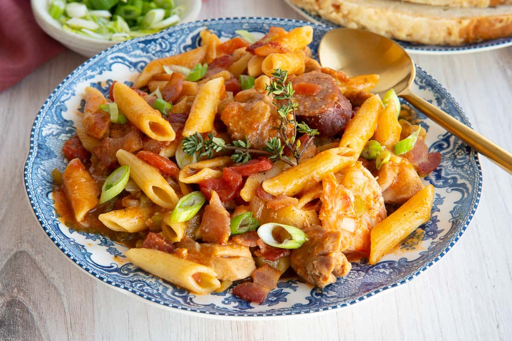

# Jambalaya

*Louisiana's one-pot rice dish: chicken, andouille and prawns cooked down with rice, the trinity and Cajun spice.*

**Serves:** 4
**Prep Time:** 25 minutes
**Cook Time:** 17 minutes

## Overview
A modern pasta-twist on the Cajun one-pot classic, swapping the traditional rice for penne but keeping the layered Louisiana flavour intact. You brown andouille sausage hard in a heavy pot to render its smoky fat, then add chicken pieces and cook them through in the same fat. The Cajun trinity (onion, celery and sweet pepper) softens in next, Cajun seasoning blooms in the heat, and a tomato base goes in with cream to build a sauce that's rich, smoky and just-spicy. Cooked pasta tosses through at the end, with prawns going in for the last few minutes so they stay tender. Eaten in deep bowls with parsley scattered over and hot sauce on the table for whoever wants more heat. New Orleans rules adapted to a Tuesday-night kitchen.

## Ingredients

### Proteins
- 12 shrimp (large, peeled and deveined)
- 2 chicken breast fillets (cut into 1 cm cubes)
- 1 Andouille sausage (cut into 5 mm slices)

### Pasta & Base
- 250 grams penne pasta
- 230 ml chicken stock
- 350 ml chopped tomatoes
- 230 ml double cream (optional)

### Aromatics & Vegetables
- 3 tablespoons olive oil
- 1 onion (finely chopped)
- 1 red pepper (deseeded and chopped)
- 1 jalapeño (finely chopped)
- 2 garlic cloves (germ removed and finely chopped)
- 1 tablespoon fresh thyme (chopped)
- 3 tablespoons fresh basil (chopped)

### Seasonings & Finish
- 3 teaspoons cajun (or creole spice mix)
- 75 grams Parmesan cheese (freshly grated)
- salt
- pepper

## Method

### Stage 1 - Prepare Pasta & Season Proteins
1. Place the pasta in a large saucepan of salted boiling water and cook until al dente.
2. Drain well, reserving 50 ml of the cooking water, and set aside.
3. Season the shrimp and chicken with 2 teaspoons of creole seasoning and a pinch of salt.

### Stage 2 - Cook Proteins
1. Put 1 tablespoon of olive oil in a sauté pan over medium heat.
2. Cook the shrimp for 1 minute on each side. Remove and set aside.
3. Add the chicken pieces to the same pan and cook for 4-5 minutes until golden and cooked through. Remove and set aside.
4. Add the andouille sausage and fry briefly (about 2 minutes) until warmed through. Remove and set aside.

### Stage 3 - Build the Sauce
1. Add the remaining 2 tablespoons of olive oil to the pan over medium heat.
2. Add the chopped onion, red pepper, jalapeño, and garlic.
3. Cook for 5-7 minutes, stirring frequently, until the vegetables are softened.
4. Stir in the fresh thyme and remaining 1 teaspoon of creole seasoning.
5. Add the chopped tomatoes and chicken stock, stirring well.
6. Bring to a simmer and cook for 10 minutes to meld flavours.
7. If using cream, stir it in now and simmer for another 2-3 minutes.

### Stage 4 - Combine & Finish
1. Return all the cooked proteins (shrimp, chicken, and sausage) to the pan.
2. Add the cooked pasta and toss gently to coat in the sauce.
3. Add the reserved pasta water as needed to achieve desired sauce consistency.
4. Stir in the fresh basil.
5. Cook for 1-2 minutes until everything is warmed through and well combined.
6. Season with salt and pepper to taste.
7. Serve immediately, topped with freshly grated Parmesan cheese.

## Notes
- **Cajun vs. Creole:** Cajun cooking is rustic and country-style; Creole is more refined. This dish bridges both traditions.
- **Andouille sausage:** Smoked and spiced, it's essential to authentic jambalaya flavour. Chorizo can substitute if unavailable.
- **Cream optional:** Traditional jambalaya skips cream; add it for a richer, contemporary version.
- **Spice heat:** Adjust creole seasoning quantity to your heat preference.
- **Pasta water:** Essential for adjusting sauce consistency and helping flavours coat the pasta.

## Variations
**Traditional rice version:** Replace penne with long-grain white rice (275g) cooked separately; combine at the end
**Seafood-only:** Replace chicken with additional shrimp or scallops for all-seafood jambalaya
**Extra spicy:** Add fresh cayenne pepper or hot sauce to the sauce during cooking
**Vegetarian:** Omit all proteins and replace sausage with smoked paprika-seasoned mushrooms

## Serving
Serve with: Crusty bread, hot sauce (Tabasco or Louisiana), and a green salad

## Storage
- Keeps 2 days refrigerated
- Not recommended for freezing (cream sauce doesn't freeze well)
- Best enjoyed fresh
