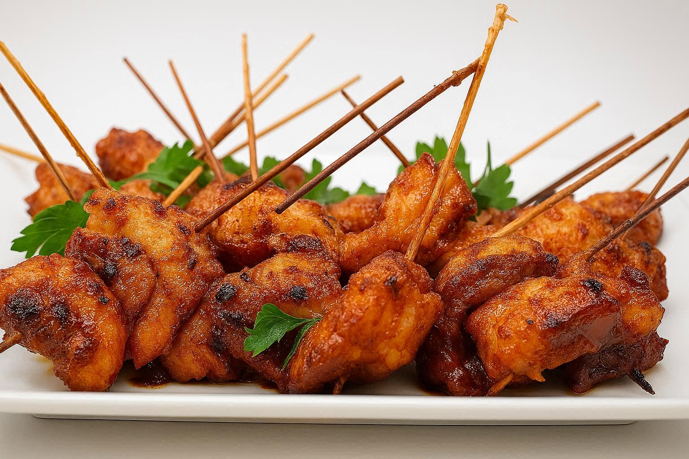

# Andouille Skewers

*A Cajun kebab: thick slices of smoky andouille threaded with peppers and onion, brushed with butter-garlic-brown-sugar-hot-sauce glaze, grilled blistered.*

**Serves:** Makes 8 skewers (4 servings)

**Prep Time:** 15 minutes

**Cook Time:** 12 minutes

## Overview
A Cajun cookout skewer, the kind of thing that comes off the grill at a Louisiana backyard barbecue while the gumbo is finishing on the back burner. You take andouille (the heavily smoked, garlicky Cajun pork sausage) and cut it into thick coins, then thread them onto pre-soaked wooden skewers (or metal) with chunks of red and green pepper, red onion, and a few halved cherry tomatoes. Brush with a quick Cajun glaze of melted butter, garlic, brown sugar, hot sauce and Cajun seasoning. Onto a hot grill over high heat for just long enough to char the vegetables and bring the sausage shiny and sticky. Eat straight off the skewer with a beer in the other hand, the smoke still hanging in the air.

## Ingredients

### Skewers
- 600 g andouille sausage, cut into 1 ½ cm thick coins
- 2 red peppers, deseeded and cut into 3 cm chunks
- 1 green pepper, deseeded and cut into 3 cm chunks
- 1 red onion (large), cut into 3 cm chunks (then separated into 2-layer pieces)
- 16 cherry tomatoes (optional)

### Glaze
- 60 g unsalted butter
- 3 garlic cloves, finely chopped
- 1 tablespoon soft brown sugar
- 1 tablespoon Louisiana hot sauce
- 1 ½ teaspoons Cajun seasoning
- 1 teaspoon smoked paprika
- 1 tablespoon olive oil
- ½ lemon (juice)
- 1 tablespoon chopped flat-leaf parsley

### Equipment
- 8 wooden skewers (soaked in water 30 minutes) or metal skewers

## Method

### Stage 1 - Make the glaze
1. Melt the butter in a small saucepan over low heat.
2. Add the garlic; cook 1 minute (do not brown).
3. Whisk in the brown sugar, hot sauce, Cajun seasoning, smoked paprika and olive oil.
4. Off the heat, stir in the lemon juice and parsley.
5. Set aside (it will firm up slightly as it cools, which is fine).

### Stage 2 - Thread the skewers
1. Thread each skewer in a repeating order: andouille coin, red pepper, andouille coin, onion piece, andouille coin, green pepper, andouille coin, cherry tomato (or similar order).
2. Aim for 4-5 sausage coins and 4-5 vegetable pieces per skewer.
3. Lay on a tray; brush all over with about half the glaze.

### Stage 3 - Grill (BBQ, ideal)
1. Heat the grill to medium-high (you should be able to hold your hand 5 cm above the bars for 4 seconds, no more).
2. Lay the skewers on the grill.
3. Cook 3 minutes; turn a quarter; brush with more glaze.
4. Repeat every 3 minutes, turning and basting, until all four sides have had heat (10-12 minutes total).
5. The sausage should be shiny and lightly blistered; the peppers should have char marks and have softened.

### Stage 4 - Grill (indoor griddle pan / oven alternative)
1. Heat a heavy ridged griddle pan over medium-high until very hot.
2. Lay the skewers in the pan (work in batches if needed).
3. Cook 2-3 minutes per side, turning and basting with glaze, for 10-12 minutes total.
4. Or: heat the oven to 220°C (200°C fan); lay the skewers on a wire rack over a tray; roast 14-16 minutes, turning and basting halfway.

### Stage 5 - Finish
1. Lift onto a serving plate.
2. Brush with any remaining glaze.
3. Scatter with extra chopped parsley.
4. Serve hot.

## Notes
- **Andouille is the headline:** Look for genuine smoked andouille at a deli or specialist butcher. UK substitutes: Polish kielbasa, smoked Cajun-style sausage from a Caribbean grocer, or a coarse-textured chorizo seco (the firm, smoked kind, not soft cooking chorizo).
- **Don't pre-cook the sausage:** Andouille is fully cooked when bought. The grill is for char, smoke and to heat through.
- **Soak wooden skewers:** 30 minutes of soaking stops them burning through on the grill.

## Variations
- **With pineapple:** Swap the cherry tomatoes for chunks of fresh pineapple, sweet, acidic, and excellent with smoky pork.
- **With shrimp:** Alternate andouille with large peeled prawns for a surf-and-turf skewer (shrimp cooks in 3-4 minutes; thread them last and add to the grill after the first 4 minutes).

## Serving
- Serve with: A pile of dirty rice, maque choux, coleslaw, or a chunk of crusty bread and a wedge of lemon. Plenty of cold beer.

## Storage
- Best eaten straight off the grill.
- Cooked skewers keep 2 days refrigerated; reheat in a 200°C oven for 8 minutes.
- Pre-assembled raw skewers keep 24 hours refrigerated before cooking.
