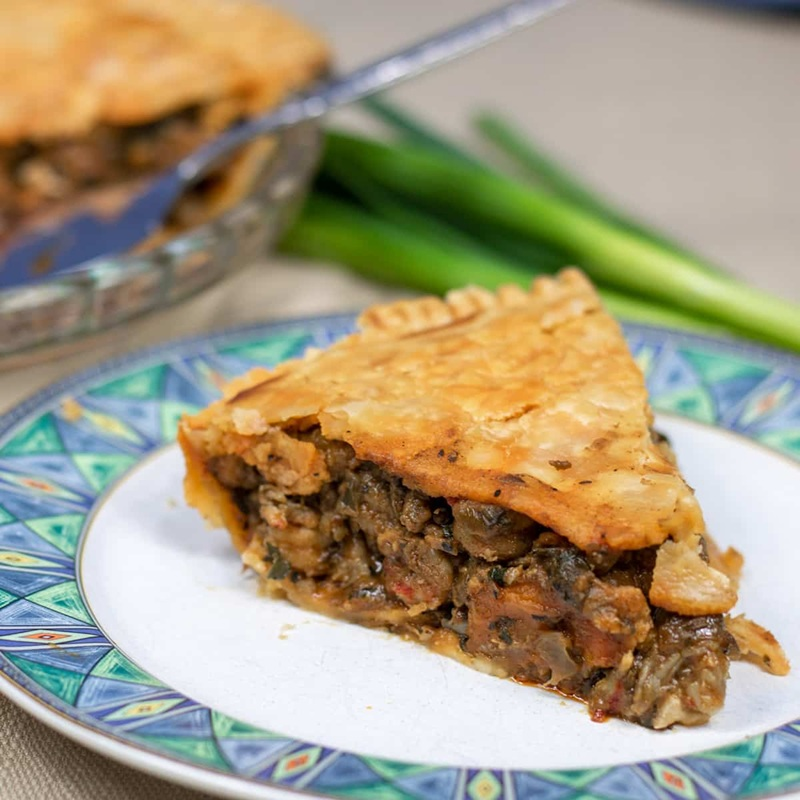

# Crawfish Pies

*Egg-sized Cajun hand pies: a flaky savoury crust hiding a buttery roux-bound filling of crawfish étouffée with the trinity and hot sauce.*

**Serves:** Makes 12 pies (4-6 servings)

**Prep Time:** 45 minutes (plus 30 minutes pastry chilling)

**Cook Time:** 30 minutes

## Overview
A Louisiana hand pie, the Cajun answer to a Cornish pasty and the snack you'd buy at a Lafayette festival booth alongside a beer. You make a flaky shortcrust enriched with a little butter and lard (or all butter if you'd rather), cold and rested. The filling is a small batch of crawfish étouffée: a blond roux first, then the trinity of onion, celery and bell pepper, garlic, tomato, Cajun spice, stock and crawfish tails, simmered down until thick enough to hold its shape on a spoon. Cool the filling completely so it can be spooned into pastry circles, folded into half-moons, crimped sharp at the edge, brushed with egg wash and either deep-fried or baked. The fried version is the classic, with the pastry blistered amber-gold and the filling steaming inside. Eaten warm from the paper with a dab of remoulade and a cold drink.

## Ingredients

### Pastry
- 300 g plain flour
- ½ teaspoon fine salt
- ¾ teaspoon Cajun seasoning
- 120 g cold unsalted butter, cubed
- 50 g cold lard, cubed (or another 50 g cold butter)
- 1 egg yolk (large)
- 6-7 tablespoons ice-cold water

### Filling
- 50 g unsalted butter
- 2 tablespoons plain flour
- 1 onion (small), finely chopped
- 1 celery stick, finely chopped
- ½ green pepper, deseeded and finely chopped
- 2 garlic cloves, finely chopped
- 1 tomato (small), deseeded and finely chopped
- 200 ml seafood (or chicken stock)
- 1 ½ teaspoons Cajun seasoning
- ½ teaspoon smoked paprika
- 1 teaspoon hot sauce (Tabasco or Louisiana)
- 1 teaspoon fresh thyme leaves
- 250 g crawfish tail meat (cooked, peeled, or peeled raw prawns, chopped)
- 3 spring onions, finely sliced
- 2 tablespoons chopped flat-leaf parsley
- salt
- pepper

### To finish
- 1 egg, beaten with 1 tablespoon water (egg wash)
- 1 litre vegetable oil (if frying)

## Method

### Stage 1 - Pastry
1. Whisk the flour, salt and Cajun seasoning together in a large bowl.
2. Rub in the cold butter and lard until the mixture resembles coarse breadcrumbs with a few pea-sized pieces still visible.
3. Beat the egg yolk with 6 tablespoons of ice water; pour over the flour mix.
4. Mix with a fork until the dough comes together (add the last tablespoon of water only if needed).
5. Tip onto a surface; press into a flat disc.
6. Wrap; chill at least 30 minutes.

### Stage 2 - Filling
1. Melt the butter in a wide pan over medium heat.
2. Whisk in the flour to form a blond roux; cook 3 minutes, stirring constantly, until pale gold and nutty.
3. Add the onion, celery and green pepper; cook 5 minutes until softened.
4. Stir in the garlic, Cajun seasoning, smoked paprika and thyme; cook 1 minute.
5. Add the tomato; cook 2 minutes.
6. Pour in the stock gradually, whisking, to make a thick sauce.
7. Simmer 5 minutes until properly thick (it should mound on a spoon - any thinner and the pies will leak).
8. Stir in the crawfish (or chopped raw prawn), spring onions, parsley and hot sauce.
9. Cook 3 minutes (just enough to cook the prawn through, if using).
10. Season with salt and pepper.
11. Spread thinly on a tray; cool fully (push into the fridge to speed it up).

### Stage 3 - Shape the pies
1. Roll the chilled pastry on a floured surface to about 3 mm thick.
2. Cut out 12 discs about 12 cm across (use a saucer as a guide; re-roll trimmings).
3. Place a heaped tablespoon of cold filling in the centre of each disc.
4. Brush the edge lightly with egg wash.
5. Fold in half to enclose; press the edges together with your fingers.
6. Crimp with a fork to seal.
7. Lay on a lined tray.

### Stage 4 - Cook (fried, traditional)
1. Heat the oil in a deep pan to 175°C.
2. Fry the pies 3 at a time, 3-4 minutes per side, until deep golden and crisp.
3. Drain on kitchen paper.
4. Serve hot.

### Stage 5 - Cook (baked, lighter alternative)
1. Heat the oven to 200°C (180°C fan).
2. Place the pies on a lined baking tray; brush all over with egg wash.
3. Cut a small steam vent in the top of each.
4. Bake 22-25 minutes until deep golden.

## Notes
- **Crawfish substitute:** Peeled North Atlantic prawns or brown shrimp are the closest UK swap. Chop large prawns to crawfish-tail size. Frozen Louisiana crawfish tail meat is occasionally found at specialist seafood shops and is worth the look.
- **Filling must be cold:** Hot filling melts the pastry edge and leaks. Cool it completely.
- **Don't overfill:** A heaped tablespoon is enough. Overstuffed pies blow open during frying.

## Variations
**With cheese:** Add 50 g grated cheddar or pepper jack to the cooled filling.
**Shrimp and corn:** Replace half the crawfish with fresh corn kernels for a different angle.

## Serving
Serve with: Remoulade, hot sauce, lemon wedges, or as part of a Cajun snack platter with boudin balls and andouille skewers.

## Storage
- Best fried fresh; keep 1 day refrigerated and reheat in a 190°C oven 8-10 minutes.
- Unfried assembled pies freeze 1 month; fry from frozen, adding 2 minutes (or bake from frozen, adding 5 minutes).
