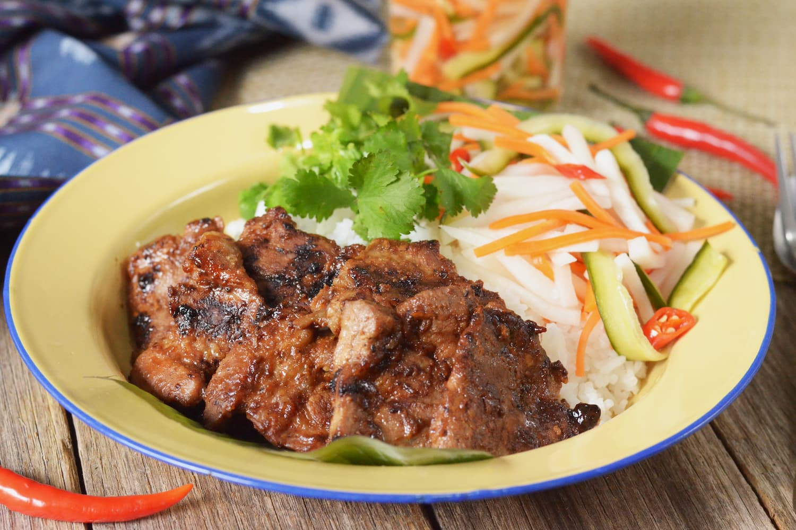

# Bai Sach Chrouk

*Cambodia's national breakfast: thin slices of pork marinated overnight in coconut water, garlic and palm sugar, then grilled till lightly caramelised and served over fragrant broken rice with pickled cucumber and carrot, a small bowl of chicken broth on the side and chilli sauce for heat. The dish that fuels Phnom Penh every morning.*

**Serves:** 4

**Prep Time:** 20 minutes (plus overnight marination)

**Cook Time:** 25 minutes

## Overview
Bai sach chrouk is Cambodia's signature breakfast and one of the country's most iconic dishes, served from street stalls and small restaurants across Phnom Penh and beyond every morning before 11am: thin slices of pork (shoulder or belly) marinated overnight in a sweet-savoury mixture of coconut water, crushed garlic, fish sauce and palm sugar, then grilled or seared till lightly caramelised, served over a mound of fragrant Cambodian broken rice with a side of pickled cucumber-and-carrot, a small bowl of clear chicken broth (or a thin omelette) and a dollop of chilli sauce for heat. The combination is what Cambodians turn up for; the slightly sweet caramelised pork pairs with the slightly tangy quick-pickle, the broth provides liquid relief, the chilli adds the wake-up element. The marinade is the heart of the dish. Coconut water (not coconut milk) provides natural sweetness and a slightly tropical note; palm sugar gives caramel-honey depth; garlic provides aromatic base; fish sauce adds umami and salt. The pork sits in this overnight; the next morning, you grill or sear the marinated pork briefly (the marinade caramelises and the pork stays tender from the sugar-and-fat). Broken rice (bai damnaeb) is the canonical accompaniment. Properly broken jasmine rice grains are smaller and slightly more porous than whole grains, soaking up the cooking juices from the pork and giving the meal its proper texture. Outside Cambodia, broken rice is available at Asian markets; or you can use regular jasmine rice (slightly less canonical but still good). The pickle is a quick-pickle of cucumber and carrot in rice vinegar with sugar and salt; it goes together in 30 minutes and brightens the rich pork. The dish is finished with a small bowl of chicken broth on the side (often very simple: chicken stock with a few coriander leaves and spring onion) or a thin Cambodian-style omelette laid over the rice; both are common.

## Ingredients

### Pork and marinade
- 600 g pork shoulder or pork belly (cut into 5 mm thick slices, 6-7 cm long)
- 200 ml coconut water (the canonical ingredient; or substitute 200 ml water + 1 tablespoon coconut sugar)
- 4 tablespoons palm sugar (grated or crumbled; or coconut sugar; or light brown sugar)
- 4 tablespoons fish sauce (good quality Vietnamese or Cambodian fish sauce)
- 6 garlic cloves (finely crushed)
- 1 thumb (3 cm) fresh ginger (finely grated)
- 2 teaspoons dark soy sauce (for colour)
- 1 teaspoon ground black pepper

### Pickled vegetables
- 1 medium cucumber (peeled in stripes, thinly sliced into rounds)
- 1 medium carrot (peeled and julienned)
- 4 tablespoons rice vinegar
- 2 tablespoons caster sugar
- 1 teaspoon fine sea salt
- 60 ml water

### Broken rice
- 400 g jasmine rice (broken rice if available; or regular jasmine)
- 600 ml water
- ½ teaspoon fine sea salt

### Chicken broth (optional but traditional)
- 600 ml good chicken stock
- 1 tablespoon fish sauce
- 1 spring onion (finely sliced)
- A few coriander leaves
- A pinch of white pepper

### To serve
- Sriracha or Cambodian chilli sauce (tuk trey)
- Fresh coriander
- Optional: 4 fried eggs (sunny-side up)

## Method

### Stage 1 - Marinate the pork (the night before)
1. Combine the coconut water, palm sugar (broken up), fish sauce, crushed garlic, grated ginger, dark soy and pepper in a wide bowl.
2. Whisk till the sugar dissolves.
3. Add the pork slices; turn through the marinade till every piece is coated.
4. Cover and refrigerate overnight (8-12 hours) for the proper flavour penetration. Minimum 4 hours if you're pressed.

### Stage 2 - Make the pickles
1. Combine the rice vinegar, sugar, salt and water in a small saucepan.
2. Warm gently over low heat till the sugar and salt dissolve. Don't boil; just dissolve.
3. Cool to room temperature.
4. Place the sliced cucumber and julienned carrot in a clean jar or wide bowl.
5. Pour the cooled brine over.
6. Let stand at room temperature for 30 minutes before serving; or refrigerate for up to 3 days.

### Stage 3 - Cook the rice
1. Rinse the rice 2-3 times in cold water till the water runs mostly clear.
2. Drain.
3. Place in a saucepan with the 600 ml of water and the salt.
4. Bring to a boil; reduce to lowest heat; cover with a tight-fitting lid.
5. Cook 15 minutes covered.
6. Take off the heat; rest covered 10 minutes.
7. Fluff with a fork before serving.

### Stage 4 - Grill or sear the pork
1. Take the marinated pork out of the fridge 20 minutes before cooking; let come to room temperature.
2. Heat a griddle pan or wide heavy frying pan over medium-high heat till smoking.
3. Lift the pork slices from the marinade (let excess drip off; reserve the marinade).
4. Place the pork on the hot pan in a single layer; don't crowd (cook in batches if needed).
5. Cook 2-3 minutes per side till the surface caramelises to a deep brown and the meat is just cooked through.
6. The marinade should caramelise on the surface, giving a slightly sticky glossy crust.
7. Transfer cooked pork to a warm plate; cover loosely with foil.

### Stage 5 - Reduce the marinade for glaze (optional)
1. Pour the reserved marinade into the hot pan after the pork is cooked.
2. Bring to a hard simmer; cook 3-4 minutes till reduced by half and slightly syrupy.
3. Pour the warm glaze over the cooked pork.

### Stage 6 - Make the broth (if using)
1. Heat the chicken stock in a separate saucepan over medium heat.
2. Add the fish sauce.
3. Taste; adjust seasoning.
4. Ladle into small bowls; garnish with a small amount of sliced spring onion and a few coriander leaves.

### Stage 7 - Plate and serve
1. Spoon a generous portion of warm rice onto each plate.
2. Lay 5-6 slices of the caramelised pork over the rice.
3. Drizzle with any reduced glaze.
4. Place a small pile of pickled cucumber and carrot to one side.
5. If using eggs, place a fried egg over the rice.
6. Place the small bowl of chicken broth alongside.
7. Provide chilli sauce and fresh coriander leaves for diners to add.
8. Eat immediately; bai sach chrouk is properly a hot-rice-fresh-pickle contrast.

## Notes
- **Coconut water, not coconut milk:** the marinade calls for natural coconut water (the clear sweet liquid from inside a young coconut), not coconut milk (the white emulsion). Coconut milk would give a creamier richer marinade that's wrong for this dish. Most supermarkets sell canned coconut water; pure unsweetened is best.
- **Palm sugar gives proper caramel notes:** palm sugar (or coconut sugar) has caramel-honey depth that regular white sugar doesn't have. Worth seeking out; it's at any Asian market. Light brown sugar is the closest mainstream substitute.
- **Marinate overnight:** the proper flavour comes from a long marination; the coconut water-sugar mixture is mild enough that 30 minutes won't penetrate the pork properly. 8-12 hours is canonical.
- **Broken rice is canonical:** broken rice (jasmine rice grains broken in milling) is the traditional accompaniment; the smaller more porous grains soak up the pork juices better than whole-grain jasmine. Available at Asian markets labelled "broken jasmine" or "bai damnaeb". Regular jasmine works as a substitute.
- **Grill is canonical, pan-sear works:** in Cambodia, the pork is grilled over charcoal, which gives a smoky note that's hard to replicate in a kitchen. A hot griddle pan gives proper caramelisation; a regular frying pan works if you let the pan get really hot before adding the pork.

## Variations
**Bai sach chrouk with fried egg:** add a fried egg (sunny-side up) over the rice; the runny yolk mixes with the rice and pork for richness. Standard variation across Cambodia.
**Bai sach chrouk with omelette:** instead of (or in addition to) the chicken broth, make a thin Cambodian omelette (2 eggs whisked with a teaspoon of fish sauce, fried thin in a pan, cut into ribbons) laid over the rice. Common variation.
**Lemongrass bai sach chrouk:** add 2 stalks of finely minced lemongrass to the marinade for a more aromatic version. Less canonical but adds a citrus note that works well.
**Bai sach chrouk with peanuts:** scatter 2 tablespoons of crushed roasted peanuts over the finished dish; adds crunch and nuttiness. Modern Phnom Penh street variation.

## Serving
On wide plates: a mound of warm rice, 5-6 slices of the caramelised pork laid over, a small pile of pickled cucumber-and-carrot to one side, a small bowl of clear chicken broth alongside, and chilli sauce at hand. Properly eaten for breakfast (before 11am is the Cambodian rule) but works for any meal of the day outside Cambodia. Drink: Cambodian iced coffee (cafe phlee) for breakfast; Angkor beer for dinner.

## Storage
- The cooked pork keeps refrigerated 3 days; reheat gently in a covered pan with a splash of water (or under a low grill till just warmed through; don't overcook or the pork goes dry).
- The pickles keep refrigerated 1 week; in fact they improve after a day in the brine.
- The rice keeps refrigerated 2 days; fries beautifully into a fried-rice variation with leftover pork.
- Cooked pork freezes 2 months in portioned containers; defrost in the fridge.
- Marinade is best fresh; don't keep beyond using.
