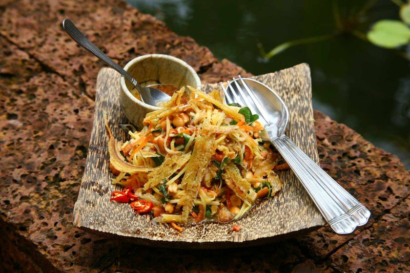

# Chruok

*Cambodian quick-pickled vegetables: julienned daikon, carrot and cucumber in a sweet-sour brine of lime, vinegar, palm sugar and salt. Bright, sharp, slightly hot from chilli; eats alongside grilled meats and fish, or piled into rice with anything saucy. Ready in an hour; best after a few.*

**Serves:** 4 as a side

**Prep Time:** 15 minutes (plus 1 hour to pickle)

**Cook Time:** 0 minutes

## Overview
A Cambodian quick-pickle, the bright sharp counter that turns up on every Khmer table next to grilled meats and rich curries. You julienne daikon, carrot and cucumber thin so the brine penetrates fast, then salt them briefly in a colander to draw the water out. The brine is sweet-sour: lime juice, white vinegar, palm sugar, fish sauce (or soy for a vegetarian version) and a sliced bird's-eye chilli. Pour it over the drained vegetables and leave to sit at room temperature for an hour, then refrigerate. Ready in an hour, better after three, best the next day. Eaten alongside grilled fish or chicken, piled into a bowl of rice with anything saucy, or tucked into a sandwich.

## Ingredients

- 1 daikon radish (medium, 200 g; julienned)
- 2 carrots (medium, julienned)
- 1 cucumber (small, deseeded and julienned)
- 1 teaspoon salt (for the initial drain)

### Brine
- 100 ml white cane vinegar (or rice vinegar)
- 60 ml lime juice
- 80 g palm sugar (or brown sugar)
- 1 tablespoon light soy sauce (or 1 tablespoon fish sauce)
- 1 teaspoon salt
- 4 garlic cloves (smashed)
- 2 cm fresh ginger (julienned)
- 2 bird's-eye chillies (sliced)
- 100 ml water

## Method

### Stage 1 - Drain
1. Toss the daikon, carrot and cucumber with the 1 teaspoon salt in a colander.
1. Rest 15 minutes - they'll release water.
1. Rinse briefly; squeeze gently to remove excess water.

### Stage 2 - Brine
1. Whisk the vinegar, lime juice, palm sugar, soy sauce and salt until the sugar dissolves.
1. Stir in the garlic, ginger, chillies and water.

### Stage 3 - Pickle
1. Pack the vegetables into a clean jar or wide bowl.
1. Pour the brine over; press down so vegetables are submerged.
1. Cover and rest 1 hour at room temperature; then refrigerate.

### Stage 4 - Serve
1. Drain briefly before serving (or scoop out with a slotted spoon).
1. Eats well alongside grilled meats, rice bowls, or noodle soups.

## Notes
- **Slice thin:** Thicker vegetables are still crunchy after a day; thin julienne pickles in an hour.
- **Salt-and-rinse first:** Skipping this step gives a watery, sluggish pickle.
- **Sugar amount:** Cambodian chruok is properly sweet-sour, not aggressively sour. Don't reduce the sugar.

## Storage
- Keeps 2 weeks refrigerated; sharpens over time.
