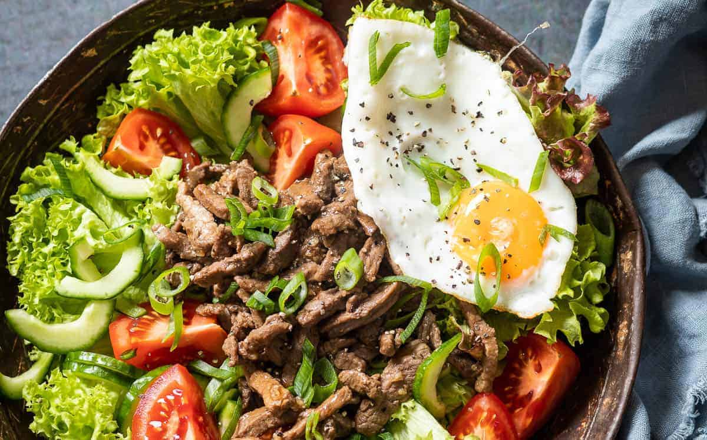

# Lok Lak

*Cambodia's beef stir-fry: cubes of beef tenderloin marinated in oyster sauce and soy, flash-fried with onion and garlic, served over a bed of lettuce and tomato with a dipping sauce of fresh lime juice, salt and black pepper. The French-Cambodian classic that turns up at every Phnom Penh restaurant table.*

**Serves:** 4

**Prep Time:** 25 minutes (plus 30 minutes marination)

**Cook Time:** 15 minutes

## Overview
Lok lak is one of Cambodia's most beloved beef dishes, with French-colonial influence visible in its construction (the bed of lettuce and tomato, the pepper-forward seasoning) blended with Khmer flavours (the oyster-soy marinade, the lime-pepper dipping sauce called tuk meric): cubes of beef tenderloin marinated briefly in oyster sauce, soy, fish sauce, sugar and garlic, flash-fried in a screaming-hot wok with sliced onion till browned outside and tender-pink inside, served over a bed of crisp lettuce leaves with tomato wedges, cucumber and red onion, with a small bowl of dipping sauce (fresh lime juice, salt, ground black pepper) on the side. The name comes from the Vietnamese "bo luc lac" (shaking beef); lok lak is the Cambodian variant, with a slightly different marinade and the distinctive lime-pepper dip. Use proper tenderloin or sirloin; nothing tougher. The high heat is everything; overcrowding the pan steams the beef instead of searing. The dipping sauce is non-negotiable: fresh lime, freshly ground black pepper (lots of it) and salt; a small bowl per diner.

## Ingredients

### Beef and marinade
- 600 g beef tenderloin or top sirloin (cut into 2 cm cubes)
- 2 tablespoons oyster sauce
- 2 tablespoons light soy sauce
- 1 tablespoon fish sauce
- 1 tablespoon caster sugar (or palm sugar)
- 1 tablespoon dark soy sauce (for colour)
- 4 garlic cloves (finely crushed)
- 1 teaspoon ground black pepper
- 1 tablespoon cornflour (to bind the marinade to the beef)

### Vegetable bed
- 1 head Boston/butter lettuce (leaves separated, washed and dried)
- 2 medium tomatoes (cut into wedges)
- 1 medium cucumber (sliced into thick rounds)
- 1 small red onion (very thinly sliced)

### Stir-fry
- 3 tablespoons vegetable oil
- 1 large onion (cut into wedges, layers separated)
- 4 spring onions (cut into 4 cm lengths)
- 4 garlic cloves (crushed)

### Finishing sauce
- 2 tablespoons oyster sauce
- 1 tablespoon dark soy sauce
- 1 teaspoon caster sugar
- 50 ml water (or beef stock)
- ½ teaspoon ground black pepper

### Dipping sauce (tuk meric)
- 1 teaspoon fine sea salt
- 2 teaspoons coarsely ground black pepper
- 3 tablespoons fresh lime juice (from 2 limes)
- 1 fresh red chilli (finely sliced, optional)

### To serve
- A fried egg per diner (optional but very common)
- Steamed jasmine rice

## Method

### Stage 1 - Marinate the beef
1. Combine the oyster sauce, light soy, fish sauce, sugar, dark soy, crushed garlic, pepper and cornflour in a wide bowl.
2. Whisk to a smooth marinade.
3. Add the beef cubes; turn through till every piece is well coated.
4. Cover and refrigerate 30 minutes (don't go beyond 1 hour; the soy starts to over-flavour the beef).

### Stage 2 - Prepare the vegetable bed
1. Arrange the lettuce leaves on a large serving platter, building a flat bed.
2. Place the tomato wedges around the edges.
3. Scatter the cucumber rounds over.
4. Scatter the very thinly sliced red onion on top.
5. Set aside; this is the cool platform under the hot beef.

### Stage 3 - Make the dipping sauce
1. In each of 4 small dipping bowls (one per diner), combine the salt and pepper.
2. Just before serving, squeeze the lime juice into each bowl; stir with a finger to dissolve the salt.
3. Add a few slices of fresh chilli if using.
4. The sauce should be sharp, peppery and salty; properly punchy.

### Stage 4 - Pre-mix the finishing sauce
1. Combine the oyster sauce, dark soy, sugar, water and pepper in a small bowl.
2. Set near the stove.

### Stage 5 - Stir-fry the beef (high heat)
1. Heat 2 tablespoons of the oil in a wok or wide heavy frying pan over high heat till smoking.
2. Take the marinated beef out of the fridge; let any excess marinade drip off into the bowl.
3. Add half the beef to the smoking pan in a single layer; don't move it for 60-90 seconds so the surface sears.
4. After the sear, toss the beef quickly in the pan for 1 minute more; the beef should be browned outside and just-pink inside.
5. Transfer to a warm plate.
6. Add the remaining oil to the pan; cook the second batch of beef the same way.
7. Transfer to the same warm plate.

### Stage 6 - Stir-fry the aromatics
1. With the pan still on high heat, add the wedges of onion (layers separated); stir-fry 1-2 minutes till the onion starts to char at the edges but stays crisp.
2. Add the spring onion lengths and crushed garlic; stir-fry 30 seconds.

### Stage 7 - Combine
1. Return all the beef and any plate juices to the pan.
2. Pour the pre-mixed finishing sauce around the edges of the pan.
3. Toss everything together for 1 minute till the sauce coats the beef and reduces slightly to a glossy coating.
4. Take off the heat.

### Stage 8 - Plate
1. Tip the beef and aromatics over the prepared lettuce-and-tomato bed.
2. Drizzle any pan juices over.
3. If using, fry a sunny-side egg per diner; place over the beef just before serving (the runny yolk mixes through the dish).
4. Place the small bowls of lime-pepper dipping sauce alongside each plate.
5. Serve immediately with steamed jasmine rice.

## Notes
- **Tenderloin or sirloin only:** the flash-fry technique requires a tender cut that cooks through in 90 seconds without going chewy. Tougher cuts like flank or skirt won't work; they need longer cooking and would be wrong for the dish. If you can't afford tenderloin, top sirloin is the next best.
- **Screaming-hot wok:** the pan must be properly smoking before the beef goes in. A cool pan gives steamed beef (grey, wet, no crust) rather than the proper deeply-seared lok lak texture. If your stove can't get a wok that hot, use a heavy cast-iron pan.
- **Cook in batches:** overcrowding the pan drops the temperature and steams the beef. Two batches of 300 g each is right for the recipe.
- **The lime-pepper dipping sauce is traditional:** tuk meric (literally "pepper water") is what makes lok lak distinct from a generic stir-fry. Don't substitute; lime, salt, and black pepper, mixed at the table just before eating, is the proper combination.
- **Marinate 30 minutes, not longer:** the soy-and-oyster marinade is potent; longer than 1 hour starts to over-flavour the meat and the texture goes off (the salt starts curing the meat). 30 minutes is the sweet spot.

## Variations
**Lok lak with chicken:** swap the beef for 600 g chicken thigh (cut into 2 cm cubes); marinate 30 minutes and stir-fry the same way. Less traditional but works for non-beef-eaters.
**Lok lak with tofu (vegetarian):** swap beef for 400 g firm tofu (cubed and lightly pressed); use mushroom oyster sauce instead of regular oyster sauce. The texture is right; the flavour is naturally less rich.
**Pepper-crusted lok lak:** crush 1 tablespoon of black peppercorns and 1 teaspoon of green peppercorns coarsely; mix into the marinade. Gives a punchier peppery profile that bridges lok lak with Vietnamese bo luc lac.
**With watercress instead of lettuce:** swap the Boston lettuce for a bed of watercress; the peppery bite of watercress pairs especially well with the lime-pepper dipping sauce.

## Serving
On a large platter as described, with the cool lettuce-tomato-cucumber bed and the hot beef cascading over. Steamed jasmine rice on the side for diners to scoop with. A fried egg per diner (sunny-side up) is the traditional addition; the runny yolk mixes through the beef and the rice. Drink: Angkor or Cambodia beer; or jasmine tea.

## Storage
- The beef is best eaten fresh; the reheat changes the texture (the pink-inside goes to fully cooked).
- Keeps refrigerated 2 days; reheat in a hot wok for 60 seconds (don't try to recreate the original; expect medium-cooked beef instead of medium-rare).
- The dipping sauce is best made fresh; doesn't keep beyond 4 hours (the lime starts to go off-flavour as it sits with the salt and pepper).
- The vegetable bed should be assembled fresh; doesn't keep once the beef has been on it.
- Don't freeze.
