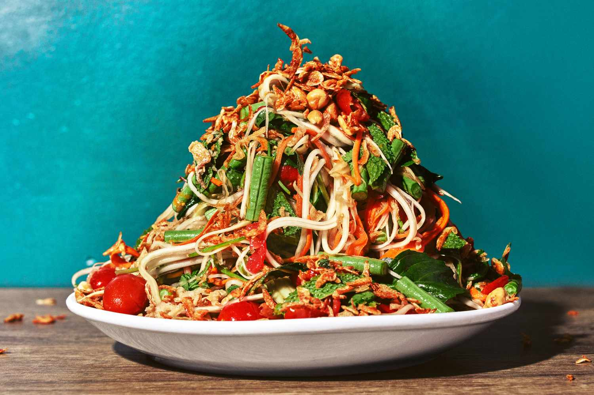

# Bok L'hong

*Cambodia's green papaya salad: shredded unripe papaya pounded in a mortar with garlic, fresh chillies, fish sauce, lime juice, palm sugar, dried shrimp, peanuts and long beans. The crunchy fiery salad of Phnom Penh markets, sharper and saltier than its Thai cousin.*

**Serves:** 4 (as a side)

**Prep Time:** 25 minutes

**Cook Time:** 0 minutes

## Overview
Bok l'hong is Cambodia's version of the green papaya salad, the cousin of Thai som tam and Laotian tam mak hoong but with a distinct Cambodian profile: shredded unripe green papaya pounded coarsely in a large stone mortar with garlic, fresh red and green chillies, dried shrimp, fish sauce, fresh lime juice, palm sugar and crushed roasted peanuts, plus pieces of long beans (yard-long beans) and cherry tomatoes for crunch and freshness. The name "bok l'hong" literally means "pounded papaya" in Khmer; the pounding is technique, not metaphor. The dish is what every Cambodian market lady and lunch-stall owner makes to order in a few minutes; you tell them how many chillies you can handle, they pound it together in front of you, you eat it standing up. Bok l'hong sits between Thai som tam (sweeter, with the addition of tamarind paste) and Laotian tam mak hoong (saltier, often with prahok or padaek fermented fish). Cambodian bok l'hong is closer to the Laotian end of the spectrum: more aggressively salty and savoury, less sweet, with fish sauce providing the salt-and-umami backbone. Some versions include a small amount of prahok (Cambodian fermented fish paste) for extra umami; less canonical but very Cambodian. The technique requires a large mortar (the wider and shallower the better; not a deep narrow spice mortar). The aromatics (garlic, chilli) get pounded first into a rough paste; the seasonings (palm sugar, fish sauce, lime juice) get added and pounded briefly to dissolve; the dried shrimp and peanuts get added with a few light pounds; finally the green papaya, long beans and tomatoes go in and get pounded gently to bruise the papaya and let the dressing penetrate (don't pulverise; you want the papaya to keep its crunch).

## Ingredients

- 500 g green (unripe) papaya (peeled, seeds removed, shredded on a coarse grater or julienned)
- 6 garlic cloves (peeled)
- 4-6 fresh red and green chillies (Thai bird's eye if you want fierce; jalapeño for milder; adjust to taste)
- 3 tablespoons palm sugar (crushed; or coconut sugar; or light brown sugar)
- 4 tablespoons fresh lime juice (from 3 limes)
- 4 tablespoons fish sauce (good quality Cambodian or Vietnamese)
- 2 tablespoons dried shrimp (rinsed in hot water, drained, roughly chopped)
- 4 tablespoons roasted peanuts (crushed coarsely with a rolling pin; not powdered)
- 8 long beans (yard-long beans; or substitute green beans; cut into 4 cm pieces)
- 8 cherry tomatoes (halved; or 2 small tomatoes cut into wedges)

### Optional traditional Cambodian addition
- 1 teaspoon prahok (Cambodian fermented fish paste; available at Asian markets; or substitute 1 tablespoon Thai fish sauce for extra-umami)

### To serve
- Extra crushed peanuts
- Fresh coriander leaves
- Lime wedges
- Sticky rice (or jasmine rice)
- Cabbage leaves or lettuce leaves (to use as wraps)

## Method

### Stage 1 - Prepare the green papaya
1. Peel the green papaya with a vegetable peeler.
2. Cut in half lengthwise; scoop out the white seeds and the white pith.
3. Shred the flesh on a coarse grater (or use a Thai mandoline if you have one, which makes thin julienne strips).
4. The shredded papaya should look like thin pale-green threads.
5. Place in a bowl; cover with cold water and a few ice cubes for 15 minutes to keep crisp and pale.
6. Drain thoroughly just before using.

### Stage 2 - Prepare the long beans
1. Wash and trim the long beans; cut into 4 cm pieces.
2. Lightly bruise each piece by pressing with the side of a knife (this lets the dressing penetrate); don't break them apart.

### Stage 3 - Pound the aromatics
1. Place the garlic cloves and chillies in a large stone mortar.
2. Pound with the pestle for 30 seconds till broken down into a rough paste with visible pieces of chilli and garlic still distinguishable. Don't go to a smooth paste; coarse is right.

### Stage 4 - Add the seasonings
1. Add the crushed palm sugar to the mortar.
2. Pound briefly to start dissolving the sugar into the garlic-chilli paste.
3. Add the lime juice, fish sauce and the prahok (if using).
4. Stir with the pestle to combine; the sugar should dissolve fully. Taste; the dressing should be sharp, salty, fierce and lightly sweet.

### Stage 5 - Add the dried shrimp and peanuts
1. Add the chopped dried shrimp to the mortar; pound lightly (3-4 strokes) to integrate.
2. Add half the crushed peanuts (reserve the rest for finishing); pound briefly.

### Stage 6 - Add the papaya, beans and tomatoes
1. Add the drained shredded green papaya, the long bean pieces and the halved cherry tomatoes to the mortar.
2. Pound gently with the pestle (a fairly soft pound, not a hard pulverising strike) while using a spoon to lift and turn the mixture so the dressing coats everything.
3. Continue gentle pounding-and-turning for 1-2 minutes till the papaya is slightly bruised, the tomatoes are starting to release juice, and the dressing has coated everything.
4. The salad should still have a coarse crunchy texture; the papaya threads should be intact but soft from the bruising; the tomato halves should be slightly broken.

### Stage 7 - Taste and adjust
1. Lift a piece of papaya to taste.
2. Adjust: more lime juice for sharpness; more fish sauce for salt; more palm sugar for sweetness; more chilli for heat.
3. The proper bok l'hong is loud in every direction: properly sharp, salty, sweet, hot, with the umami of dried shrimp and peanuts running through.

### Stage 8 - Serve
1. Transfer to a serving plate.
2. Scatter the reserved crushed peanuts over.
3. Garnish with fresh coriander leaves.
4. Serve immediately with sticky rice (the canonical accompaniment), cabbage or lettuce leaves (for wrapping), and lime wedges.

## Method (Alternative: Large Bowl)
If you don't have a large mortar, you can make bok l'hong in a wide bowl with a wooden spoon or muddler: mash the garlic, chillies, sugar, lime juice, fish sauce, dried shrimp and peanuts together with the back of a spoon till a rough dressing forms; tip in the papaya, beans and tomatoes; toss together with two big spoons while pressing down occasionally to bruise the papaya. The flavour is good; the texture is slightly less integrated than the mortar version.

## Notes
- **A large mortar is the right tool:** the proper Cambodian mortar is wide and shallow, about 25-30 cm across, made of stone. The wide flat base lets you fit all the salad ingredients while pounding. A deep narrow spice mortar won't work. If you don't have one, the alternative method above is workable.
- **Green papaya, not ripe:** the salad uses unripe green papaya, which is crunchy and slightly tart, not the sweet orange-fleshed ripe fruit. Green papayas are at most Asian markets year-round. If you can't find green papaya, green mango (also unripe) is the closest substitute; cucumber and apple work in a pinch but the texture is different.
- **Coarse, not pulverised:** the papaya should keep its crunch. Pound gently; don't try to make a smooth paste. Visible threads of papaya, halved tomatoes, pieces of long bean: all should be distinguishable.
- **Chilli to taste:** the canonical Cambodian bok l'hong is properly fierce (4-6 bird's eye chillies). For non-spice-tolerant diners, use 2 jalapeños deseeded; for proper Cambodian heat, use 6 bird's eye chillies seeds in.
- **Eat fresh:** bok l'hong is meant to be made and eaten in the same hour. It doesn't keep beyond a few hours; the papaya loses its crunch and the tomatoes go too soft.

## Variations
**Bok l'hong with prahok (canonical Cambodian):** add 1 teaspoon of prahok (fermented fish paste) to the dressing; gives the salad a properly funky umami depth that's authentically Cambodian. Strong flavour; not for everyone.
**Bok l'hong with crab:** add 100 g of cooked picked crab meat to the salad at the end; tossed gently rather than pounded. A more luxurious variation.
**Bok l'hong with grilled chicken:** serve the salad alongside 200 g of grilled chicken (Cambodian-style: marinated in lemongrass, garlic, soy and palm sugar) for a more substantial meal.
**Bok l'hong with green mango:** swap the green papaya for green mango (peeled, julienned); slightly tarter and brighter. Common variation when green papaya is unavailable.

## Serving
On a serving plate scattered with peanuts and coriander, with sticky rice (the canonical accompaniment) in a separate bamboo basket. Wraps of cabbage or lettuce leaves on the side for diners to make their own bites. Drink: Angkor beer; or a cold glass of palm wine if you can get it; or just plain water (the salad is so loud that subtle drinks get lost).

## Storage
- Best eaten within 2 hours of making.
- Keeps refrigerated 1 day; the papaya softens and the tomatoes go to mush, but the flavour holds.
- Don't freeze; the texture suffers completely.
- The dressing (garlic, chilli, lime, fish sauce, palm sugar) can be made ahead and kept for 1 week refrigerated; toss with fresh papaya at serving time.
