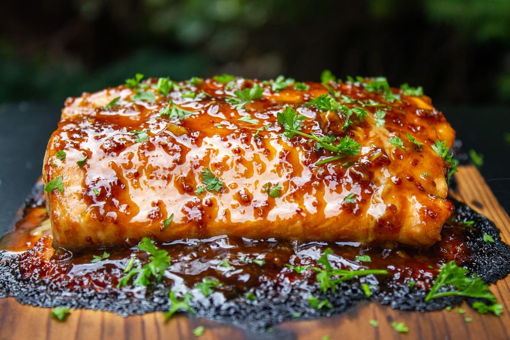

# Cedar-Plank Pacific Salmon

*British Columbia's signature outdoor dish: a side of wild Pacific salmon brushed with maple and Dijon, grilled on a soaked cedar plank till the wood smokes and the fish is just-cooked.*

**Serves:** 6

**Prep Time:** 20 minutes (plus 2 hours soaking the cedar plank)

**Cook Time:** 18 minutes

## Overview
Plank-cooked salmon is the Indigenous-derived technique that defines British Columbia outdoor cooking. The Coast Salish peoples of the Pacific Northwest have cooked salmon on cedar boards beside open fires for thousands of years; the wood smoke perfumes the fish, the cedar oils flavour the flesh, and the upright plank radiates heat evenly. Modern home cooks use the same technique on a covered barbecue: a thick western red cedar plank, soaked in cold water for two hours so it doesn't burn through, set on the hot grill with embers at one side, salmon laid on top to cook indirectly. Best with wild-caught Pacific salmon: sockeye for its assertive flavour and red flesh, king/chinook for richness, coho for a milder middle ground. The modern Canadian glaze is maple syrup, Dijon, a touch of soy sauce and a squeeze of lemon, brushed on at the start and again halfway. The plank chars dramatically underneath. That's fine and adds to the smoke.

## Ingredients

### The salmon
- 1 whole side of wild Pacific salmon (1.2-1.5 kg), skin-on, pin bones removed
- (Sockeye, bright red, strong flavour; king/chinook, rich; coho, mild)

### The glaze
- 80 ml pure Canadian maple syrup (grade A "Dark, robust" ideal)
- 2 tablespoons Dijon mustard
- 1 tablespoon soy sauce
- 1 tablespoon lemon juice
- 1 clove garlic, finely grated
- 1 teaspoon freshly grated ginger
- 1/4 teaspoon black pepper

### The seasoning rub (before glazing)
- 1 teaspoon flaky sea salt
- 1/2 teaspoon black pepper
- 1 teaspoon dried dill (optional)

### Equipment
- 1 thick western red cedar plank, untreated (35 × 15 × 1.5 cm): available from BBQ supply shops; sold as "grilling planks"
- A covered barbecue (gas or charcoal): this technique doesn't work in an indoor oven
- Hardwood lump charcoal OR wood chunks for a charcoal grill; gas grills work but lose some of the smoke benefit

### To serve
- 1 batch [Maple-bacon Brussels sprouts](side-dishes/maple-bacon-brussels-sprouts.md)
- 1 lemon, cut into wedges
- A small bowl of chopped fresh dill or chives
- 600 g small new potatoes, boiled and buttered
- A glass of cold dry Riesling OR a BC Pinot Gris

## Method

### Stage 1 - Soak the plank
1. Submerge the cedar plank in cold water, weighting it with a heavy bowl or a clean stone so it stays submerged.
2. Soak at least 2 hours, longer is fine, overnight is ideal.
3. The soaked plank should feel heavy with absorbed water; an un-soaked plank will burn through within 8 minutes of grilling.

### Stage 2 - Prepare the salmon
1. Pat the salmon dry with kitchen paper.
2. Run your fingers down the flesh side and check for any pin bones; remove with fish tweezers.
3. Sprinkle the salt, pepper and optional dill evenly over the flesh side.

### Stage 3 - Make the glaze
1. Whisk together the maple syrup, Dijon, soy sauce, lemon juice, grated garlic, grated ginger and pepper in a small bowl.
2. Set aside; you'll brush this on the salmon twice during cooking.

### Stage 4 - Prepare the grill
1. Heat the barbecue to medium-high (around 200°C measured at the lid).
2. For charcoal: arrange the lit coals to one side of the grill, leaving the other side empty for indirect cooking.
3. For gas: turn on burners on one side only.
4. Add wood chunks (oak, maple, or apple) to the coals if you have them.

### Stage 5 - Place the salmon on the plank
1. Lift the soaked plank from the water; shake off excess.
2. Place the plank directly on the grill grate over the COLDER side (the indirect-heat side, away from the lit coals).
3. Close the lid briefly to let the plank pre-heat for 2-3 minutes, the wood will start to steam and may char slightly on the underside.
4. Open the lid; place the salmon skin-side-down on the plank.
5. Brush the salmon generously with the glaze.

### Stage 6 - Cook with the lid closed
1. Close the lid; the temperature inside the grill should be 180-200°C.
2. Cook 12-15 minutes for a 1.5 kg side, depending on thickness.
3. Halfway through (at the 7-8 minute mark), open the lid quickly and brush a second coat of glaze over the top.
4. The salmon is done when the thickest part reads 50-55°C on a probe thermometer (rare-medium); the flesh flakes gently with a fork and is just opaque in the centre.
5. Most home cooks pull the salmon at 50°C and let carryover cooking bring it to 53-55°C.

### Stage 7 - Rest and serve
1. Lift the entire plank with the salmon off the grill onto a heatproof surface.
2. Let rest 4-5 minutes, the salmon firms slightly and the carryover heat finishes the cooking.
3. Squeeze a wedge of lemon over the top.
4. Scatter with fresh dill or chives.
5. Serve the salmon directly from the plank (the plank can be the serving board) or transfer to a platter.
6. Plate alongside the Brussels sprouts, boiled potatoes, and a glass of cold white wine.

## Notes
- **Soak the plank properly:** 2 hours is the minimum; overnight is better. An under-soaked plank burns through.
- **Lid closed for the smoke:** the cedar's flavour is captured by the closed grill. An open grill is just charring the wood without flavouring the fish.
- **Don't overcook:** 50-55°C is the sweet spot. Pacific salmon is naturally lean; overcooked, it goes dry and the texture goes chalky.
- **The plank smokes, that's correct:** dark char on the underside of the plank is fine. If it catches actual flame, mist with water from a spray bottle.
- **One plank, one use:** the plank can be re-used once for a short cook, but is typically charred too thoroughly to use a second time. Worth the investment, planks cost a few dollars each.
- **Maple syrup grade:** "Dark, Robust" or older "Grade B" gives the deepest flavour. "Light, Golden" is too delicate; reserve for tea or pancakes.

## Variations
- **Cedar-plank salmon with brown sugar rub:** swap the maple glaze for a rub of brown sugar + smoked paprika + salt + black pepper, the Pacific Northwest classic dry rub.
- **Plank-grilled salmon with mango salsa:** finish with a mango-jalapeño-lime salsa, the Vancouver fusion variant.
- **Cedar-plank salmon with miso-maple glaze:** swap the Dijon for 2 tablespoons of white miso paste, Japanese-Canadian fusion.
- **Indigenous-traditional style (no glaze):** salt-only seasoning, slow-cooked over alder wood embers, no maple, the Coast Salish original technique.
- **Bourbon-maple glaze:** add 1 tablespoon bourbon to the glaze, the southern-Ontario variant.
- **Cedar-plank arctic char:** swap salmon for arctic char (a Canadian Arctic species): the Yukon variant.
- **Smaller fillets, individual planks:** 6 individual 180 g salmon fillets on 6 small cedar planks; same cooking time minus 4 minutes. The dinner-party presentation.

## Serving
- At a BC backyard barbecue (the traditional setting) · at a Vancouver Island summer beach cook · at a Sunshine Coast cabin dinner · at a Canadian Thanksgiving (second Monday of October) · at a Pacific Northwest food festival · at a Vancouver fine-dining restaurant alongside Indigenous-inspired sides · at home as a Saturday-night dinner-party showpiece.

## Storage
- Leftover plank-grilled salmon refrigerates 3 days; eat cold flaked over salad, or fold into a salmon chowder.
- Don't reheat in the microwave, the texture suffers; flaking it cold into a hot dish is better.
- Freezes 2 months but the texture softens; better used in chowder or fish cakes than as a centrepiece.
- The cedar plank is single-use; clean and discard.
- Leftover maple-Dijon glaze keeps refrigerated 2 weeks; use as a dressing for cold salmon salad.
- Cold smoked salmon (plank-cooked, sliced thin) is excellent on rye bread with cream cheese, capers and red onion, the Canadian breakfast classic.
