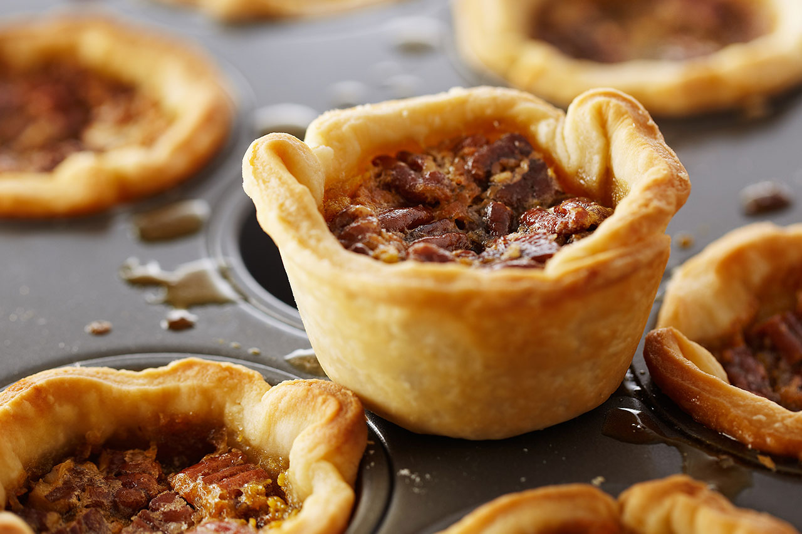

# Butter Tarts

*Ontario's signature pastry: small shortcrust shells filled with translucent caramel of brown sugar, butter and egg, baked till the filling sets to a slightly wobbly centre.*

**Serves:** 12 small tarts

**Prep Time:** 30 minutes (plus 30 minutes chilling pastry)

**Cook Time:** 22 minutes

## Overview
The butter tart is one of Ontario's most identity-defining baked goods, made in Ontario farm kitchens since at least the 1890s. The construction is simple but every element matters. The pastry is a basic short pastry: flour, butter, a little lard for traditional flakiness, cold water. Rolled thin, cut into rounds, pressed into small individual tart tins. The filling is brown sugar, melted butter, egg, vanilla and a splash of white vinegar; the vinegar is essential, it prevents the sugar crystallising and keeps the filling translucent. The bake starts hot at 200 °C to set the pastry edges, then drops to 180 °C to set the filling without over-browning. Two debates divide Ontario households. Runny vs firm centre: Toronto leans runny, the North and Maritimes leans set. Raisin vs pecan vs plain: traditional farm kitchens used raisins, modern bakeries lean plain or pecan. This is the slightly-runny, optional-raisin Ontario classic.

## Ingredients

### The shortcrust pastry (for 12 small tarts; 7-8 cm tart tins)
- 250 g plain flour
- 1/2 teaspoon fine sea salt
- 1 teaspoon caster sugar
- 125 g cold unsalted butter, cubed
- 60 g cold lard OR 60 g extra cold butter, cubed
- 1 large egg yolk
- 3-5 tablespoons ice-cold water

### The butter-tart filling
- 200 g soft light brown sugar (or 50/50 light + dark for deeper flavour)
- 80 g unsalted butter, melted and cooled to lukewarm
- 1 large egg, lightly beaten
- 2 tablespoons golden corn syrup OR golden syrup (gives extra shine and gloss; can be omitted)
- 1 tablespoon white vinegar OR cider vinegar (essential)
- 1 teaspoon vanilla extract
- A small pinch of fine sea salt
- 1/4 teaspoon ground cinnamon (optional; modern variant)

### Optional add-ins (pick one or skip)
- 60 g raisins, soaked in hot water for 10 minutes then drained (the traditional Ontario inclusion)
- 60 g toasted pecans, roughly chopped (the modern Ontario inclusion)
- 60 g walnut halves (the Northern Ontario variant)
- 60 g currants

### Equipment
- 12 individual tart tins (7-8 cm wide, 2.5 cm deep): non-stick is helpful
- A 9 cm round cookie cutter
- A baking tray

## Method

### Stage 1 - Make the pastry
1. Combine the flour, salt and sugar in a large bowl.
2. Add the cold butter and lard cubes; rub with cold fingertips till the mixture resembles coarse breadcrumbs.
3. Whisk the egg yolk with 3 tablespoons of ice water; add to the dry mix.
4. Gather into a rough dough; add more cold water 1 tablespoon at a time only if needed.
5. Shape into a flat disc; wrap in cling film.
6. Refrigerate at least 30 minutes (overnight is better).

### Stage 2 - Roll, cut and shape the tart shells
1. Heat the oven to 200°C (180°C fan).
2. Lightly butter the 12 tart tins (skip if non-stick).
3. On a floured surface, roll the pastry to 3 mm thick.
4. Cut out 12 rounds with a 9 cm cookie cutter (re-rolling scraps once is fine).
5. Press each round gently into a tart tin, easing it up the sides; the pastry should reach the top of the tin's rim.
6. Place the lined tart tins on a baking sheet.

### Stage 3 - Make the filling
1. Whisk the brown sugar, melted butter, beaten egg, corn syrup, vinegar, vanilla, salt and optional cinnamon together in a bowl.
2. The mixture should be smooth and pourable, like thick custard.
3. Don't over-whisk, you don't want to incorporate air.

### Stage 4 - Add the optional fillings
1. If using raisins or pecans, divide them evenly among the 12 lined tart tins (about 1 tablespoon per tart).

### Stage 5 - Fill and bake
1. Pour the filling into each tart shell to about 2/3 full, DO NOT OVER-FILL (the filling expands and overflows; an overflow burns onto the tin and sticks).
2. Bake on the middle shelf of the oven at 200°C for 8 minutes.
3. Reduce the oven to 180°C (160°C fan); bake 12-14 minutes more till the pastry edges are deep golden and the filling has set around the edges but still wobbles slightly in the centre (for a runny-centre tart) or is fully set (for a firm-centre tart).
4. The filling will continue to set as it cools.

### Stage 6 - Cool and unmould
1. Let the tarts cool in the tins 8-10 minutes (the filling sets enough to handle).
2. Run a thin knife around the edge of each tart to release.
3. Lift out gently with a small palette knife; place on a wire rack.
4. Cool fully before storing, the filling firms further as it cools.

### Stage 7 - Serve
1. Best eaten at room temperature, the day they are baked.
2. With a cup of strong tea or a glass of cold milk.
3. The runny-centre version is best eaten within 24 hours (the moisture in the filling softens the pastry over time); the firm-centre version keeps a few days longer.

## Notes
- **Vinegar in the filling is essential:** it prevents the sugar crystallising and keeps the filling translucent. Don't skip.
- **Don't over-fill:** 2/3 full is the maximum. The filling expands and bubbles over; spillage burns on the tin and stops the tart releasing cleanly.
- **Runny vs firm:** pull the tarts when the centres still wobble for the Toronto-style runny butter tart; bake an extra 3-4 minutes for the Northern Ontario firm-set version.
- **Pastry should NOT be pre-baked:** unlike a French tartelette, butter tarts bake the pastry and the filling together. The hot initial heat sets the pastry edges; the lower heat cooks the filling.
- **Cool in the tin:** filling that's still hot will crack and fall apart if you try to unmould while warm. 10 minutes resting is the minimum.
- **The raisin debate:** Ontario households are divided. Both versions are valid. If undecided, do half raisin and half pecan.

## Variations
- **Butter tarts with pecans (modern):** swap raisins for 60 g toasted chopped pecans.
- **Maple butter tarts:** swap 2 tablespoons of the brown sugar for 2 tablespoons pure maple syrup; reduces overall sweetness and adds maple notes, the Quebec-Ontario crossover.
- **Butter tarts with walnuts:** the Northern Ontario classic - 60 g walnut halves.
- **Chocolate-chip butter tarts (modern):** scatter 60 g small dark-chocolate chips on the bottom of each tart before filling, the Cottage-Country variant.
- **Bourbon butter tarts:** add 1 tablespoon of bourbon to the filling, the modern bakery variant.
- **Salted-caramel butter tarts:** add a heavier pinch of fleur de sel on top of each tart in the last 2 minutes of baking; sprinkle a few flakes after cooling.
- **Butter-tart squares (sheet variant):** press the pastry into a 23 × 23 cm tin; pour the filling on top; bake 30 minutes; cool, cut into 16 squares, the home-cook shortcut.
- **Open-faced large butter tart (Ontario diner style):** make one big tart in a 23 cm tart tin; bake 35-40 minutes; serve as a sliced pie. Less traditional but practical for parties.

## Serving
- At an Ontario bakery (the traditional setting; Maid's Cottage, Crust & Crumb, or the legendary Doo Doo's Tarts in Bailieboro) · at a cottage-country Sunday brunch in the Muskoka or Kawartha lakes · at a Toronto coffee shop with a cup of strong tea · at a Canadian Thanksgiving dinner · at a Canada Day picnic · at home as the traditional small treat with afternoon tea · as the Ontario birthday-tea pastry.

## Storage
- Stores 3 days at cool room temperature in an airtight container (separate layers with parchment paper).
- Refrigerates 5 days, bring to room temperature before serving.
- Freezes 3 months, baked, defrost at room temperature for 2 hours; the texture is slightly firmer after freezing.
- The runny-centre version is best within 24 hours; the moisture softens the pastry over time.
- The firm-centre version keeps longer (4-5 days at room temperature).
- The raw filling can be made 24 hours ahead and refrigerated; whisk briefly before using.
