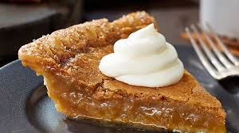

<!-- TODO: hero image undersized, refresh from Pexels or hand-curate -->
# Maple-Syrup Pie (Tarte au Sirop d'Érable)

*Quebec's spring dessert: shortcrust pie filled with caramelised maple syrup, cream, brown sugar and eggs, baked till the filling sets to a wobbly fudgy centre.*

**Serves:** 8 (one 23 cm pie)

**Prep Time:** 25 minutes (plus 30 minutes pastry chilling)

**Cook Time:** 50 minutes

## Overview
Tarte au sirop d'érable is the Quebec dessert that distils the entire maple-sugar tradition into one tin. The construction is dazzlingly simple: shortcrust pie shell, filling of caramelised maple, cream and egg, baked till just set. The pie's character lives or dies by the syrup. Use pure Canadian maple, grade A "Dark, Robust" or older "Grade B"; the darker grades carry more depth, more caramel, more woody-toffee character. Grade A "Light, Golden" gives a paler, sweeter, less interesting pie. Three Quebec-specific moves: the syrup is reduced on the hob for four or five minutes before joining anything else, which concentrates flavour and gives a filling that sets reliably; the reduced syrup is whisked with double cream, brown sugar, eggs and a small amount of cornflour (without the cornflour, the filling stays soft and runny); and the bake starts hot at 200 °C to set the pastry, then drops to 170 °C to set the filling without burning the top. Serve with a counterbalance of whipped cream or vanilla ice cream; the pie is intensely sweet.

## Ingredients

### The shortcrust pastry (for one 23 cm pie shell)
- 220 g plain flour
- 1 teaspoon fine sea salt
- 2 teaspoons caster sugar
- 110 g cold unsalted butter, cubed
- 45 g cold lard OR 45 g extra cold butter
- 1 large egg yolk
- 3-4 tablespoons ice-cold water

### The maple-syrup filling
- 350 ml pure Canadian maple syrup (Grade A "Dark, Robust" or Grade B)
- 100 g soft dark brown sugar
- 200 ml double cream
- 30 g unsalted butter
- 1 tablespoon cornflour
- 2 large eggs, lightly beaten
- 1 teaspoon vanilla extract
- A small pinch of fine sea salt
- 1 tablespoon Canadian whisky OR rum (optional; modern adult variant)

### To finish (egg wash for the pastry rim)
- 1 egg yolk + 1 tablespoon milk

### To serve
- Lightly whipped unsweetened double cream OR a scoop of good vanilla ice cream
- A drizzle of extra maple syrup over the top (optional - some Quebecois would consider this gilding the lily)
- Chopped toasted pecans or walnuts (optional)
- A small glass of cold dessert wine OR a digestif of Calvados / Cognac
- Fresh raspberries for colour and tartness (optional)

## Method

### Stage 1 - Make the pastry
1. Combine the flour, salt and sugar in a large bowl.
2. Add the cold butter and lard cubes; rub with cold fingertips till the mixture resembles coarse breadcrumbs.
3. Whisk the egg yolk with 3 tablespoons of ice water; add to the dry mix.
4. Gather into a rough dough.
5. Shape into a flat disc; wrap in cling film.
6. Refrigerate at least 30 minutes (overnight ideal).

### Stage 2 - Roll and line the pie tin
1. Heat the oven to 200°C (180°C fan).
2. Lightly butter a 23 cm pie dish.
3. Roll the pastry on a floured surface to 4 mm thick and 30 cm across.
4. Drape over the pie dish; press gently into the base and sides.
5. Trim the overhang with a knife, leaving 1 cm.
6. Fold the overhang under itself; crimp with a fork or fingers.
7. Prick the base with a fork in several places.
8. Refrigerate 15 minutes while you make the filling.

### Stage 3 - Reduce and prep the maple filling
1. In a heavy small saucepan, combine the maple syrup, brown sugar and butter.
2. Bring to a gentle boil over medium heat.
3. Reduce to a simmer for 4-5 minutes, stirring occasionally. The mixture should darken slightly and reduce by about 1/4.
4. Take off the heat; let cool 10 minutes.

### Stage 4 - Build the filling
1. Whisk the cornflour with the double cream in a small bowl until smooth (no lumps).
2. Stir the cream-cornflour mixture into the cooled maple reduction.
3. Whisk in the beaten eggs slowly (a steady stream while whisking) to prevent them scrambling.
4. Stir in the vanilla, salt and optional whisky/rum.

### Stage 5 - Fill and bake
1. Brush the rim of the chilled pastry with the egg-yolk-and-milk glaze.
2. Pour the filling into the pastry shell.
3. Place the pie on a baking tray (catches any drips).
4. Bake at 200°C for 10 minutes.
5. Reduce the oven to 170°C (150°C fan); bake 35-40 minutes more.
6. The pie is done when the edges are set but the centre still wobbles slightly when gently shaken. The top should be a deep gold-brown.

### Stage 6 - Cool
1. Lift onto a wire rack.
2. Cool fully - at least 3 hours - before slicing. The filling sets entirely as it cools.
3. The pie can be served at room temperature or slightly warm; cold is also acceptable.

### Stage 7 - Serve
1. Slice into 8 wedges with a hot knife (dip in hot water, wipe dry).
2. Place a wedge on each plate.
3. Add a generous spoonful of lightly whipped unsweetened cream alongside (essential - the pie is intensely sweet on its own).
4. Optional: scatter a few toasted pecans, a drizzle of extra maple, or a small handful of fresh raspberries.
5. Serve with a small glass of dessert wine or coffee.

## Notes
- **Dark maple syrup is essential:** Grade A "Dark, Robust" or older "Grade B" gives the depth this pie needs. "Light, Golden" gives a thin, one-dimensional pie.
- **Reduce the syrup:** 4-5 minutes of simmering concentrates the flavour and gives a more reliable set. Don't skip.
- **Cornflour is the setting agent:** without it, the filling stays soft. The 1 tablespoon is calibrated; less and it runs, more and it goes claggy.
- **Cool fully before slicing:** a warm pie cuts soft. Cool at least 3 hours; the filling firms entirely as it cools.
- **Cream or ice cream on the side is essential:** the pie's intensity demands balance. Don't serve it naked - the sweetness is overwhelming alone.
- **Pure maple, never pancake syrup:** "maple-flavoured syrup" is corn syrup with artificial flavouring; the result is shockingly sweet and one-dimensional.

## Variations
**Maple-walnut pie:** scatter 100 g toasted walnut halves over the base of the pie shell before pouring in the filling - the Quebec-Ontario crossover.
**Maple-pecan pie (the southern-cousin version):** swap walnuts for pecans, omit the cornflour, follow the standard pecan-pie format. Reads more American than Canadian.
**Sugar-shack maple pie (more intense):** double the maple syrup and skip the brown sugar; add an extra 1 tablespoon cornflour to compensate; the Quebec sugar-shack version is unapologetically syrupy.
**Whisky-maple pie:** double the optional Canadian whisky in the filling - the adult dinner-party variant.
**Maple cream pie (no-bake):** make a cooked maple custard with cornflour; pour into a baked crust; chill - lighter, smoother, modern.
**Tarte au sucre (sugar pie):** the sweeter cousin - made with brown sugar and cream, no maple syrup. A Quebec staple in households without access to maple syrup.
**Mini maple-syrup tarts:** divide the filling among 12 individual tart shells; bake 18-22 minutes - the buffet variant.
**Maple-syrup pie with bourbon-pecan crumble top:** add a streusel topping (60 g butter + 60 g flour + 60 g brown sugar + 40 g chopped pecans) in the last 15 minutes of baking - the modern Toronto bakery variant.

## Serving
At a Quebec sugar shack (cabane à sucre) at the end of a maple-tapping season meal (the traditional setting; March-April in Quebec) · at a Quebec Christmas Eve reveillon dessert table · at a Canadian Thanksgiving dinner · at a Quebec family Sunday lunch · at a Toronto restaurant dessert menu · at home as the showpiece for a Canadian dinner-party · paired with a glass of late-harvest Riesling or a small Canadian ice wine.

## Storage
- Refrigerates 5 days. The pie can be served straight from the fridge or warmed gently (a 150°C oven for 10 minutes).
- Freezes 3 months (whole or in slices) - defrost overnight in the fridge.
- Don't keep at room temperature longer than 24 hours - the egg-cream filling is perishable.
- Slices are easier to cut when cold; bring to room temperature before serving.
- Leftover filling (very small amount that won't fit in the pie) can be baked in ramekins as individual custards - 25 minutes at 170°C.
