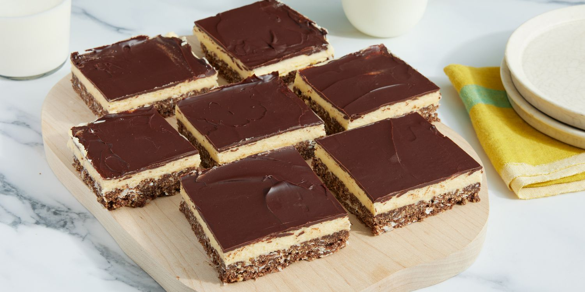

# Nanaimo Bars

*British Columbia's signature no-bake bar: three layers of graham-crumb base, custard-powder butter-icing middle, and a snap of dark chocolate top.*

**Serves:** 16 squares

**Prep Time:** 35 minutes

**Cook Time:** 5 minutes (for the bottom layer) + 4 hours chilling

## Overview
The Nanaimo bar is British Columbia's most famous sweet, named for the Vancouver Island town where it was first published in a 1950s church cookbook. Three distinct horizontal layers, each made separately, stacked and refrigerated to set. The bottom is crushed graham cracker crumbs (digestives in the UK) with cocoa, finely chopped walnuts and shredded coconut, bound with melted butter, sugar and a briefly cooked beaten egg, pressed firmly into a parchment-lined tin. The middle is a soft butter icing flavoured with Bird's custard powder (yellow tin, English-origin), milk and vanilla. The custard-powder layer is what makes a Nanaimo bar a Nanaimo bar; without it you have a nameless biscuit. The top is dark chocolate melted with a little butter, poured over the cold custard layer, swirled flat and refrigerated till set. Four hours minimum in the fridge before cutting; cut too early and the layers smear together.

## Ingredients

### Layer 1 - The crumb base
- 125 g unsalted butter
- 60 g caster sugar
- 60 g unsweetened cocoa powder
- 1 large egg, lightly beaten
- 220 g graham cracker crumbs (or digestive biscuit crumbs - blitz biscuits in a food processor)
- 90 g sweetened shredded coconut
- 60 g walnuts, finely chopped

### Layer 2 - The custard butter icing (the BC essential layer)
- 150 g unsalted butter, soft (room temperature)
- 3 tablespoons Bird's Custard Powder (yellow tin; UK Bird's)
- 3 tablespoons whole milk
- 1 teaspoon vanilla extract
- 300 g icing sugar, sifted

### Layer 3 - The chocolate top
- 120 g good dark chocolate (60-70% cocoa), chopped (or chopped milk chocolate for a softer top)
- 30 g unsalted butter

### Equipment
- A 23 × 23 cm square tin, lined with parchment that overhangs (the overhang is the lift-out handle)
- A small saucepan
- A heatproof bowl

## Method

### Stage 1 - Make the bottom layer
1. Place the butter, caster sugar and cocoa powder in a heatproof bowl set over a saucepan of barely simmering water (no contact between bowl and water).
2. Stir 3-4 minutes till the butter melts and the mixture is smooth and glossy.
3. Whisk in the beaten egg slowly, stirring constantly. The egg pasteurises in the gentle heat (1-2 minutes); the mixture will thicken slightly to the consistency of soft fudge.
4. Take off the heat.
5. Stir in the graham cracker crumbs, shredded coconut and chopped walnuts till evenly combined.
6. Tip the mixture into the parchment-lined tin.
7. Press firmly with the back of a spoon (or with another small tin pressed on top) to create an even, compact base layer.
8. Refrigerate 30 minutes till firm.

### Stage 2 - Make the custard butter icing
1. In a large mixing bowl, beat the soft butter with a wooden spoon or electric beater till light and fluffy (2-3 minutes).
2. Sprinkle the custard powder over; beat in.
3. Add the milk and vanilla; beat to combine.
4. Sift in the icing sugar in 3 batches, beating after each addition.
5. The mixture should be a smooth, soft, spreadable butter icing - just stiff enough to hold its shape but soft enough to spread cleanly.

### Stage 3 - Apply the middle layer
1. Take the cold tin from the fridge.
2. Dollop the custard icing over the chilled base.
3. Spread evenly with a palette knife to a uniform thickness (about 1 cm thick).
4. Smooth the top.
5. Refrigerate 1 hour till the icing is fully firm (not just chilled - it should be solid enough to support the chocolate top without smearing).

### Stage 4 - Make the chocolate top
1. Place the chopped chocolate and butter in a heatproof bowl over a saucepan of barely simmering water.
2. Stir gently till just melted and smooth.
3. Take off the heat; let cool 3-4 minutes (don't pour hot chocolate over the cold butter icing - it will melt the icing layer).
4. The chocolate should still be pourable but no longer hot to the touch.

### Stage 5 - Apply the chocolate top
1. Pour the melted chocolate evenly over the chilled custard layer.
2. Tilt the tin gently so the chocolate flows to the edges.
3. Use a palette knife if needed to ensure complete coverage.
4. Tap the tin gently on the work surface to release any bubbles.
5. Refrigerate 30 minutes.

### Stage 6 - Score and chill
1. When the chocolate is just set but still gives slightly when pressed (about 25-30 minutes in the fridge), take the tin out.
2. With a sharp knife dipped in hot water and wiped dry, score the chocolate into 16 squares (4 × 4 grid). This scoring lets you cut clean edges later.
3. Refrigerate at least 3 more hours (4 hours total minimum from start; overnight ideal).

### Stage 7 - Cut and serve
1. Lift the entire slab out of the tin using the parchment overhang.
2. Place on a board.
3. With a sharp hot knife (dip in hot water, wipe dry between cuts), slice along the score lines into 16 squares.
4. Serve cold, with a strong cup of coffee or a glass of cold milk.

## Notes
- **Bird's Custard Powder is the canonical ingredient:** the yellow tin of UK/Canadian Bird's. Substitute with 3 tablespoons vanilla instant pudding mix + 1/4 teaspoon yellow food colouring + 1/2 teaspoon extra vanilla extract, but the flavour is slightly different.
- **Cool the chocolate before pouring:** hot chocolate over cold custard icing melts the middle layer and creates a smeared mess. 3-4 minutes off the heat is essential.
- **Score before fully set:** cutting cold-hard chocolate cracks the top. Score the soft-set chocolate with a hot knife; refrigerate; cut along the score lines later.
- **Sweetened coconut:** shredded sweetened coconut is the canonical type. Unsweetened works but the bar tastes drier; reduce caster sugar by 30 g if using unsweetened.
- **Don't substitute the walnuts with almonds:** the walnut bitterness is part of the flavour profile. Pecans work as a substitute; almonds give a different (and arguably inferior) result.
- **Layers must be cold before the next goes on:** rushing means the layers smear together. Patience is the rule.

## Variations
**Mint Nanaimo bars:** add 1/2 teaspoon peppermint extract to the middle layer; tint pale green - the after-dinner-mint variant.
**Mocha Nanaimo bars:** add 2 teaspoons instant espresso powder to the middle layer and to the chocolate top.
**Peanut-butter Nanaimo bars:** replace 30 g of butter in the middle layer with 30 g peanut butter; add chopped peanuts to the base.
**Raspberry Nanaimo bars:** add a layer of raspberry jam (about 3 tablespoons) spread between the bottom and middle layers - the modern bakery variant.
**Maple Nanaimo bars:** replace 60 g of icing sugar in the middle layer with 60 ml maple syrup; the texture is slightly softer.
**Boozy Nanaimo bars:** add 1 tablespoon Cognac, Irish Cream, or Canadian whisky to the middle layer.
**Vegan Nanaimo bars:** swap butter for vegan block butter; egg for 3 tablespoons aquafaba; milk for almond milk; the custard powder is technically vegan (read the label).
**Round Nanaimo "truffles":** roll the chilled middle-layer icing into balls; dip in the chocolate-and-butter top mix; refrigerate till set - the bite-sized variant for canapés.

## Serving
At a BC tea-room (the canonical setting) · at a Vancouver Island café · at a Nanaimo bakery (the canonical city is the namesake) · at a Canadian Thanksgiving dessert table · at a Canadian Christmas cookie tray · at a Vancouver office potluck · at a Canadian community fundraiser bake sale · at home as a make-ahead Sunday-afternoon treat · paired with a strong cup of black tea or coffee.

## Storage
- Refrigerates 1 week in an airtight container (separate layers with parchment).
- Freezes 3 months wrapped tight; defrost in the fridge overnight before serving.
- Best served cold - leaving them at room temperature for 30 minutes softens the chocolate; longer than an hour and the layers start to migrate.
- Don't store at room temperature - the butter-heavy middle layer goes soft and the layers blur.
- Pre-cut squares stack well in a tin if separated by parchment circles between layers.
- The crumb base can be made 24 hours ahead and pressed; the rest of the bars assembled the next day.
