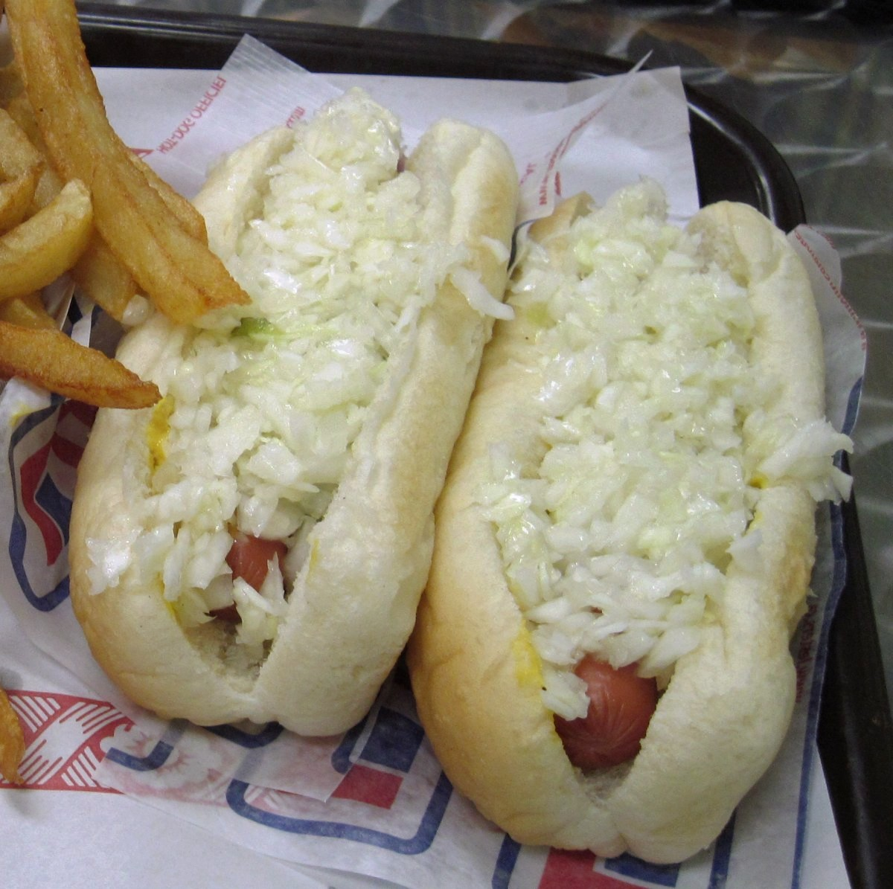

# Montreal "All-Dressed" Hot Dog (Toute Garnie)

*Montreal's steamed hot dog: a steamed all-beef frankfurter in a steamed New England-style top-split bun, topped with yellow mustard, chopped raw onion, and shredded raw cabbage. The Quebec snack-bar institution; "all-dressed" or "toute garnie" is the traditional ordering phrase at Montreal's casse-croûte counters.*

**Serves:** 4

**Prep Time:** 10 minutes

**Cook Time:** 8 minutes

## Overview
The Montreal all-dressed hot dog (toute garnie in French) is the signature Quebec take on the hot dog and a fixture of every Montreal casse-croûte (snack bar). The construction is more restrained than American regional dogs: a steamed all-beef frankfurter in a steamed New England top-split bun, topped with the traditional all-dressed trio of yellow mustard, finely chopped raw onion, and finely shredded raw white cabbage. The cabbage is the Quebec-distinctive ingredient, finely shredded and eaten raw, almost slaw-like but undressed. The "steamé" (steamed) version is the traditional Montreal preparation; the "toasté" version with the bun toasted on the flat-top is the alternative, ordered by name at any counter from a Belle Province to a corner dépanneur. Some snack-bar variants add sweet pickle relish; cheese versions add a slice of melted cheddar. Eat with a side of fries and a paper cup of root beer.

## Ingredients

### Sausages and buns
- 4 standard all-beef frankfurters
- 4 New England-style top-split hot-dog buns (or substitute with side-split buns, but the top-split is traditional Montreal)
- 2 tablespoons butter (for toasting buns the toasté way; skip for the steamé way)

### Toppings
- 4 tablespoons yellow mustard (Gulden's, French's; not Dijon)
- 1 small white onion (very finely chopped)
- 200 g white cabbage (very finely shredded; no dressing)
- 4 tablespoons sweet pickle relish (optional; traditional at some Montreal snack bars)

### To serve
- Poutine (the traditional Montreal side: fries + cheese curds + gravy)
- Or French fries with a side of mayo or vinegar (Quebec style)
- A cold Molson Canadian or Boréale beer
- A vintage Pepsi cola (Quebec is a famous Pepsi market)

## Method

### Stage 1 - Steam the sausages
1. Set up a steamer: a wide pan with a steamer insert, or a metal colander over a saucepan of simmering water.
2. Place the frankfurters in the steamer basket.
3. Steam 5-6 minutes till heated through and slightly plumped.

### Stage 2 - Steam the buns (steamé style)
1. Place the top-split buns in the steamer above the simmering water for 30 seconds.
2. The bun should be soft and slightly damp from the steam.

### Stage 2b - Or toast the buns (toasté style)
1. If you want the toasted version: butter the flat exterior sides of each top-split bun.
2. Toast cut-side-down (the flat sides) on a hot griddle 60 seconds till golden.

### Stage 3 - Build the all-dressed (toute garnie)
1. Open the steamed (or toasted) bun.
2. Place a steamed sausage in the bun.
3. A zigzag of yellow mustard down the length of the dog.
4. A heap of finely chopped raw onion.
5. A generous heap of finely shredded raw cabbage piled on top.
6. Optional: a spoonful of sweet pickle relish alongside or under the mustard.

### Stage 4 - Serve immediately
1. With poutine or fries on the side.
2. A cold beer or a Pepsi.
3. Eat with hands; the steamed bun holds together remarkably well.

## Notes
- **Steamed, not grilled:** the traditional Montreal preparation. The snack-bar steamer is always running.
- **New England top-split bun:** the structural signature. Side-split buns work but aren't right.
- **Shredded raw cabbage, undressed:** the Quebec ingredient. Not slaw - just raw shredded cabbage.
- **Yellow mustard, chopped onion, cabbage:** the traditional "all-dressed" trio.

## Variations
**Toasté:** bun toasted on the flat-top instead of steamed.
**Michigan-style (Quebec):** add a meat-tomato sauce (Quebec interpretation of the upstate-NY Michigan dog).
**Fromage:** add a slice of melted cheddar on the dog.
**Stimé Bacon (steamed with bacon):** wrap the sausage in bacon before steaming (the bacon doesn't get crispy; it adds flavour).
**Pogo (corn dog):** the Quebec corn-dog-on-a-stick variant.

## Serving
At a Belle Province or Lafleur snack-bar in Montreal; at a Quebec dépanneur (corner store) lunch counter; at home with poutine and Pepsi.

## Storage
- Cooked sausages refrigerate 4 days.
- Buns: best fresh; freeze 1 month.
- Don't assemble in advance.
