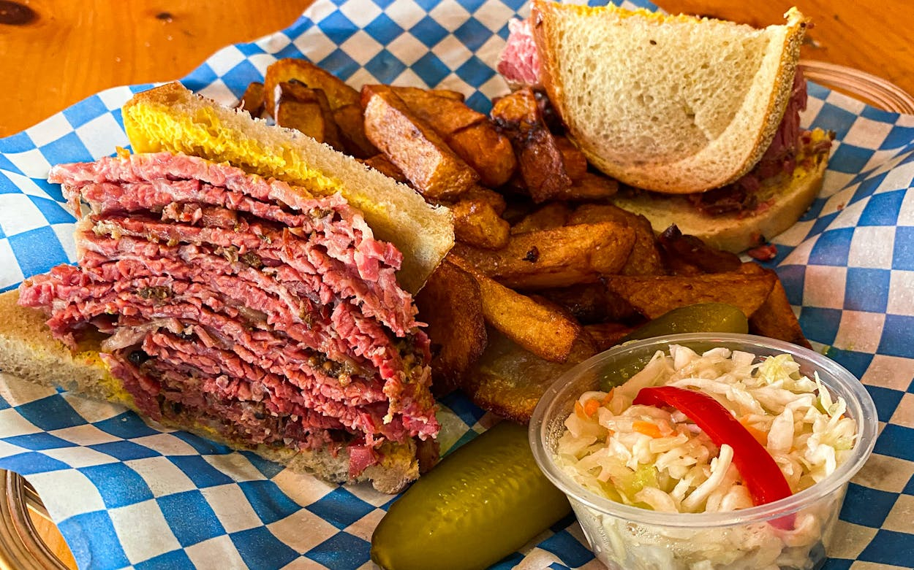

# Montreal Smoked-Meat Sandwich

*Montreal's deli icon: hand-cut slices of brisket cured ten days, smoked, then steamed tender and piled high on rye spread with yellow mustard. Served with a sour pickle and frites.*

**Serves:** 4 (sandwiches)

**Prep Time:** 30 minutes (active)

**Cook Time:** 10 days curing + 4 hours smoking + 4 hours steaming

## Overview
The Montreal smoked-meat sandwich is one of Canada's most identity-defining deli dishes, distinct from New York pastrami in three ways. The cure uses a heavier hand of coriander seed and black pepper with less paprika, and runs ten to fourteen days rather than the shorter pastrami cure. The meat is traditionally a brisket "plate" cut from the navel end, with more fat marbling than the flat that holds up to the long process. The cold smoke at low temperature followed by hours of steaming is the technique that gives slice-paper-thin-without-crumbling texture; either step alone gives a worse sandwich. Schwartz's on Saint-Laurent has been making it since 1928 and remains the traditional reference. The serving is austere: 4 mm slices piled to a 5 or 6 cm stack on rye spread thinly with yellow mustard, with a sour pickle and frites on the side. Nothing else. This is a project: two weeks from start to first bite. A sous-vide shortcut is in Variations.

## Ingredients

### The brisket and cure (for one about 2.5 kg brisket, about 16 sandwiches)
- 1 whole "plate" or point-cut brisket, about 2.5 kg, with the fat cap mostly intact
- 80 g coarse kosher salt
- 30 g granulated sugar
- 20 g Prague Powder #1 (curing salt with 6.25% sodium nitrite) - essential for safety on a long cure
- 4 tablespoons coarsely cracked black pepper
- 4 tablespoons whole coriander seeds, cracked
- 2 tablespoons whole black peppercorns, cracked
- 2 tablespoons whole mustard seeds
- 2 tablespoons granulated garlic powder
- 1 tablespoon paprika
- 1 tablespoon ground coriander
- 2 teaspoons dried thyme
- 2 teaspoons ground allspice
- 1 teaspoon ground bay leaf (or 4 fresh bay leaves crushed)

### The rub (applied just before smoking)
- 4 tablespoons coarsely cracked black pepper
- 4 tablespoons coarsely cracked coriander seed

### For the sandwich (per sandwich)
- 180-220 g sliced steamed smoked meat (4 mm slices, hand-cut perpendicular to the grain)
- 2 slices fresh rye bread (seedless or caraway), about 1 cm thick
- 1 generous teaspoon prepared yellow mustard (French's or a Canadian equivalent; NOT Dijon, NOT honey-mustard)

### To serve alongside
- 1 large sour pickle (kosher dill, half-sour, or full-sour)
- 1 cold Cott Black Cherry soda OR cherry cola
- A handful of Belgian-style or Quebec-style frites
- Optional: a small mound of coleslaw (some delis include, some don't)

## Method

### Stage 1 - The cure (day 0 to day 10)
1. Trim excess fat from the brisket but leave a 5 mm fat cap intact.
2. Combine the kosher salt, sugar, Prague Powder #1, and all dry spices in a bowl. Mix thoroughly.
3. Pat the brisket dry. Rub the cure all over, working into every surface.
4. Place the brisket in a large food-grade plastic bag or non-reactive container.
5. Seal and refrigerate.
6. Every 2 days, flip the brisket and massage the cure into the surface. Liquid will accumulate (this is normal - the brine forms around the meat).
7. Continue for 10 days (some Quebec delis do 14 days; the longer cure penetrates more deeply and gives a more intense flavour).

### Stage 2 - The rinse and rub
1. After the cure, remove the brisket from the bag.
2. Rinse thoroughly under cold running water; pat dry.
3. (Optional but traditional: soak the brisket in cold fresh water for 1-2 hours to draw out excess salt. Schwartz's purists skip this step; the cure is what makes the meat.)
4. Pat dry again.
5. Combine the rub ingredients (extra cracked black pepper and coriander); press generously into every surface of the brisket.

### Stage 3 - The smoke
1. Set up a smoker at 95-110°C (200-225°F).
2. Use hardwood for smoke - oak, hickory, maple (Quebec traditional), or apple.
3. Place the brisket fat-side-up on the smoker rack.
4. Smoke 4-6 hours till the internal temperature reads 65°C and a dark, mahogany bark forms on the outside.
5. Don't go above 110°C - this is a cold-to-warm smoke, not a hot grill.

### Stage 4 - The steam (this is the Montreal move)
1. Remove the smoked brisket from the smoker.
2. Wrap tightly in 2-3 layers of cling film, then foil.
3. Place in a deep roasting tin on a wire rack with 5 cm of water in the bottom.
4. Cover the whole tin with foil to seal in the steam.
5. Place in an oven at 150°C (130°C fan).
6. Steam for 3-4 hours till the brisket is fork-tender (internal 92-96°C) and the meat is soft enough to slice without crumbling.

### Stage 5 - Cool and slice
1. Let the brisket rest in the foil 30 minutes after steaming.
2. Unwrap; the brisket is now ready to slice.
3. Use a sharp slicing knife (or a deli slicer); slice perpendicular to the grain (across the fibres) into 4 mm thick slices.
4. Don't slice too thin - paper-thin slices fall apart; 4 mm is sturdy enough to handle and tender enough to bite through.

### Stage 6 - Build the sandwich
1. Lightly toast or warm 2 slices of rye bread.
2. Spread one slice with yellow mustard, edge to edge.
3. Pile 180-220 g (or whatever feels obscene) of warm smoked meat slices onto the mustard slice.
4. Cap with the second slice of rye.
5. Cut diagonally with a serrated knife (or in half straight across; both are acceptable).

### Stage 7 - Serve
1. Place a whole sour pickle alongside.
2. Pour a cold Cott Black Cherry soda over ice.
3. Add a handful of fries on the plate.
4. Eat immediately - smoked meat is at its peak warm.

## Notes
- **Prague Powder #1 is essential:** the nitrite cure prevents botulism during the 10-day cure. Don't skip; don't substitute regular salt for the full quantity.
- **A 10-day cure is the minimum:** the spices penetrate slowly. Less than 10 days gives an under-cured, pale interior.
- **Steam after smoking:** this is THE Montreal move that distinguishes the dish from New York pastrami. The steam makes the meat sliceable and tender.
- **Slice perpendicular to the grain:** the fibres run lengthwise in a brisket; you slice across them. Wrong-direction slices are stringy.
- **Yellow mustard, not Dijon:** Schwartz's serves French's yellow mustard. Dijon is too sharp and stops you tasting the meat.
- **No cheese, no mayo, no lettuce, no tomato:** the Montreal classic is meat + rye + mustard. Adding anything else is a denial of the tradition.

## Variations
**Sous-vide shortcut:** cure 7 days; vacuum-seal; sous-vide at 80°C for 24 hours; finish under a hot smoker or in a 230°C oven for 30 minutes for the bark. 24 hours of sous-vide replicates the 4-hour steam stage; the cure is shorter, the smoke shorter, but the result is very close.
**Smoked meat on rye with mustard AND pickles (Schwartz's "complète"):** the traditional Schwartz's order - add a side of sliced sour pickle on the sandwich itself.
**Smoked meat poutine:** chop the smoked meat into smaller pieces; scatter over a finished poutine - see [Poutine](poutine.md) variations.
**Lean cut sandwich:** ask for "lean" - thicker slices from the trimmed point with minimal fat. Schwartz's purists order "medium" for a balance of fat and lean.
**Smoked meat omelette:** chop 100 g into small pieces; fold into a 3-egg omelette with Swiss cheese - the deli breakfast variant.
**Smoked meat hash:** dice 200 g smoked meat; fry with diced potato, onion, and a fried egg on top.
**Vegan "smoked meat" (modern):** seitan or jackfruit slow-cooked with the Montreal spice profile and smoked - surprisingly close.

## Serving
At Schwartz's Hebrew Delicatessen in Montreal (the traditional setting; the queue down Saint-Laurent Boulevard at any hour) · at any Montreal Jewish deli (Lester's, Smoked Meat Pete, Snowdon Deli) · at a Toronto deli with Montreal pedigree · at home as a special-project weekend with friends · as a Quebec Saint-Jean-Baptiste celebration dish (24 June) · at any Canadian summer barbecue with a touch of theatre.

## Storage
- Smoked meat (cooked) refrigerates 5 days wrapped tight; steam-reheat for 10 minutes to restore tenderness.
- Freezes 3 months sliced and vacuum-packed; defrost in the fridge overnight.
- Don't microwave smoked meat - the steam-reheat is essential to keep it tender.
- Leftover smoked meat is the basis of dozens of next-day dishes: hash, poutine, omelette, sandwich-revival.
- The 10-day cure brisket can be made and held at the post-cure / pre-smoke stage in the fridge for an extra week if you can't get to the smoke step.
- Caraway rye for the sandwich keeps 3 days at room temperature; slice fresh each time.
