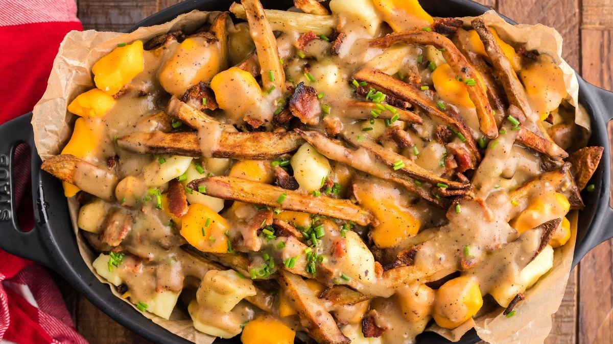

# Poutine

*Quebec's national plate: twice-fried potato fries piled in a wide bowl, topped with fresh squeaky cheese curds, then drowned in hot brown gravy that partially melts the curds.*

**Serves:** 4

**Prep Time:** 25 minutes (plus 30 minutes rest between fries)

**Cook Time:** 35 minutes

## Overview
Poutine (pronounced "poo-TEEN", not "poo-TIN") is Quebec's most famous food export and the dish that, more than any other, has come to symbolise Canadian comfort food. Born in rural Quebec in the 1950s and spread nationwide by the 1980s, it's now sold from Vancouver to Halifax. The construction is bracingly specific: three components, none complicated, but each one matters. First, the fries: floury potatoes cut about 1 cm thick, blanched then fried again hot for crisp golden sturdiness; the double-fry is non-negotiable because a single-fry chip goes limp under the gravy in thirty seconds. Second, the cheese curds: fresh, at room temperature, that audibly squeak when bitten. The squeak is the test; refrigerated curds more than twelve hours old don't squeak. Third, the gravy: a deeply savoury brown built from a roux and beef-or-chicken stock, with a touch of vinegar and pepper to lift it. Layered hot fries, then curds, then gravy. Eaten immediately with a fork.

## Ingredients

### The fries (twice-fried, see [Belgian frites](../belgian/side-dishes/belgian-frites.md) for full method)
- 1.2 kg floury potatoes (Yukon Gold, Russet, Maris Piper)
- 2 litres refined sunflower or groundnut oil (or beef tallow for the canonical taste)
- Fine sea salt

### The brown gravy
- 60 g unsalted butter
- 60 g plain flour
- 500 ml hot beef stock (homemade or good shop-bought; the Quebec canonical is 50/50 beef + chicken)
- 250 ml hot chicken stock
- 1 tablespoon Worcestershire sauce
- 1 teaspoon soy sauce (gives umami and colour depth)
- 1 teaspoon apple cider vinegar OR white wine vinegar
- 1/2 teaspoon black pepper
- 1/4 teaspoon dried thyme
- Salt to taste

### The cheese curds
- 350 g fresh white cheese curds (at ROOM TEMPERATURE; take out of the fridge 1 hour ahead)
- (Substitute: 350 g fresh mozzarella, torn into walnut-sized pieces - loses the squeak but gains the melt)

### To serve
- 4 wide shallow bowls (warmed)
- Forks (no knife needed)
- Optional: a small bottle of hot sauce, a small dish of pickled jalapeños, a cold beer

## Method

### Stage 1 - Cut and soak the potatoes
1. Peel and cut the potatoes into 1 cm thick batons (about 1 × 1 × 7-9 cm).
2. Soak in cold water 15 minutes to wash off surface starch.
3. Drain and pat thoroughly dry on a clean tea towel.

### Stage 2 - First fry (the blanch)
1. Heat the oil to 150°C in a deep heavy pot.
2. Fry the potatoes in 3 batches, 5-6 minutes each batch, till tender-soft and pale (no colour yet).
3. Lift out with a wire spider; drain on a wire rack over a tray.
4. Let rest at least 15 minutes (or up to 2 hours).

### Stage 3 - Make the brown gravy
1. Melt the butter in a heavy saucepan over medium heat.
2. Whisk in the flour; cook 3-4 minutes till the roux is the colour of peanut butter (a darker roux gives more flavour and colour).
3. Slowly whisk in the hot beef stock, then the hot chicken stock, in a steady stream.
4. Simmer 6-8 minutes, whisking, till the gravy is glossy and the consistency of double cream.
5. Stir in the Worcestershire sauce, soy sauce, vinegar, black pepper and thyme.
6. Taste and adjust salt (the soy and Worcestershire are salty; you may not need extra).
7. Keep warm over the lowest heat, with a lid loosely on.

### Stage 4 - Bring curds to room temperature
1. Take the cheese curds out of the fridge at least 1 hour before serving.
2. Place in a bowl at room temperature.
3. Cold curds don't squeak and won't soften properly under the gravy.

### Stage 5 - Second fry (the crisp)
1. Heat the oil to 180°C.
2. Fry the rested potatoes in batches, 2-3 minutes each, till deep golden and crisp.
3. Lift out, drain briefly, then tip onto a tray lined with kitchen paper.
4. Season generously with fine sea salt immediately while hot.

### Stage 6 - Assemble
1. Working fast, pile a generous portion of hot fries into each warm bowl.
2. Scatter a quarter of the room-temperature cheese curds over the top of each.
3. Ladle a generous amount of hot gravy over the curds and fries, making sure the gravy reaches every fry.
4. The hot gravy should soften (but not fully melt) the cheese curds in 30 seconds.
5. Serve IMMEDIATELY with a fork.

## Notes
- **The curds must be FRESH:** within 24 hours of being made. Refrigerator-stored curds for several days lose their squeak entirely. Look for "fresh today" labels at farmer's markets.
- **Don't substitute grated cheese:** grated cheddar melts into a uniform layer; the curd-clumps are the textural identity of poutine.
- **Twice-fried fries are non-negotiable:** single-fry potatoes go soggy in 30 seconds under the gravy. The double-fry + the salt-coating + the rest is the engineering that makes poutine work.
- **Gravy temperature matters:** the gravy must be HOT (just below boiling) when ladled so it softens the curds. Lukewarm gravy gives you cold curds in cold sauce.
- **Eat immediately:** poutine is at its peak for about 4 minutes. After 8 minutes the fries are limp and the curds have melted fully.

## Variations
**Poutine au foie gras:** add a small slice of seared foie gras on top - the Au Pied de Cochon Montreal restaurant variant. Very upmarket.
**Poutine galvaude:** add chunks of cooked chicken and green peas to the gravy - a Quebec rural variant.
**Poutine smoked-meat:** add chopped Montreal smoked-meat brisket over the curds - the deli variant.
**Poutine au pulled pork:** add slow-cooked pulled pork in the gravy - a modern restaurant variant.
**Italian poutine:** swap the gravy for marinara, the curds for fresh mozzarella - a Quebec-Italian crossover.
**Poutine breakfast:** add a fried egg on top, runny yolk through the gravy - the brunch variant.
**Vegetarian mushroom poutine:** swap the beef-chicken gravy for a deep mushroom-stock gravy; the curds stay.
**Vegan poutine:** vegan cheese curds (jackfruit-based work surprisingly well) + a vegetable-stock gravy thickened with cornflour.
**Quebec-style poutine "all-dressed":** add chopped pickles, raw onion, a dribble of yellow mustard on top - the diner variant.

## Serving
At a Quebec roadside chip-stand (the canonical setting; La Banquise in Montreal is the famous tourist spot but most Quebecois eat it at their local cabane-à-patates) · at a Quebec hockey-arena snack bar · at a Canadian university dining hall at 2 am after a night out · at a Canadian winter ski-resort lodge · at a Toronto food-truck festival · at home as a Friday-night Canadian comfort plate.

## Storage
- Doesn't store. Eat within 5 minutes.
- Leftover gravy refrigerates 4 days; freeze 3 months.
- Leftover fries (without gravy) refrigerate 2 days; refresh in a 200°C oven 6 minutes.
- Don't refrigerate assembled poutine - the fries go limp and the cheese curd texture is destroyed.
- Cheese curds keep refrigerated up to 5 days but lose the squeak after 24 hours; rescue old curds by warming briefly under a hot grill (they melt nicely even if they no longer squeak).
