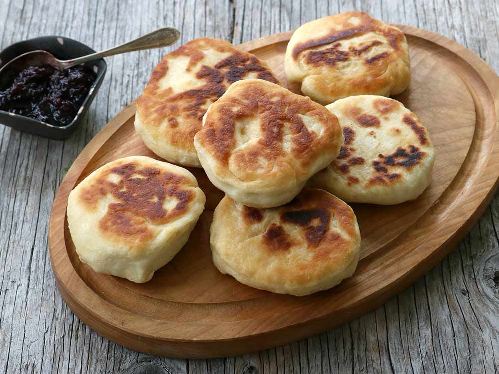

# Bannock (Canadian Fry Bread)

*Canada's most widely cooked Indigenous bread: a simple dough of flour, water, salt and a spoon of fat, pan-fried golden or wrapped around a stick and toasted over a fire.*

**Serves:** 8 (small flat rounds)

**Prep Time:** 10 minutes

**Cook Time:** 12 minutes (in 2-3 batches)

## Overview
Bannock is the canonical Indigenous bread of Canada, with roots that predate European arrival. The pre-contact version used wild grain flours (cattail root, wild rice, ground corn) mixed with water and fat and cooked on hot rocks or wrapped on green sticks over fires. The modern flour-based form post-dates the introduction of wheat flour by traders in the late 18th and 19th centuries. Today's Canadian Indigenous bannock uses wheat flour, a small amount of baking powder for lift (some traditional recipes are unleavened), salt, water or milk, and a spoon of lard, butter or vegetable oil. It's the most adaptable bread in Canada: pan-fried into "fry bread", oven-baked into thick discs, wrapped on a stick and toasted over a campfire, or shallow-fried into puffy plate-sized rounds associated with First Nations and Métis foodways. Eaten with butter and jam, with stews, with soup, with smoked fish, with maple syrup. This recipe is the pan-fried home version.

## Ingredients

### The dough (for 8 small rounds)
- 400 g plain flour (or 50/50 plain and whole-wheat for a denser, more rustic loaf)
- 3 teaspoons baking powder
- 1 teaspoon fine sea salt
- 2 teaspoons granulated sugar (optional; gives a slight sweetness - some traditional cooks include, some don't)
- 40 g cold unsalted butter OR lard, cubed (or 3 tablespoons vegetable oil mixed in at the end)
- 250-300 ml warm water OR warm whole milk

### For pan-frying
- 60 ml sunflower oil OR melted lard (enough to give a 4-5 mm depth in a heavy frying pan)

### To serve
- Salted butter
- Saskatoon-berry jam OR strawberry jam OR maple syrup
- A pot of strong tea (Red Rose, Tetley, or any sturdy Canadian brand)

## Method

### Stage 1 - Mix the dry ingredients
1. In a wide bowl, combine the flour, baking powder, salt and (optional) sugar.
2. Whisk to mix evenly.

### Stage 2 - Cut in the fat
1. Add the cold butter or lard cubes (or pour in the oil if using).
2. Rub with cold fingertips till the mixture resembles coarse breadcrumbs.

### Stage 3 - Add the liquid
1. Pour in 250 ml of the warm water or milk.
2. Mix with a wooden spoon till a shaggy dough forms.
3. Add more liquid 1 tablespoon at a time only if needed; the dough should be soft but not sticky.

### Stage 4 - Light knead and rest
1. Turn the dough out onto a lightly floured surface.
2. Knead very gently 4-5 times - just till it comes together into a smooth ball.
3. DON'T over-knead - bannock is meant to be light and slightly crumbly inside.
4. Let rest 5 minutes.

### Stage 5 - Shape
1. Divide the dough into 8 equal portions (about 90 g each).
2. With floured hands, shape each into a flat round about 10 cm across, 1.5 cm thick.
3. Some cooks use a wooden spoon to make a small dimple in the centre (this prevents a domed centre while frying).

### Stage 6 - Pan-fry
1. Heat the oil to medium-low (around 160°C if you have a thermometer; or test with a small piece of dough - it should bubble gently but not violently).
2. Working in batches of 2-3, lower the bannocks gently into the oil.
3. Fry 3-4 minutes on the first side till deep golden.
4. Flip carefully with tongs; fry 3-4 minutes on the second side till golden.
5. The bannock should be cooked through (firm, not doughy in the centre); if it's still soft inside, lower the heat and cook longer.
6. Lift out with tongs; drain briefly on kitchen paper.

### Stage 7 - Serve immediately
1. Pile the warm bannocks on a board or platter.
2. Cut into wedges or eat whole, broken open by hand.
3. Spread with salted butter, then jam or maple syrup.
4. Serve with a pot of strong tea.

## Notes
- **Don't over-knead:** bannock is meant to be light, slightly crumbly, almost biscuit-like inside. Over-kneading makes it tough.
- **Medium-low heat:** the bannock needs time to cook through. High heat burns the outside before the inside is done.
- **Eat warm:** bannock is best within an hour of cooking. It firms up as it cools and loses some of its character.
- **Sugar is optional:** Indigenous home cooks vary widely on this. Some include sugar (gives a slight sweetness that pairs well with savoury fillings); some don't. Both are valid.
- **Whole-wheat half-and-half:** swapping in 50% whole-wheat flour gives a more rustic, slightly denser bannock. Traditional in some First Nations communities.

## Variations
**Oven-baked bannock (the "tea biscuit" cousin):** form into one large 25 cm disc; bake on a parchment-lined tray at 220°C (200°C fan) for 18-22 minutes till deep golden and a tester comes out clean. Cut into wedges.
**Stick-wrapped bannock (canoe-trip / pow-wow style):** wrap a fist-sized ball of dough around the peeled end of a green stick (birch is canonical); toast over the embers of an open fire, turning slowly, 12-15 minutes till the outside is crisp and the inside cooked through.
**Cinnamon-raisin bannock:** add 80 g raisins and 1 teaspoon ground cinnamon to the dough - the breakfast / sweet variant.
**Cheddar bannock:** fold 100 g grated mature cheddar through the dough - the modern savoury variant.
**Saskatoon-berry bannock:** fold 80 g fresh or dried Saskatoon berries through the dough; pan-fry as normal - the prairie variant.
**Wild-rice bannock:** add 80 g cooked wild rice to the dough - the Northern Ontario / Manitoba variant.
**Métis "fry bread" (puffy):** thin the dough slightly (5 mm thick rounds); deep-fry in hot oil till puffed and golden - the larger, puffier Métis variant served with chili or stew on top.
**Skillet-baked bannock (one big disc):** pour the dough straight into a hot oiled cast-iron skillet; bake at 220°C for 25 minutes - the canoe-trip variant where you only have one pot.
**Sweet bannock with maple syrup:** drizzle warm maple syrup over the freshly-fried bannock - the sugar-shack lunch.

## Serving
At an Indigenous community feast (the canonical setting) · at a First Nations powwow · at a Métis cultural event · at a Canadian camp or canoe trip · at a Yukon trapline cabin · at a Saskatchewan farm kitchen · at home as a side for chili, stew, or breakfast eggs · at an Indigenous-led restaurant (e.g. Salmon n' Bannock in Vancouver, NishDish in Toronto) · as the universal Canadian bread accompaniment.

## Storage
- Best within 4 hours of cooking. After that the texture firms and the bannock loses its softness.
- Cool, wrapped in a clean tea towel, keeps 24 hours at room temperature; refresh in a hot oven for 4 minutes to soften.
- Freezes 2 months wrapped tight; defrost at room temperature and refresh in the oven.
- Day-old bannock makes excellent French toast - dip in beaten egg and milk, pan-fry, serve with maple syrup.
- The dough itself doesn't keep well - bannock is a make-and-eat bread, not a make-ahead one.
