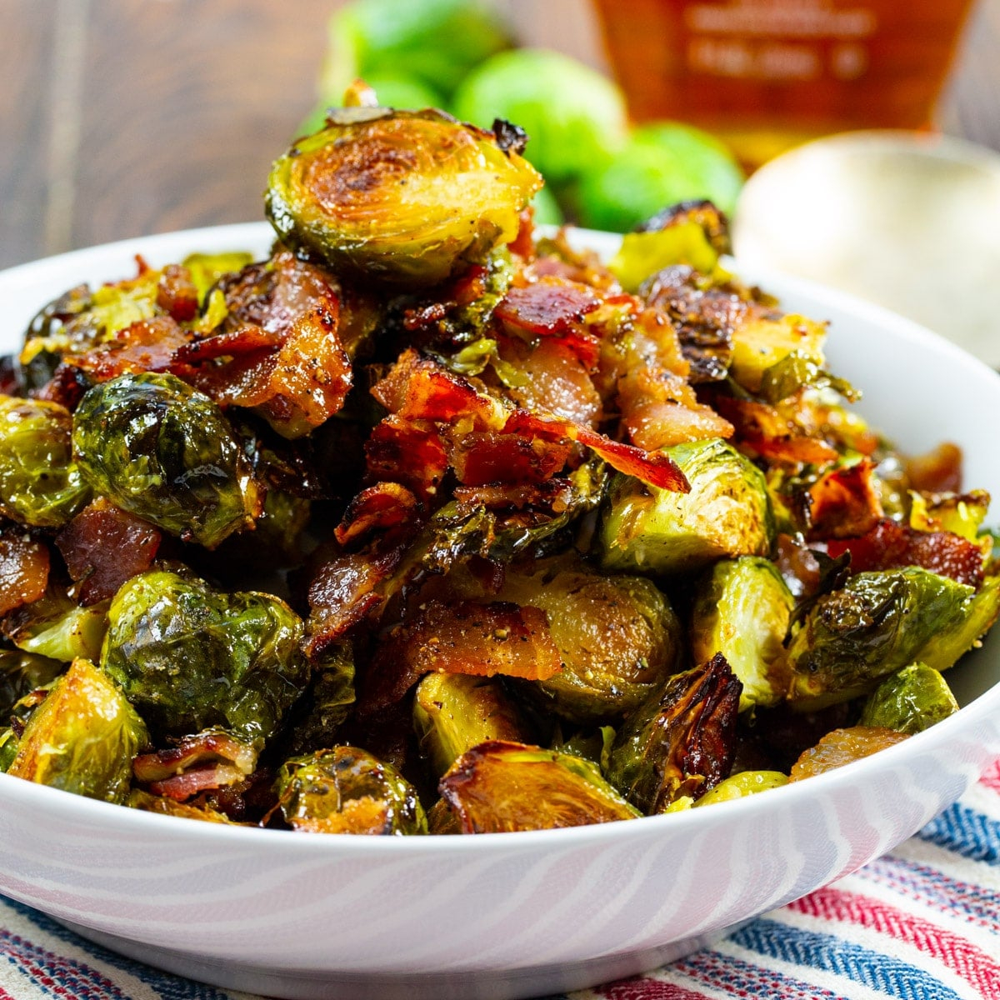

# Maple-Bacon Brussels Sprouts

*The Canadian Thanksgiving side: halved Brussels sprouts pan-roasted with chunky bacon lardons till deep brown, glazed with maple syrup, lemon and flaky salt at the end.*

**Serves:** 6 (as a side)

**Prep Time:** 15 minutes

**Cook Time:** 25 minutes

## Overview
Maple-bacon Brussels sprouts is the modern Canadian side dish that's elbowed its way onto every Thanksgiving and Christmas table. The construction is built on three steps that each matter. First, the prep: sprouts halved so the cut face caramelises against the pan, loose outer leaves saved (they crisp into chips), bacon cut into chunky 1 cm lardons rather than thin slices, since the thicker pieces give crisp texture. Second, the cook: bacon rendered slowly to release its fat and lifted out crisp; sprouts seared cut-side-down in the bacon fat at high heat without moving for four or five minutes till deeply browned; tossed and finished briefly in the oven till tender. Third, the glaze: pure Canadian maple syrup (grade A "Dark, Robust" for the deepest flavour) splashed in at the end with a squeeze of lemon, reducing to a glossy lacquer that coats every sprout. The bacon goes back in, flaky salt finishes. The Canadian touch is the maple, which gives a distinctly woody-caramel sweetness.

## Ingredients

### The sprouts
- 800 g fresh Brussels sprouts, trimmed and halved (outer wilted leaves discarded; loose nice leaves reserved)

### The bacon
- 200 g good thick-cut smoked streaky bacon, cut into 1 cm lardons
- 1 tablespoon sunflower oil (only if the bacon is very lean)

### The maple glaze finish
- 3 tablespoons pure Canadian maple syrup (grade A "Dark, Robust")
- 2 tablespoons cider vinegar OR lemon juice
- 1/2 teaspoon Dijon mustard
- 1/4 teaspoon black pepper
- A pinch of red chilli flakes (optional; modern variant)
- 1 teaspoon flaky sea salt (Maldon)

### To finish
- 2 tablespoons toasted pecans, roughly chopped (optional)
- A few sprigs of fresh thyme leaves (optional)

### To serve alongside
- Cedar-plank salmon, roast turkey, baked ham, or a Sunday roast
- A glass of cold dry Riesling or a Canadian Pinot Noir

## Method

### Stage 1 - Prep the sprouts
1. Trim the woody stem from each sprout (cut a thin slice; the leaves often loosen).
2. Halve each sprout lengthways through the stem.
3. Set aside the loose outer leaves - they'll crisp into separate small chips in the pan.

### Stage 2 - Render the bacon
1. Heat the oven to 200°C (180°C fan).
2. Place the bacon lardons in a heavy oven-proof frying pan or a roasting tin (cast iron is ideal).
3. Cook over medium heat 6-8 minutes till the bacon is crisp and has rendered its fat.
4. Lift the bacon out with a slotted spoon; set aside on kitchen paper.
5. Leave the rendered bacon fat in the pan.

### Stage 3 - Sear the sprouts
1. Increase the heat to medium-high.
2. If the pan looks dry, add 1 tablespoon of sunflower oil.
3. Place the sprouts CUT-SIDE-DOWN in a single layer (you may need 2 batches).
4. DO NOT MOVE THEM for 4-5 minutes - this is where the deep brown caramelisation forms.
5. Once the cut faces are deep brown, scatter in the loose outer leaves.

### Stage 4 - Roast in the oven
1. Transfer the pan to the hot oven.
2. Roast 8-10 minutes till the sprouts are tender (a knife slides in easily) and the outer leaves are crisp.
3. Don't overcook to mush - the sprouts should still have a slight bite.

### Stage 5 - The maple glaze finish
1. Take the pan back onto the stove over medium heat.
2. Whisk together the maple syrup, vinegar (or lemon juice), Dijon mustard, pepper and (optional) chilli flakes.
3. Pour this over the sprouts.
4. Toss to coat; cook 1-2 minutes till the syrup bubbles and reduces to a glossy lacquer that coats every sprout.

### Stage 6 - Finish and serve
1. Return the crisp bacon lardons to the pan; toss.
2. Tip into a warm serving bowl.
3. Scatter with flaky sea salt, optional toasted pecans, optional fresh thyme leaves.
4. Serve immediately while hot.

## Notes
- **Sear hard and don't move them:** the secret to good Brussels sprouts is high heat + cut-side-down + no fidgeting. Stirring keeps them pale.
- **Save the loose leaves:** the outer leaves that fall off during prep crisp into small chips in the oven - they're the cook's reward.
- **Grade A "Dark, Robust" maple syrup:** the darker grades give deeper caramelisation and more woody-caramel flavour. Light amber is too thin for this.
- **Don't over-reduce the glaze:** the maple syrup should coat the sprouts but not cement them together. 1-2 minutes of bubbling is enough.
- **Bacon goes back in last:** if the bacon spends time in the oven, it loses its crispness. Add at the end.
- **Don't overcook the sprouts:** mushy sprouts in maple syrup is what gives Brussels sprouts a bad reputation. Tender-crisp is the goal.

## Variations
**Maple-bacon Brussels sprouts with pecans (Christmas variant):** add 80 g toasted pecans at the end with the bacon - the classic Canadian Christmas variation.
**Maple-glazed sprouts (vegetarian):** skip the bacon; use 3 tablespoons of olive oil and brown the sprouts in that. Finish with the same maple glaze, plus 2 tablespoons toasted walnuts.
**Maple-bacon sprouts with chili flakes (modern):** double the chili flakes and add a tablespoon of gochujang or sriracha to the glaze - the modern restaurant variant.
**Sprouts with maple-balsamic glaze:** swap the vinegar for aged balsamic - sweeter, more Italian-Canadian.
**Maple-bacon sprouts with goat cheese (modern):** crumble 80 g of good goat cheese over the top after plating - the cheese-shop variant.
**Brussels sprout salad (cold variant):** shave raw sprouts thin; toss with the cooled maple-bacon dressing, toasted pecans, and shredded cheddar - the cold-buffet version.
**Maple-bacon sprouts on toast (the modern small-plate):** spread the warm sprouts over a slice of grilled sourdough with whipped ricotta - the modern Canadian bistro starter.

## Serving
At a Canadian Thanksgiving table (the canonical setting; second Monday of October) · at a Canadian Christmas dinner · at a Vancouver Island Sunday roast · at a Toronto modern-Canadian gastropub alongside steak frites · at a Quebec sugar-shack spring feast · at home as a weeknight side with grilled chicken or salmon · paired with a roast turkey, glazed ham, or [Cedar-plank salmon](../cedar-plank-salmon.md).

## Storage
- Refrigerates 3 days. Reheat in a hot pan with a touch of oil to refresh the crisp; or in a 200°C oven for 8 minutes.
- Don't microwave - the texture goes soft and limp.
- Freezing not recommended - the sprouts lose their bite irreversibly.
- The maple glaze on its own (whisked together) keeps refrigerated 2 weeks - use as a quick dressing on any roasted vegetable.
- Day-old sprouts chopped finely and folded into a baked-potato hash with an egg on top is an excellent breakfast.
