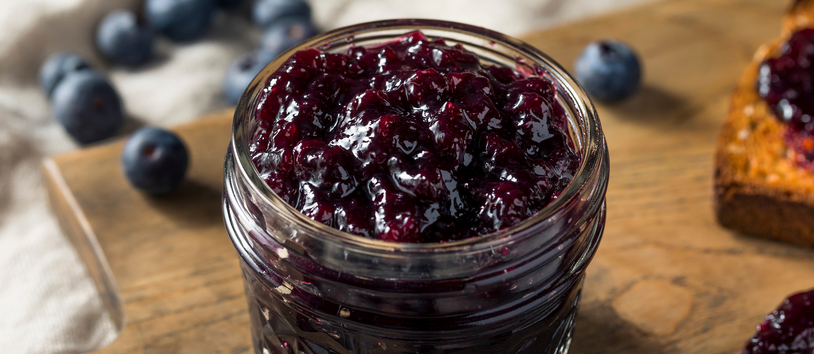

# Saskatoon-Berry Compote

*The Canadian prairie's signature preserve: saskatoon berries simmered with sugar, lemon and cinnamon till they collapse into a glossy purple syrup with a marzipan note.*

**Serves:** 8 (makes about 400 g compote)

**Prep Time:** 10 minutes

**Cook Time:** 25 minutes

## Overview
Saskatoon berries are the Canadian prairie's signature wild fruit, growing on Amelanchier alnifolia shrubs across Manitoba, Saskatchewan and Alberta. They look like small blueberries, deep purple-blue with a powdery bloom, but taste different: a cross between a blueberry and a marzipan-like sweet almond note, with thicker skins and small soft pips that give a slightly granular texture. They ripen in late July and early August; rural prairie communities go saskatoon-picking the way other regions go blackberry-picking. The compote is the most universal preparation: berries simmered with sugar, lemon juice and a small amount of cinnamon till they collapse into a sticky purple syrup, the natural pectin in the skins giving just enough body to coat a spoon without setting like jam. Spooned over Sunday pancakes, baked into the Canadian classic saskatoon-berry pie, swirled into yogurt, brushed onto roast pork in the last ten minutes, or eaten straight from the jar. Outside the prairies, use frozen saskatoons or fresh blueberries with a splash of almond extract.

## Ingredients

### The compote
- 500 g fresh OR frozen saskatoon berries (substitute: 500 g fresh blueberries + 1/4 teaspoon almond extract)
- 100-120 g granulated sugar (depending on the berry's natural sweetness; taste a few first)
- 2 tablespoons lemon juice
- Finely grated zest of 1/2 lemon
- 1/4 teaspoon ground cinnamon
- 1/4 teaspoon ground cardamom (optional; modern variant)
- A small pinch of fine sea salt
- 1 tablespoon water (only if the berries seem dry)

### To finish (optional)
- 1 teaspoon vanilla extract OR 1/2 vanilla pod scraped
- 1 tablespoon Cognac, brandy or whisky (modern adult variant)

### To serve
- Spooned over pancakes, French toast, waffles or porridge
- Swirled into Greek yogurt or whipped cream
- As a sauce for roast pork, duck breast or game
- Layered into a trifle or pavlova
- Stirred into a glaze for a Canadian-style cheesecake

## Method

### Stage 1 - Prep the berries
1. If using fresh: pick over and remove any stems, leaves, or unripe berries. Rinse and pat dry.
2. If using frozen: no need to defrost, they go straight in.

### Stage 2 - The cook
1. Place the berries in a heavy small saucepan.
2. Add the sugar, lemon juice, lemon zest, cinnamon, optional cardamom and salt.
3. If the berries are very dry (or fresh from cold storage), add 1 tablespoon water.
4. Stir gently to combine.

### Stage 3 - Simmer
1. Place over medium-low heat.
2. Cook 4-5 minutes till the sugar dissolves and the berries start to release their juice.
3. Reduce to a low simmer.
4. Cook 18-20 minutes, stirring every few minutes, till the liquid has thickened to a glossy syrup and about a third of the berries have collapsed (leaving two-thirds whole).
5. The mixture should coat the back of a spoon; a thin line drawn across the spoon stays clear for 1-2 seconds.

### Stage 4 - Finish
1. Take off the heat.
2. Stir in the optional vanilla and brandy.
3. Taste; adjust sugar if needed (the compote sweetens slightly more as it cools).
4. Let cool 10 minutes in the pan.

### Stage 5 - Jar and store
1. Transfer to a clean glass jar (250 ml or 500 ml).
2. Cool fully before sealing the lid.
3. Refrigerate.
4. Serve cold over hot pancakes, warm over cold yogurt, or any temperature combination you like.

## Notes
- **Saskatoons taste different from blueberries:** the marzipan-almond note is real, try to source the real berry if you can. Frozen Canadian saskatoons are sold online by specialty Canadian preservers; supermarket frozen blueberries with a 1/4 teaspoon almond extract added gets you close.
- **Don't over-cook:** the compote should keep some whole berries for textural interest. Cooking it down to a uniform jammy mass loses the character.
- **The pectin is in the skins:** saskatoons have plenty of natural pectin. No need to add pectin powder for this recipe.
- **Adjust sugar to taste:** late-season berries are sweeter; early-season berries are tart. Taste a few before deciding on sugar quantity.
- **Lemon goes in at the start:** the acid helps the pectin form a light set. Lemon at the end gives a thinner syrup.

## Variations
- **Saskatoon-berry pie filling:** double the recipe; add 2 tablespoons cornflour mixed with 2 tablespoons cold water; cook 2 minutes more till thick. Use as a pie filling.
- **Saskatoon-berry sauce for pork:** add 1 tablespoon Dijon mustard, 1 tablespoon balsamic vinegar, and reduce slightly thinner, excellent over roast pork loin.
- **Saskatoon-rhubarb compote:** swap 200 g of the berries for 200 g chopped rhubarb, a prairie classic spring-into-summer pairing.
- **Saskatoon-blueberry compote:** 50/50 saskatoons and blueberries, the cross-prairie variant.
- **Saskatoon syrup (thinner):** reduce the sugar to 80 g; cook only 12 minutes; strain through a sieve, use as a cocktail mixer or drizzle for cheesecake.
- **Saskatoon-berry-and-cardamom jam (deeper):** double the cardamom; cook longer with an extra 30 g sugar till the texture sets to a jam consistency.
- **Spiced saskatoon compote (winter):** add a cinnamon stick, 4 cloves, and a thin slice of ginger to the cook; remove before serving.
- **Boozy saskatoon compote:** add 30 ml maple whisky or Cognac at the end, the after-dinner sauce.

## Serving
- At a Manitoba Sunday-morning pancake breakfast (the traditional setting) · at a Saskatchewan farm kitchen at the end of saskatoon-picking season · at an Alberta cattle-ranch barbecue · alongside roast pork or duck breast at a Canadian Thanksgiving dinner · at a Calgary Stampede breakfast · at a Yukon cabin alongside bannock and butter · as the Canadian prairie answer to French confiture · paired with a glass of cold milk, hot tea, or a slice of buttered [Bannock](bannock.md).

## Storage
- Refrigerates 4 weeks in a clean sealed jar.
- For longer storage, water-bath can in proper jam jars (10 minutes for 250 ml jars at full boil); keeps a year unrefrigerated.
- Freezes 6 months in airtight containers; defrost in the fridge overnight before using.
- Once opened, refrigerate and use within 3 weeks.
- The compote thickens slightly as it cools and again in the fridge; warm gently in a saucepan to loosen if needed.
- Can be used as a glaze on the last 10 minutes of a roast pork or duck cook, heats and reduces to a sticky lacquer.
