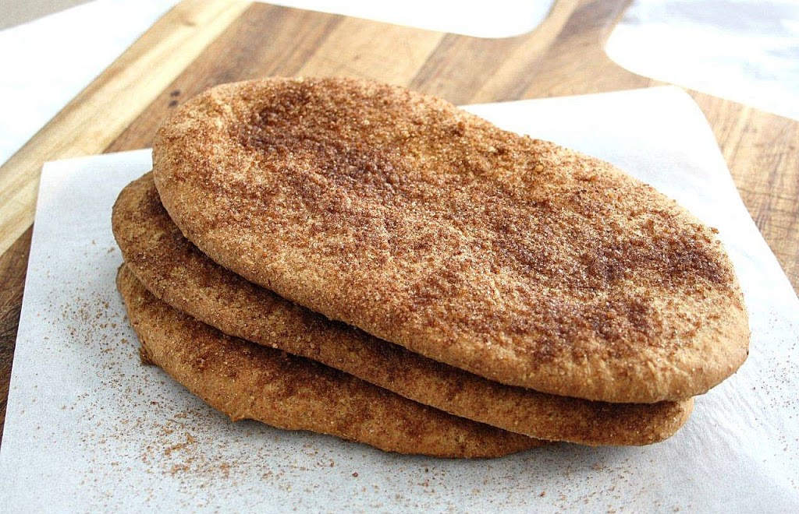

# BeaverTails (Canadian Flat Fried Doughnuts)

*Ottawa's signature winter street-food: hand-stretched flat ovals of yeasted dough deep-fried till golden and puffed, dusted with cinnamon-sugar or piled with sweet toppings.*

**Serves:** 6 large flat doughnuts

**Prep Time:** 25 minutes (plus 90 minutes for the dough to rise)

**Cook Time:** 18 minutes (3 minutes per piece)

## Overview
BeaverTails are flat, hand-stretched, deep-fried doughnuts shaped to roughly resemble a beaver's tail. The trademark is held by BeaverTails Canada Inc., who founded the kiosk chain in Ottawa in 1978; the generic Quebec name is "queues de castor". Sold from kiosks on the frozen Rideau Canal during Ottawa's Winterlude festival, now imitated across Canada from Whistler to Quebec City. The construction is built around three specifics. The dough: yeasted brioche-style, enriched with butter, milk and a single egg, rolled out and stretched by hand into irregular ovals about 25 cm long. The hand-stretching matters; the BeaverTail isn't a uniform disc, it's slightly thicker in the middle than at the edges. The fry: 180 °C for about ninety seconds per side. The topping: cinnamon-sugar is the canonical classic, but the kiosk menu includes Killaloe Sunrise (cinnamon-sugar plus lemon), Choco-Hazelnut, the Reese, the Maple, and others. Eaten hot from the fryer with your hands.

## Ingredients

### The dough
- 400 g strong white bread flour
- 60 g caster sugar
- 1 teaspoon salt
- 7 g instant dry yeast (1 sachet)
- 1 large egg
- 200 ml whole milk, lukewarm
- 60 g unsalted butter, melted and cooled
- 1 teaspoon vanilla extract

### For frying
- 2 litres sunflower oil OR rapeseed oil (or 1.5 kg beef tallow for the canonical Quebec version - a strong but excellent taste)

### Topping 1 - Cinnamon-sugar (the classic)
- 150 g caster sugar
- 3 tablespoons ground cinnamon
- A small pinch of fine sea salt

### Topping 2 - Killaloe Sunrise (cinnamon-sugar + lemon juice)
- The same cinnamon-sugar as above
- 2 tablespoons fresh lemon juice (squeezed over after sugaring)

### Topping 3 - Maple butter spread
- 60 g unsalted butter, soft
- 60 ml pure maple syrup (Grade A "Dark, Robust")
- Whisk together; spread on the hot BeaverTail

### Topping 4 - Choco-Hazelnut
- 4 tablespoons Nutella OR chocolate-hazelnut spread, warmed slightly

### Equipment
- A deep heavy pot or deep fryer (capable of 180°C)
- A spider or large slotted spoon
- A wire rack over a baking tray
- A small clean knife for shaping

## Method

### Stage 1 - Mix the dough
1. In the bowl of a stand mixer (with dough hook), combine the flour, caster sugar, salt and yeast.
2. Whisk the egg, lukewarm milk, melted butter and vanilla together in a jug.
3. Pour the wet into the dry; mix on low speed 3 minutes.
4. Switch to medium speed; knead 8 minutes till smooth, glossy and slightly tacky.

### Stage 2 - First rise
1. Scrape the dough into a lightly oiled bowl.
2. Cover with cling film.
3. Let rise at warm room temperature 75-90 minutes till doubled.

### Stage 3 - Portion the dough
1. Turn the dough onto a lightly floured surface.
2. Divide into 6 equal portions (about 110 g each).
3. Shape each into a ball.
4. Cover with a damp tea towel; let rest 10 minutes.

### Stage 4 - Hand-stretch the BeaverTails
1. Take one ball; press flat with the palm.
2. With floured hands, stretch each ball into an irregular oval about 25 cm × 10 cm, with one end slightly wider than the other and the surface slightly uneven (this is the canonical look - irregular, not perfectly oval).
3. The dough should be about 4-5 mm thick.
4. Place each stretched piece on a lightly floured baking sheet.

### Stage 5 - Heat the oil
1. Heat the oil to 180°C (use a thermometer to check).
2. Don't go above 190°C - too hot and the outside burns before the inside cooks.
3. Don't go below 170°C - the dough soaks up fat and goes greasy.

### Stage 6 - Mix the cinnamon-sugar
1. In a wide shallow dish (big enough to hold a finished BeaverTail), whisk together the caster sugar, cinnamon and salt.

### Stage 7 - Fry the BeaverTails
1. Carefully lower one stretched BeaverTail into the hot oil.
2. Fry 90 seconds on the first side till deep golden.
3. Flip with the spider; fry 60 seconds on the second side.
4. The BeaverTail should be puffed slightly and an even deep golden brown all over.
5. Lift out with the spider; drain briefly over the pot.
6. Repeat with the remaining BeaverTails one at a time (don't crowd the oil).

### Stage 8 - Top while hot
1. Immediately toss the hot fried BeaverTail in the cinnamon-sugar dish; flip and coat both sides.
2. Transfer to a serving plate.
3. Alternative: for the Maple Butter or Choco-Hazelnut versions, spread the topping over the hot BeaverTail with the back of a spoon.
4. For the Killaloe Sunrise, dust with cinnamon-sugar then squeeze a slice of lemon over the top.
5. Eat immediately - BeaverTails lose their crisp within 5 minutes.

## Notes
- **Hand-stretch, don't roll uniform:** the BeaverTail's irregular oval shape is part of its identity. A pasta-rolled uniform disc looks like a funnel cake or a deep-fried elephant ear, not a BeaverTail.
- **Hot oil is non-negotiable:** below 170°C, the dough soaks fat; above 190°C, the outside burns. Use a thermometer.
- **Topping while hot:** the sugar sticks to the hot oily surface; the Nutella melts onto the warm surface; the maple butter spreads smoothly on warm dough. Cooled BeaverTails don't take the topping the same way.
- **Eat immediately:** BeaverTails are at their peak for about 5 minutes. After 10 minutes the texture has firmed; the sugar has soaked in slightly.
- **The hole optional:** some kiosks make BeaverTails with a small finger-poked hole in the middle (a la Italian zeppole). Others don't. The hole isn't structural.
- **Don't reheat in the microwave:** the texture is destroyed. The oven (200°C for 4 minutes) revives them passably; freshly fried is always better.

## Variations
**Killaloe Sunrise (the original BeaverTails Inc. variant):** dust with cinnamon-sugar; squeeze fresh lemon juice over - the canonical Ottawa kiosk classic.
**Choco-Hazelnut BeaverTail:** spread 2 tablespoons warm Nutella over the hot pastry; eat immediately.
**Maple Butter and Skor:** spread with maple butter (recipe above); sprinkle 1 tablespoon of crushed Skor or Heath toffee bits.
**Apple Cinnamon BeaverTail:** dust with cinnamon-sugar; pile with finely chopped cooked apples (apple chunks pre-stewed with brown sugar and cinnamon).
**Reese BeaverTail:** spread peanut butter; scatter chopped Reese's Pieces or peanut-butter-cup chunks; drizzle melted chocolate.
**Lemon-Sugar BeaverTail (the British "pancake day" style):** dust with caster sugar (no cinnamon); squeeze fresh lemon juice generously over.
**Banana-Chocolate BeaverTail:** spread with Nutella; pile sliced banana on top.
**Cinnamon-Maple BeaverTail (the Quebec variant):** dust with cinnamon-sugar; drizzle pure maple syrup over.
**Vegan BeaverTail:** swap the egg for 3 tablespoons aquafaba; the butter for vegan block butter; the milk for oat milk - the texture is slightly different but works.
**Mini BeaverTails (for kids):** halve the dough portions (55 g each); make 12 smaller hand-stretched pieces; fry 60 seconds per side.

## Serving
At an Ottawa BeaverTails kiosk on the frozen Rideau Canal during Winterlude (the canonical setting; February in Ottawa) · at a Quebec winter festival · at a Canadian ski-resort village · at a Canadian National Exhibition (the CNE in Toronto) · at a Banff or Whistler summer street fair · at home as a Sunday-afternoon treat with hot chocolate · paired with a hot maple toddy or a Canadian coffee.

## Storage
- Best eaten within 5 minutes of frying. The texture is destroyed after an hour.
- Refrigerate up to 24 hours, but the texture won't fully recover; reheat in a 200°C oven for 4 minutes.
- Don't freeze fried BeaverTails - the texture goes leathery.
- The raw dough refrigerates 24 hours after the first rise (cover tight); take to room temperature for 30 minutes before stretching and frying.
- The cinnamon-sugar mix keeps indefinitely in a sealed jar - useful for sprinkling on toast, French toast, or oatmeal.
- The maple butter spread keeps refrigerated 2 weeks - excellent on toast.
