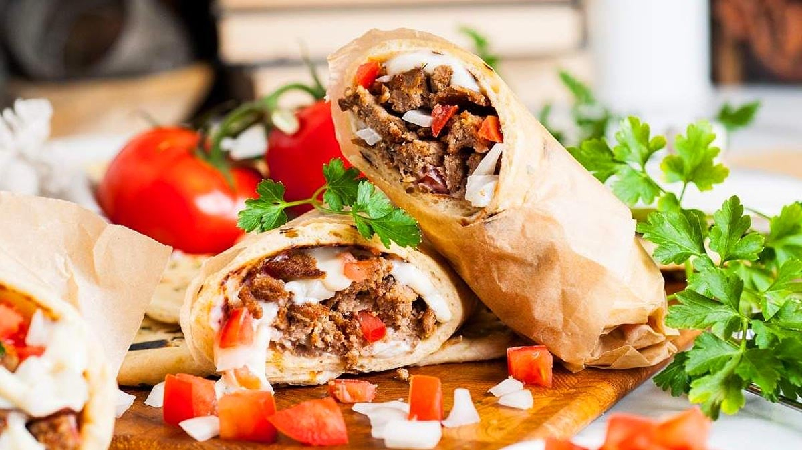

# Halifax Donair

*Nova Scotia's signature street-food: thinly sliced spiced beef wrapped in pita with raw onion, tomato and the famously sweet, garlicky condensed-milk-and-vinegar donair sauce.*

**Serves:** 4 donairs

**Prep Time:** 25 minutes (plus 4 hours or overnight rest for the meat mix)

**Cook Time:** 50 minutes (for the meat loaf) + 5 minutes assembly

## Overview
The Halifax donair is the city's most identity-defining street food, and the proud creation of Greek-Canadian families who arrived in the 1970s. Officially designated Halifax's "official food" in 2015 and eaten after midnight from Spring Garden Road kebab stands across the city. Three Halifax-specific components: the meat, the sauce, and the assembly. The meat is traditionally cooked on a vertical rotisserie, but the home version is a heavily seasoned beef loaf, kneaded thoroughly to develop a dense sliceable texture (not the loose seasoned beef you'd use for burgers), shaped, baked, refrigerated, then sliced thin and re-crisped in a hot pan. The sauce is what makes a Halifax donair Halifax: sweetened condensed milk, white vinegar and garlic powder whisked together, the chemistry thickening it to a tangy-sweet garlicky cream. The assembly is a warm soft pita, the re-crisped beef in the middle, diced raw onion and chopped tomato, a generous slick of the sweet sauce, folded into a torpedo. Wrap in foil to eat.

## Ingredients

### The meat loaf (makes enough for 4 donairs, with leftovers)
- 700 g minced beef (15-20% fat)
- 1.5 teaspoons salt
- 1.5 teaspoons dried oregano
- 1 teaspoon sweet paprika
- 1 teaspoon garlic powder
- 1 teaspoon onion powder
- 1/2 teaspoon black pepper
- 1/2 teaspoon cayenne pepper
- 1/2 teaspoon ground cumin
- 1/4 teaspoon ground allspice
- 60 ml ice water

### The famous Halifax donair sauce
- 1 × 397 g tin sweetened condensed milk (Eagle Brand or equivalent)
- 60 ml white vinegar (white distilled; NOT cider or wine)
- 1 teaspoon garlic powder
- A small pinch of salt
- (Some variants add 1 teaspoon Worcestershire sauce or 1/4 teaspoon ground coriander; the Halifax purist keeps it to the 4 ingredients above)

### The assembly (per donair, × 4)
- 1 fresh large soft pita (about 20 cm diameter; the soft "Greek-style" pocketless pita is traditional)
- 1/2 small white onion, very finely diced
- 1 ripe tomato, deseeded and finely diced
- (Optional: 2 tablespoons chopped fresh flat-leaf parsley - some Halifax purists object, some include)
- (Optional: a few thin slices of fresh jalapeño - modern variant)

### Equipment
- A loaf tin (about 24 × 11 cm) or a baking tray for shaping the loaf
- A heavy frying pan for re-crisping the slices

### To serve alongside
- A handful of [Belgian-style frites](../../belgian/side-dishes/belgian-frites.md) OR potato wedges
- Foil sheets for wrapping (the traditional Halifax serving)
- A cold can of pop or a Canadian lager
- Optional: extra sauce on the side for dipping

## Method

### Stage 1 - Make the meat mixture (the kneading is the key)
1. In a large bowl, combine the minced beef with the salt, oregano, paprika, garlic powder, onion powder, black pepper, cayenne, cumin and allspice.
2. Mix briefly with clean hands.
3. Add the ice water; mix in.
4. NOW THE CRITICAL STEP: knead the mixture vigorously for 3-4 minutes. Press, fold, slap, work it. The meat should become noticeably denser and more pasty - the texture is closer to a stiff sausage forcemeat than to a burger blend.
5. The kneading develops the meat proteins into a dense, sliceable matrix. Without this step, the loaf crumbles when sliced.

### Stage 2 - Shape and rest
1. Shape the kneaded mixture into a tight, dense loaf about 22 × 10 × 6 cm.
2. Wrap tightly in cling film.
3. Refrigerate at least 4 hours, ideally overnight, to firm up the texture and develop the spice flavour.

### Stage 3 - Bake the loaf
1. Heat the oven to 200°C (180°C fan).
2. Unwrap the chilled loaf; place on a rack over a baking tray (the fat drips into the tray).
3. Bake 40-50 minutes till the internal temperature reaches 75°C and the outside is dark brown.
4. Lift onto a board.
5. Let cool completely (1 hour at room temperature), then refrigerate at least 2 more hours till fully cold. (Cold meat slices thin without crumbling; warm meat shreds.)

### Stage 4 - Make the donair sauce
1. In a small bowl, whisk the sweetened condensed milk with the white vinegar.
2. As you whisk, the mixture will thicken visibly - the acid reacts with the milk solids.
3. Whisk in the garlic powder and salt.
4. Refrigerate at least 30 minutes (the sauce thickens further as it sits).
5. Taste; the balance is sweet-tangy-garlicky. Adjust vinegar if too sweet, or garlic if too mild.

### Stage 5 - Slice the cold meat thin
1. With a very sharp slicing knife (or a deli slicer), slice the cold meat loaf into thin slices (about 2-3 mm thick).
2. Cut the slices in half if they're too wide for a pita.

### Stage 6 - Re-crisp the slices
1. Heat a heavy frying pan over medium-high heat with no extra fat (the meat has plenty).
2. Place the slices in a single layer.
3. Cook 2 minutes per side till hot through and the edges are slightly crisped.
4. Lift onto a plate; cover loosely to keep warm.

### Stage 7 - Warm the pitas
1. Wrap the pitas in foil; warm in a 180°C oven for 4 minutes.
2. OR briefly warm each pita in a dry hot pan, 20 seconds per side.

### Stage 8 - Assemble each donair
1. Lay a warm pita flat.
2. Pile 4-6 slices of warm meat down the centre.
3. Scatter a generous spoonful of diced onion and a tablespoon of diced tomato.
4. Add optional parsley.
5. Drizzle 2-3 tablespoons of donair sauce generously over the top - don't skimp; the sauce is what makes it a Halifax donair.
6. Fold one side of the pita over, then roll into a torpedo shape.
7. Wrap the bottom half in foil to hold it together (the traditional Halifax kebab-stand presentation).

### Stage 9 - Serve immediately
1. Hand the foil-wrapped donair to the diner.
2. Eat hot, in the hand, peeling back the foil as you go.
3. Have extra sauce in a small dish for dipping.

## Notes
- **Knead the meat hard:** the dense, sliceable texture comes from vigorous mixing. Skipping this step gives you a crumbly loaf that won't slice.
- **Cold meat is essential for slicing:** warm meat shreds. The 2+ hour refrigeration is non-negotiable.
- **Sweet donair sauce is non-negotiable:** this is what makes a Halifax donair different from a generic gyro or shawarma. Don't substitute tzatziki, garlic sauce, hummus or anything else.
- **Pita choice matters:** the soft pocketless Greek-style pita is traditional. Pocket pitas don't fold the same way.
- **Use a deli slicer if you have one:** the home version with a sharp knife works, but a deli slicer gives the paper-thin slices of a proper rotisserie donair.
- **The Halifax purist insists:** beef only (no lamb, no chicken, no pork); the sweet sauce only; the onion-tomato garnish only. Other cities (Toronto, Edmonton) make modernised versions; Halifax keeps it pure.

## Variations
**Donair pizza (Halifax bar-food classic):** spread the donair sauce over a pizza base; top with sliced donair meat, mozzarella, onion, tomato; bake - the famous Halifax sit-down variant.
**Donair eggrolls:** wrap the meat, sauce and onion in Chinese egg-roll wrappers; deep-fry till crisp - the Halifax bar variant.
**Donair poutine:** chopped donair meat over poutine; drizzle of the sweet sauce instead of gravy - the modern fusion variant.
**Donair-stuffed garlic fingers:** Atlantic Canadian garlic fingers (flatbread with garlic butter and mozzarella) topped with donair meat and sauce - the classic 2 am combo.
**Chicken donair (modern):** swap the beef for spiced minced chicken; same sauce - the lighter, modern variant.
**Lamb donair (Toronto variant):** swap the beef for spiced minced lamb; the Toronto-Greek take.
**Lettuce-cup donair (low-carb variant):** skip the pita; serve the meat and toppings in butter-lettuce cups - the modern dietary-flexible variant.
**Vegan donair (modern):** crumbled spiced tempeh or seitan; the same sauce made with vegan condensed milk - surprisingly close.
**Garlic donair (extra garlic variant):** triple the garlic powder in the sauce - for the garlic-loving Halifax purist.

## Serving
At a Halifax kebab stand on Spring Garden Road or Quinpool Road after midnight (the traditional setting) · at the King of Donair on Quinpool (the founding restaurant) · at a Halifax Mooseheads or Hurricanes hockey game · at a Maritime university residence on a Friday night · at a Halifax pub for Saturday lunch · at home as a satisfying weekend dinner project · packed in foil for a Halifax-themed picnic or road trip.

## Storage
- The baked meat loaf refrigerates 5 days wrapped tight; slice and re-crisp as needed.
- Freezes 3 months sliced and vacuum-packed; defrost in the fridge overnight.
- The sauce refrigerates 2 weeks in a sealed jar; gives a slightly thicker, more deeply sweet flavour after a few days.
- Don't store the assembled donair - the pita softens and the sauce makes everything soggy within 30 minutes. Assemble fresh.
- Leftover sliced meat (without sauce) is excellent in a sandwich, on a salad, or chopped into a stir-fry.
- The sauce on its own is the secret of many Halifax recipes; use it as a dip for fries, a glaze on chicken wings, or thinned with extra vinegar as a salad dressing.
