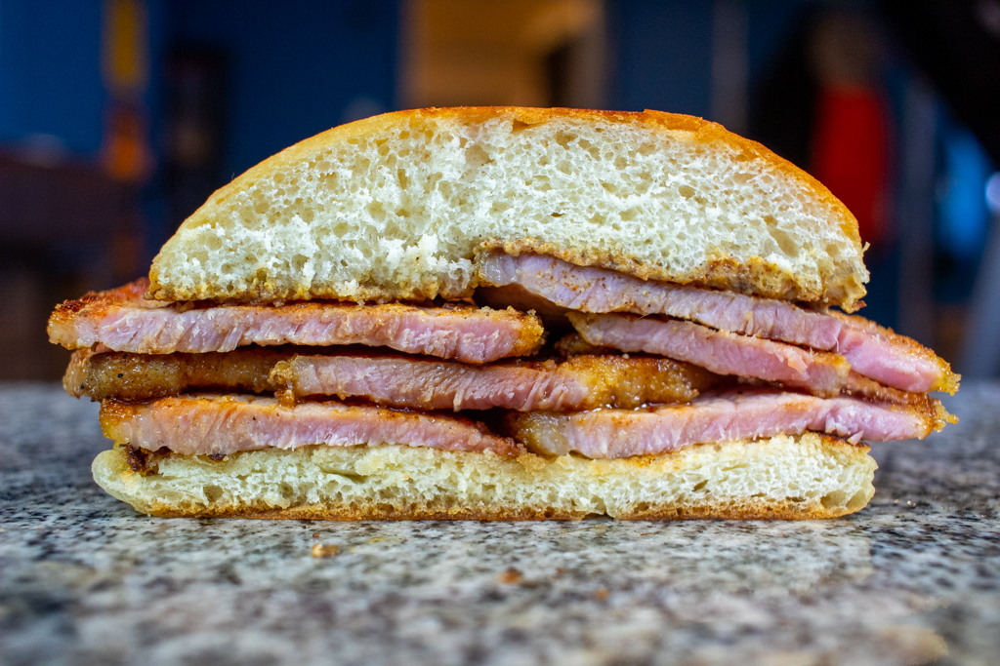

# Peameal-Bacon Sandwich

*Toronto's signature sandwich: pan-fried slices of cornmeal-rolled peameal bacon layered onto a kaiser roll with yellow mustard, tomato, lettuce and a pickle on the side.*

**Serves:** 4

**Prep Time:** 10 minutes

**Cook Time:** 12 minutes

## Overview
The peameal-bacon sandwich is Toronto's defining lunchtime dish, born at the Carousel Bakery stall in St. Lawrence Market in 1996 and now the city's most-photographed lunch. The construction sits between an American "Canadian bacon" sandwich and a British bacon butty. The bacon itself is the key distinction; peameal is not American "Canadian bacon" (which is smoked). It's an unsmoked, wet-cured boneless pork loin trimmed of all fat and rolled in fine yellow cornmeal, and the 19th-century cornmeal coating is what gave the bacon its preservative dry shell and its name. The slice thickness matters; 6 mm on a deli slicer is the traditional Toronto cut, where thinner gives papery curls and thicker gives a chewy plank. This is not crispy bacon (pan-fried only till golden and just heated through); the texture is tender, juicy and pork-loin-like, much closer to ham than to streaky breakfast bacon. A fresh kaiser roll barely toasted is the right bread, with yellow mustard the traditional condiment; tomato and lettuce are optional. A whole sour pickle on the side.

## Ingredients

### The sandwich (per sandwich, multiplied by 4)
- 4 slices peameal bacon (6 mm thick) - about 80-100 g per sandwich
- 1 tablespoon sunflower oil OR a knob of butter (for frying)
- 4 fresh kaiser rolls (about 12 cm diameter; soft white)
- 4 tablespoons prepared yellow mustard (French's or a Canadian equivalent; NOT Dijon)
- 4 thick slices of ripe tomato (optional, but the Toronto home version includes)
- 8 crisp lettuce leaves (oak leaf, romaine, or iceberg) (optional)
- A small pat of butter (optional, for spreading on the roll)

### To serve alongside
- 4 whole sour pickles (kosher dill, half-sour, or full-sour)
- 1 pile of Belgian-style or Quebec-style frites OR potato wedges
- A glass of cold Canadian lager (Molson Canadian, Labatt Blue) OR a Tim Hortons coffee

## Method

### Stage 1 - Prep the rolls
1. Slice each kaiser roll in half horizontally.
2. (Optional) Lightly toast the cut sides in a dry pan or under a hot grill for 30 seconds - just to give them a hint of golden colour and structure.
3. Spread the bottom half of each with 1 tablespoon of yellow mustard, edge to edge.
4. (Optional) Spread a thin smear of butter on the top half.

### Stage 2 - Fry the peameal bacon
1. Heat 1 tablespoon of oil in a heavy frying pan over medium-high heat.
2. Add the peameal slices in a single layer (work in 2 batches if needed).
3. Fry 3-4 minutes per side till golden brown on both sides and just heated through (internal temperature 60-65°C).
4. Don't over-cook - peameal goes dry and chewy past 70°C internal.
5. Lift onto kitchen paper to drain briefly.

### Stage 3 - Assemble
1. Place 1 slice of peameal bacon onto the mustard-spread bottom roll half.
2. Add a slice of tomato (if using) and 2 lettuce leaves.
3. Cap with the top half of the roll.
4. Press down gently.

### Stage 4 - Serve immediately
1. Cut each sandwich in half on the diagonal with a serrated knife.
2. Place on plates with a whole sour pickle on the side.
3. Add a pile of frites or potato wedges.
4. Serve with a cold beer or a Tim Hortons coffee.

## Notes
- **Peameal is not bacon as you might know it:** it's a cured, cornmeal-rolled, unsmoked pork loin. The name "bacon" is a North American convention but the texture is closer to a juicy pork chop than to crispy strip bacon.
- **6 mm slices is the traditional thickness:** thin slices dry out; thick slices don't cook through evenly. 6 mm is the sweet spot.
- **Don't over-cook:** peameal is best at 60-65°C internal - just-cooked-through, still juicy. Past 70°C and the meat goes tough.
- **Yellow mustard, not Dijon:** the traditional Toronto condiment is French's yellow. Dijon is too sharp; honey-mustard is too sweet.
- **Fresh kaiser roll:** the Polish-Canadian soft white round roll. Day-old rolls go limp. Buy fresh, eat within 6 hours of purchase.
- **No mayo, no relish:** the Carousel Bakery purist version is just peameal + mustard. Adding mayo, cheese, ranch, or chipotle sauce is a personal choice; defenders of the tradition would object.

## Variations
**The Carousel Bakery classic (the purist version):** peameal + yellow mustard + kaiser roll. Nothing else. Sold from the original stall at St. Lawrence Market in Toronto since 1996.
**Peameal sandwich with fried egg:** add an over-easy fried egg on top of the peameal - the breakfast variant.
**Peameal sandwich with cheddar:** add a slice of melted Canadian cheddar - the modern Toronto deli variant.
**Peameal on rye:** swap the kaiser roll for fresh rye bread - the Jewish-Toronto fusion variant.
**Toronto-style peameal sandwich with maple syrup:** drizzle a teaspoon of pure maple syrup over the peameal - the Quebec-Ontario crossover.
**Peameal on a brioche bun (modern):** swap the kaiser for a brioche burger bun and add caramelised onions - the upmarket gastropub variant.
**Peameal-and-egg breakfast (no bread):** skip the roll; serve the fried peameal with two fried eggs, hash browns and beans - the diner breakfast.
**Pulled peameal (modern):** cook a whole peameal roast in the oven (170°C, 90 minutes); shred and pile on the roll - the slow-cooker variant.
**Vegan "peameal" (recent):** seitan dough rolled in cornmeal, brined, slow-cooked, pan-fried. Surprisingly close in texture.

## Serving
At the Carousel Bakery stall in Toronto's St. Lawrence Market (the traditional setting; the location where the modern peameal-sandwich tradition was established in 1996) · at a Toronto diner or deli at lunchtime · at a CFL Toronto Argonauts football game · at the Canadian National Exhibition (CNE) · at a Toronto-themed Canadian celebration · at home as a Saturday-morning brunch · paired with a glass of Canadian Caesar cocktail or a strong coffee.

## Storage
- Best assembled and eaten immediately. The roll goes soggy from the mustard within 30 minutes.
- The cooked peameal bacon refrigerates 3 days; eat cold sliced thin, or pan-fry again briefly to refresh.
- Raw peameal bacon refrigerates 7 days (sealed in the deli wrapper); slice and cook as needed.
- The raw peameal freezes 3 months in vacuum-sealed portions.
- Don't refrigerate the assembled sandwich - the bread goes soggy.
- The pickle and the frites are best fresh; the sandwich components can be prepped 30 minutes ahead and assembled on demand.
