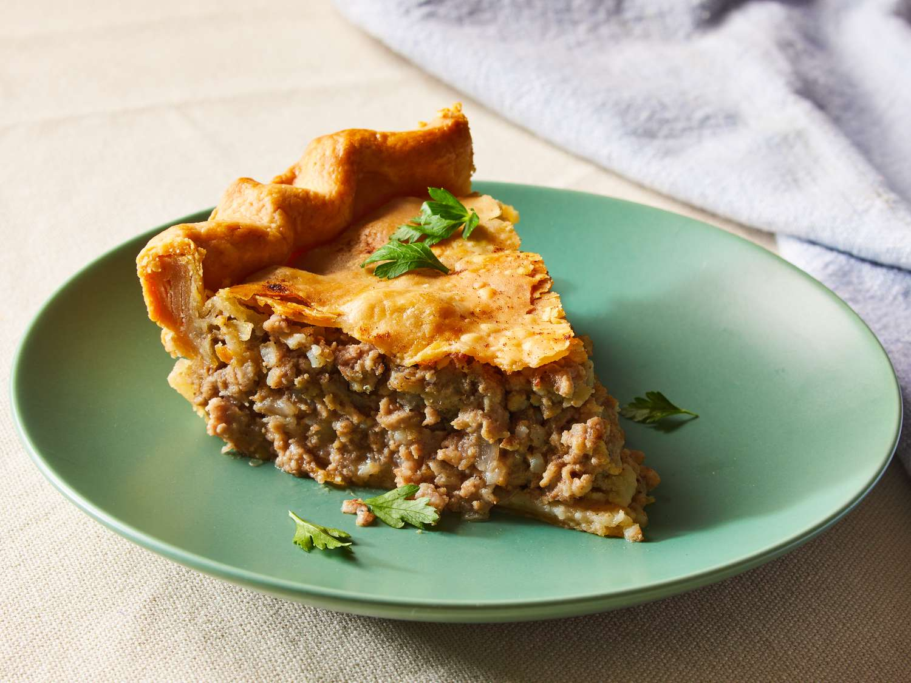

# Tourtière (Quebec Meat Pie)

*Quebec's Christmas Eve pie: buttery shortcrust around minced pork slow-cooked with onion, garlic, mashed potato and the Quebec spice mix of cinnamon, cloves, allspice and savoury.*

**Serves:** 6

**Prep Time:** 40 minutes (plus 30 minutes to chill the pastry)

**Cook Time:** 1 hour 20 minutes

## Overview
Tourtière is Quebec's most identity-defining family pie, made for Christmas Eve (le reveillon) but eaten throughout the cold months and sliced cold for Boxing Day lunch. Minced pork is the traditional base, sometimes with a small proportion of beef or veal for body; the Lac-Saint-Jean rural variant uses cubed game meats but that's a different recipe entirely. The Quebec spice profile (cinnamon, cloves, allspice and summer savoury, sarriette) is what makes tourtière Quebec rather than a generic meat pie; this warm, slightly sweet, faintly resinous combination is the dish's defining flavour signature, and substituting any of these spices changes the dish. Mashed potato bound through the cooked filling is the Quebec trick that gives the pie body; pies bound only with egg or breadcrumbs give a drier interior that misses the silky French-Canadian texture. The pastry is a classic French shortcrust, top and bottom crust. Served hot or warm with the traditional Quebec accompaniments: a homemade tomato chutney (ketchup aux fruits), pickled silverskin onions, and a glass of cold cider.

## Ingredients

### The shortcrust pastry (for a 23 cm pie, top + bottom)
- 350 g plain flour
- 1 teaspoon fine sea salt
- 175 g cold unsalted butter, cubed (or 130 g butter + 45 g lard, the traditional Quebec mix)
- 1 large egg, lightly beaten
- 4-6 tablespoons ice-cold water
- 1 egg yolk + 1 tablespoon milk (for glazing)

### The meat filling
- 500 g good minced pork (not too lean - 15% fat is ideal)
- 250 g minced beef OR veal
- 1 large onion, very finely chopped
- 4 cloves garlic, very finely chopped
- 200 ml beef or chicken stock
- 2 medium floury potatoes (300 g), boiled and mashed (no butter or milk added)
- 1/2 teaspoon ground cinnamon
- 1/2 teaspoon ground cloves
- 1/4 teaspoon ground allspice
- 1/4 teaspoon ground nutmeg
- 1 teaspoon dried summer savoury (sarriette) OR thyme
- 1/4 teaspoon ground white pepper
- 1 teaspoon salt
- 1 tablespoon plain flour (to bind)

### To serve
- Quebec-style tomato chutney (ketchup aux fruits) OR a good shop tomato chutney
- A small dish of pickled silverskin onions
- A glass of cold dry hard cider
- A simple green salad (oak leaf, vinaigrette)

## Method

### Stage 1 - Make the pastry
1. Combine the flour and salt in a large bowl.
2. Add the cold butter (and lard if using); rub with cold fingertips till the mixture resembles coarse breadcrumbs.
3. Whisk the beaten egg with 4 tablespoons of ice water; add to the dry mix.
4. Gather into a rough dough, adding more cold water 1 teaspoon at a time only if needed.
5. Divide the dough into 2 portions, one slightly larger (for the base, about 60%), the smaller for the top.
6. Flatten each into a disc; wrap in cling film.
7. Refrigerate at least 30 minutes (overnight is better).

### Stage 2 - Cook the meat filling
1. Heat a heavy frying pan over medium-low heat (no extra fat, the meat will render its own).
2. Add the minced pork and beef.
3. Break up with a wooden spoon; cook 6-8 minutes till the meat has lost its pink colour but not browned hard.
4. Add the finely chopped onion and garlic; cook 6-8 minutes more till the onion is translucent.

### Stage 3 - Add stock and spices
1. Stir in the cinnamon, cloves, allspice, nutmeg, summer savoury, white pepper and salt.
2. Pour in the stock; bring to a gentle simmer.
3. Reduce heat to low; cover loosely.
4. Simmer 25-30 minutes, stirring occasionally, till the liquid has mostly evaporated and the mixture is moist but not soupy.
5. Test the seasoning: the spices should be present but not aggressive; salt should be assertive.

### Stage 4 - Bind with mashed potato
1. Stir the boiled, mashed potato into the cooked meat filling.
2. Sprinkle the 1 tablespoon flour over and stir in.
3. Cook 2-3 more minutes; the potato should be fully integrated, the texture moist and binding.
4. Let the filling cool to room temperature before assembling (essential, hot filling melts the pastry).

### Stage 5 - Roll and assemble
1. Heat the oven to 200°C (180°C fan).
2. On a floured surface, roll the larger pastry disc into a circle about 30 cm across, 3-4 mm thick.
3. Drape over a 23 cm pie dish, pressing gently into the base and sides; leave a small overhang.
4. Tip the cooled meat filling into the pie shell; smooth the top with a spoon.
5. Roll the smaller pastry disc into a circle about 25 cm across.
6. Brush the rim of the base pastry with the beaten egg-yolk-and-milk glaze.
7. Drape the top pastry over the filling.
8. Press the edges firmly together; trim away excess pastry leaving a 1 cm overhang.
9. Crimp the edges with a fork or fingers.
10. Cut 3 small slashes in the top to vent.
11. Brush the entire top with the egg-yolk glaze.

### Stage 6 - Bake
1. Place the pie on a baking sheet (catches any drips).
2. Bake on the middle shelf of the oven for 25 minutes at 200°C.
3. Reduce the heat to 180°C (160°C fan); continue baking 30-35 minutes till the pastry is deep gold and the filling is bubbling visibly through the slashes.
4. If the top browns too fast, cover loosely with foil.

### Stage 7 - Rest and serve
1. Lift the pie out of the oven; rest 10 minutes (the filling firms up).
2. Slice into wedges.
3. Serve hot or warm with the tomato chutney, a pickled onion, a salad alongside, and a glass of cold cider.

## Notes
- **Cool the filling fully:** if you put hot filling in the pastry, the base pastry melts. Filling must be room-temp or cool before assembly.
- **Bind with potato, not breadcrumbs:** this is the Quebec move. Mashed potato gives a binding that holds the filling without the dryness breadcrumbs add.
- **Spices matter:** the cinnamon-clove-allspice-savoury combination is what makes a tourtière taste like a tourtière. Don't substitute pumpkin pie spice (the proportions are different); don't skip the savoury (sarriette is sold dried; thyme is the substitute).
- **A cold pie sliced thin:** tourtière is excellent hot, but the Quebec tradition is to eat it cold for breakfast or Boxing Day lunch, sliced thin like a French country pâté.
- **Lard vs all-butter:** lard gives a flakier traditional Quebec crust; all-butter gives a richer modern crust. Both are valid.

## Variations
- **Tourtière du Lac-Saint-Jean:** cubed game meats (venison, wild boar, hare) layered with potatoes and onions in a deep pie dish; baked 6 hours slow. A completely different (and longer-cooked) dish from the Lac-Saint-Jean region of northern Quebec.
- **Tourtière aux deux viandes:** the Christmas variant, half pork, half ground turkey or chicken; lighter.
- **Tourtière de cerf (venison):** swap the beef for minced venison; the Quebec hunter's variant.
- **Pâté chinois (the "shepherd's pie cousin"):** a layered casserole, same meat filling but layered with corn niblets in the middle and mashed potato on top, baked uncovered. Not a pie, but a sister dish in Quebec families.
- **Vegetarian tourtière:** swap meat for a mix of green lentils, chopped mushrooms, finely diced carrot and walnuts; same spices and mashed potato binding. Excellent.
- **Mini-tourtières (individual):** divide the filling among 6 individual pie dishes; bake 25 minutes total, the buffet/canapé variant.
- **Acadian variant (tourtière acadienne):** add a layer of sliced potato in the middle, more allspice, less cinnamon, the Maritime cousin.

## Serving
- At a Quebec Christmas Eve reveillon (the traditional setting; after midnight Mass) · at a Quebec sugar-shack lunch (cabane à sucre) · as Boxing Day lunch with leftover salads · at a Quebec funeral wake · as a working-day winter dinner with cider · as a packed lunch sliced cold (the Quebec lunchbox equivalent of pork pie).

## Storage
- Refrigerates 4 days. Eat cold or reheat individual slices in a 180°C oven 15 minutes.
- Freezes excellently - 3 months baked, or 1 month unbaked. Defrost overnight in the fridge before reheating or baking.
- Cold tourtière is arguably better than hot, the spices marry overnight and the filling firms into a sliceable terrine texture.
- Don't microwave, the pastry goes soggy; the oven is the right reheat tool.
- Baked tourtière keeps at room temperature 4-6 hours during a long Christmas-Eve evening (typical reveillon serving window).
