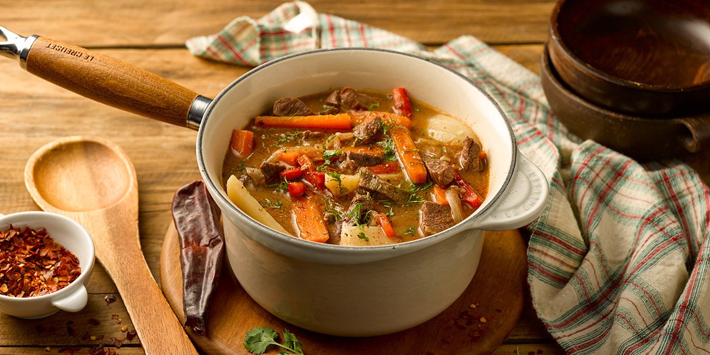

# Ajiaco Chileno

*Chile's hangover soup: a hot brothy soup of shredded leftover beef (often from the previous day's asado), sliced potatoes, fried onions, garlic, paprika and a soft-poached egg, finished with chopped coriander and a squeeze of lime. The Chilean Monday-morning cure for Sunday's excesses.*

**Serves:** 4

**Prep Time:** 15 minutes

**Cook Time:** 35 minutes

## Overview
Ajiaco Chileno (distinct from Colombian ajiaco which is creamy and chicken-based) is the canonical Chilean Monday-morning hangover soup: shredded leftover beef (typically from the previous day's Sunday asado / barbecue; or fresh-cooked beef shin for the everyday version) is added to a brothy soup of sliced potatoes, fried onions, crushed garlic, paprika, cumin and beef stock, simmered together till the potatoes are tender; a soft-poached egg is dropped into each bowl just before serving; finished with chopped coriander and a squeeze of lime. The dish is what every Chilean family makes on a Monday morning to revive themselves after Sunday's parrilla-and-wine excesses; it's also a comforting weekday dinner. Leftover beef is the soul of the dish; shredded asado from yesterday's grill is canonical, though fresh-cooked beef shin works for the everyday version. The soft-poached egg on top with its runny yolk is the Chilean touch. And the broth is properly brothy; this is a soup, not a stew, with plenty of liquid per portion.

## Ingredients

### Soup base
- 4 tablespoons olive oil
- 3 large onions (sliced into thin half-moons)
- 8 garlic cloves (crushed)
- 1 tablespoon merkén (or 1 tablespoon smoked paprika + 1/2 teaspoon cayenne)
- 1 tablespoon paprika
- 1 tablespoon ground cumin
- 1 ½ teaspoons fine sea salt
- 1 teaspoon ground black pepper

### Vegetables
- 6 medium potatoes (peeled and sliced into 1 cm rounds)
- 2 medium carrots (peeled and sliced into rounds; optional)

### Meat
- 400 g cooked beef (shredded; leftover asado / grilled steak; or pre-cooked beef shin)

### Broth
- 1.5 litres hot beef stock
- 250 ml dry red wine (optional but Chilean)
- 2 bay leaves
- 1 tablespoon dried oregano

### Eggs (poached)
- 4 large eggs
- 1 tablespoon white vinegar (for the poaching water)

### To finish
- 1 large bunch fresh coriander (chopped)
- Spring onions (sliced)
- Lime wedges

### To serve
- Marraqueta bread
- Pebre

## Method

### Stage 1 - Fry the onions
1. Heat the olive oil in a large heavy pot over medium heat.
2. Add the sliced onions; cook 12-15 minutes till deeply soft and starting to caramelise.
3. Add the crushed garlic; cook 30 seconds.
4. Add the merkén, paprika, cumin, salt and pepper; cook 1 minute.

### Stage 2 - Add potatoes and liquid
1. Add the sliced potatoes and carrots.
2. Pour in the hot beef stock and red wine (if using).
3. Add the bay leaves and oregano.
4. Bring to a simmer.

### Stage 3 - Simmer
1. Cover with the lid slightly ajar.
2. Cook 15-20 minutes till the potatoes are tender.

### Stage 4 - Add the meat
1. Add the shredded beef.
2. Simmer 5 minutes till the beef is heated through and the flavours have melded.

### Stage 5 - Poach the eggs
1. In a separate saucepan, bring water to a simmer; add 1 tablespoon vinegar.
2. Crack each egg into a small cup; gently slip into the water.
3. Poach 3 minutes till whites are set, yolks runny.
4. Lift out with a slotted spoon.

### Stage 6 - Serve
1. Ladle the soup into deep bowls.
2. Place a poached egg on top of each.
3. Scatter chopped coriander and spring onions.
4. Lime wedges, marraqueta, pebre on the side.

## Notes
- **Leftover beef:** the dish is meant to use Sunday's grilled-meat leftovers.
- **Poached egg essential:** the canonical Chilean touch.
- **Broth, not stew:** lots of liquid.
- **Cumin and merkén for the proper Chilean profile:** don't skip.
- **Eat immediately:** the egg should still be warm and runny.

## Variations
**Chicken ajiaco:** swap beef for shredded leftover chicken; lighter version.
**With chickpeas:** add 1 tin of drained chickpeas in stage 4; gives extra body.
**Vegetarian (vegetal):** skip the meat; double the potatoes; add 1 chopped chorizo for non-strict-vegetarian flavour; or pure vegetable for vegetarian.
**Spicier:** add 1 chopped fresh chilli to the base.

## Serving
In deep bowls with marraqueta bread for sopping. Drink: cold Cristal beer or fresh limonada. Monday morning hangover cure or weeknight comforting dinner.

## Storage
- Keeps refrigerated 3 days; thickens overnight (add stock when reheating).
- Don't freeze; potatoes go off-texture.
- Day-old ajiaco is a great breakfast.
