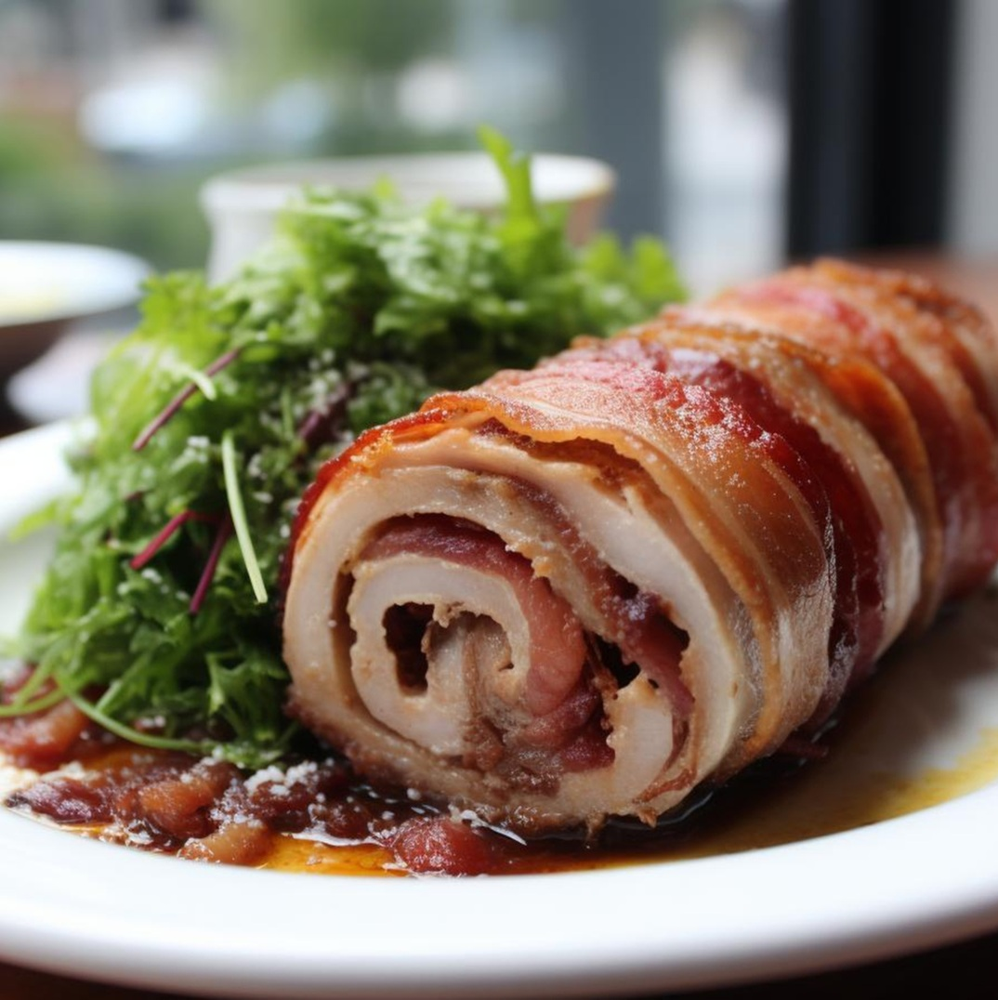

# Arrollado de Huaso

*Chile's "huaso's rolled pork": thin pork belly slices rolled around a fragrant filling of pork mince, garlic, merkén, cumin and parsley, tied with kitchen twine, and slow-braised in a richly spiced broth till the meat is fork-tender. The Chilean countryside specialty served sliced thick with mashed potato and pebre.*

**Serves:** 6-8

**Prep Time:** 40 minutes

**Cook Time:** 2 hours 30 minutes

## Overview
Arrollado de huaso ("huaso's rolled-up") is a Chilean countryside specialty named for the huaso, the Chilean cowboy: thin pork belly slices spread with a fragrant filling of pork mince mixed with crushed garlic, merkén (Chilean smoked-chilli spice), cumin, oregano and parsley, rolled into a tight sausage shape and tied with kitchen twine, slow-braised in a spiced broth of onion, garlic, tomato, white wine, paprika and bay till the pork belly is meltingly tender and the stuffing has soaked up the broth. Merkén is essential; the Chilean smoked-pepper spice gives the dish its proper character. Sliced thick (1.5 cm) at the table, served with mashed potato (puré de papas), pebre (Chilean salsa) and a fresh salad. What countryside families make for major celebrations and Sunday lunches, and a feature of every "típico" Chilean restaurant.

## Ingredients

### Pork belly wrap
- 800 g pork belly (sliced thin, about 5 mm; ask the butcher; aim for one long thin sheet about 30 cm × 40 cm; or use 2-3 slices to make a sheet)

### Filling
- 500 g pork mince (15-20% fat)
- 1 medium onion (finely chopped)
- 8 garlic cloves (crushed)
- 1 small bunch fresh parsley (chopped)
- 2 tablespoons merkén (or 2 tablespoons smoked paprika + 1/2 teaspoon cayenne)
- 1 tablespoon ground cumin
- 1 tablespoon dried oregano
- 1 tablespoon paprika
- 1 ½ teaspoons fine sea salt
- 1 teaspoon ground black pepper
- 1 large egg
- 50 g breadcrumbs (soaked in 50 ml milk; squeezed)

### Cooking
- 4 tablespoons olive oil
- 2 large onions (sliced)
- 2 medium carrots (sliced)
- 1 stalk celery (sliced)
- 8 garlic cloves (crushed)
- 4 tablespoons tomato paste
- 250 ml dry white wine
- 800 ml hot beef stock
- 2 bay leaves
- 1 cinnamon stick (small)
- 1 tablespoon dried oregano
- 1 tablespoon merkén
- 1 ½ teaspoons fine sea salt
- 1 teaspoon ground black pepper

### To finish
- 2 tablespoons fresh parsley (chopped)
- Lemon wedges

### To serve
- Puré de papas (Chilean mashed potato)
- Pebre
- Ensalada chilena
- Marraqueta bread

## Method

### Stage 1 - Make the filling
1. In a wide bowl, combine the pork mince, chopped onion, crushed garlic, parsley, merkén, cumin, oregano, paprika, salt, pepper, egg and soaked breadcrumbs.
2. Mix thoroughly for 2-3 minutes till sticky and cohesive.

### Stage 2 - Lay out the pork belly
1. Lay the thin pork belly slices on a clean work surface, slightly overlapping if needed to form one large sheet (about 30 cm × 40 cm).
2. Spread the filling over the belly, leaving a 3 cm border at one long edge.

### Stage 3 - Roll and tie
1. Starting from the filled side, roll the pork belly tightly around the filling into a long sausage shape (like a long thick Swiss roll).
2. Tie firmly with kitchen twine in a cross-pattern at 5 cm intervals to hold the shape.

### Stage 4 - Brown the roll
1. Heat the olive oil in a heavy Dutch oven over medium-high heat.
2. Brown the rolled pork on all sides for 10-12 minutes till deep golden all over.
3. Lift out.

### Stage 5 - Build the braise
1. Reduce heat to medium.
2. Add the sliced onions, carrots, celery and garlic to the pot.
3. Cook 8 minutes till soft.
4. Add the tomato paste; cook 2 minutes.
5. Pour in the white wine; let bubble 2 minutes.
6. Add the beef stock, bay leaves, cinnamon stick, oregano, merkén, salt and pepper.

### Stage 6 - Slow-cook
1. Return the rolled pork to the pot.
2. Cover with the lid; bring to a simmer.
3. Reduce to lowest heat (or transfer to a 160°C / 320°F oven).
4. Cook 2 hours, turning halfway.
5. The pork should be fork-tender.

### Stage 7 - Rest
1. Lift out the rolled pork; let rest 20 minutes covered.

### Stage 8 - Reduce the sauce
1. Strain the cooking liquid; press the vegetables through.
2. Skim fat; bring to a hard boil; reduce 8-10 minutes till glossy.

### Stage 9 - Slice and serve
1. Remove the twine; slice the pork thickly (1.5 cm).
2. Arrange on a platter.
3. Pour the reduced sauce over.
4. Scatter parsley.
5. Serve with puré de papas, pebre, ensalada chilena, lemon wedges.

## Notes
- **Thin pork belly:** ask the butcher for thin slices (5 mm).
- **Tie firmly:** the roll holds its shape during the braise.
- **Brown before braising:** essential for sauce depth.
- **Slow-cook 2 hours:** fork-tender result.
- **Slice across the roll:** not lengthwise.

## Variations
**Beef arrollado:** swap pork belly for thin flank steak; cook the same way; different but excellent.
**Stuffed with hard-boiled egg:** lay 4 hard-boiled eggs along the centre of the filling before rolling; gives a cross-section reveal when sliced.
**With chorizo strip:** place a strip of chorizo sausage along the centre of the filling before rolling.
**Smoked arrollado:** add 100 g of bacon to the filling; gives smoky depth.

## Serving
At the centre of a Sunday Chilean lunch table sliced thick. Puré de papas, pebre, salad. Drink: Chilean red wine, Cristal beer.

## Storage
- Keeps refrigerated 5 days; flavour deepens.
- Reheat covered in a 160°C oven for 25 minutes.
- Freezes 3 months in slices.
