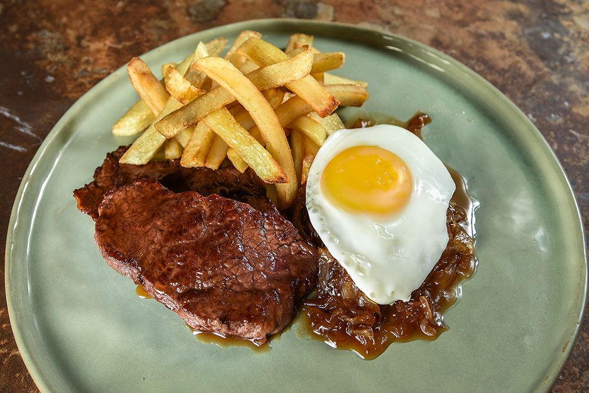

# Bife a lo Pobre

*Chile's "poor man's steak": a thick beef steak grilled to medium-rare, plated with a heap of hand-cut fried potatoes, two sunny-side-up fried eggs and a heap of sautéed sliced onions. The Chilean and Argentine working-class plate, named "poor" but actually extravagantly substantial.*

**Serves:** 2 (large portions)

**Prep Time:** 20 minutes

**Cook Time:** 25 minutes

## Overview
Bife a lo pobre (literally "poor man's steak", though the dish is actually quite extravagant) is the traditional Chilean and Argentine working-class plate and a beloved diner classic in both countries: a thick beef steak grilled to medium-rare, plated alongside a heap of hand-cut fried potatoes, two sunny-side-up fried eggs with runny yolks, and a heap of sautéed sliced onions. The name is ironic given the substantial size of the plate; the origin is the early-20th-century worker's lunch when steak was relatively affordable in Chile and Argentina, served with whatever could pad it out. All four components live on the same plate, and the combination is the dish. Hand-cut fries, not bagged frozen chips; twice-fried for proper crispness. Sunny-side-up eggs whose yolks run into the steak and fries; the runniness is the point.

## Ingredients

### Steaks
- 2 large beef steaks (sirloin, ribeye, or rump; about 350 g each; 2 cm thick)
- 1 tablespoon olive oil
- 1 ½ teaspoons fine sea salt
- 1 teaspoon ground black pepper

### Fries (papas fritas)
- 6 large potatoes (peeled and cut into 1 cm × 1 cm × 8 cm batons)
- Vegetable oil for deep-frying (about 1 litre)
- 1 teaspoon flaky sea salt

### Onions
- 2 large white onions (sliced into thin half-moons)
- 3 tablespoons olive oil
- 1 teaspoon fine sea salt
- ½ teaspoon ground black pepper

### Eggs
- 4 large eggs (2 per person)
- 1 tablespoon vegetable oil

### To finish
- Fresh parsley (chopped)
- Pebre (Chilean salsa)
- Lemon wedges

### To serve
- Marraqueta bread (optional)
- Salad
- Cold beer or red wine

## Method

### Stage 1 - First-fry the potatoes (blanching)
1. Soak the cut potato batons in cold water for 10 minutes; drain and pat dry thoroughly.
2. Heat the vegetable oil in a deep pot to 160°C (320°F).
3. Add the potato batons in batches; fry 4-5 minutes till they're just cooked through but not browned (pale gold).
4. Lift out; drain on kitchen paper.
5. Let cool 10 minutes.

### Stage 2 - Sauté the onions
1. Heat the olive oil in a wide heavy pan over medium heat.
2. Add the sliced onions, salt and pepper.
3. Cook 12-15 minutes, stirring occasionally, till deeply soft and starting to caramelise.
4. Keep warm.

### Stage 3 - Cook the steaks
1. Pat the steaks dry; sprinkle with salt and pepper.
2. Heat the olive oil in a wide heavy pan (or grill pan) over high heat till smoking.
3. Cook the steaks 3-4 minutes per side for medium-rare; longer for medium or well-done.
4. Lift onto a board; rest 5 minutes.

### Stage 4 - Second-fry the potatoes
1. Heat the oil up to 190°C (375°F).
2. Add the blanched potatoes in batches; fry 2-3 minutes till deeply golden and crispy.
3. Lift out; drain; sprinkle with flaky salt.

### Stage 5 - Fry the eggs
1. Heat the 1 tablespoon vegetable oil in a wide pan over medium heat.
2. Crack 4 eggs into the pan; fry sunny-side up for 3-4 minutes till the whites are set and the yolks are still runny.

### Stage 6 - Plate
1. On each plate, place one rested steak (sliced if you prefer; or whole).
2. Pile a generous mountain of fried potatoes alongside.
3. Top the steak (or the potatoes) with 2 fried eggs.
4. Scatter sautéed onions over (or alongside).
5. Add a pinch of parsley and lemon wedges.
6. Serve immediately with pebre on the side.

## Notes
- **Twice-fried potatoes:** for proper crispness. First fry low-and-slow to cook through; second fry hot-and-fast to crisp.
- **Sunny-side-up eggs with runny yolks:** essential.
- **Don't overcook the steak:** medium-rare is the target.
- **Onions deeply caramelised:** 12-15 minutes minimum.
- **All four components on the same plate:** the combination defines the dish.

## Variations
**With Italian sausage (bife a lo pobre completo):** add a grilled Italian sausage to the plate; even more substantial.
**With grilled chillies:** add 1-2 grilled long chillies to the plate; common Chilean diner addition.
**Chicken version (pollo a lo pobre):** swap steak for grilled chicken breast or thigh; lighter version.
**Without eggs (kid-friendly):** skip the eggs; double the potatoes; common children's version.

## Serving
On wide plates with all four components arranged separately. Drink: Chilean red wine (carmenere or cabernet) or cold Cristal beer. As a Chilean diner lunch or a substantial weekend dinner.

## Storage
- Best eaten immediately.
- Don't refrigerate the assembled plate.
- Leftover steak keeps refrigerated 3 days; reheat briefly.
- Leftover potatoes don't reheat well.
