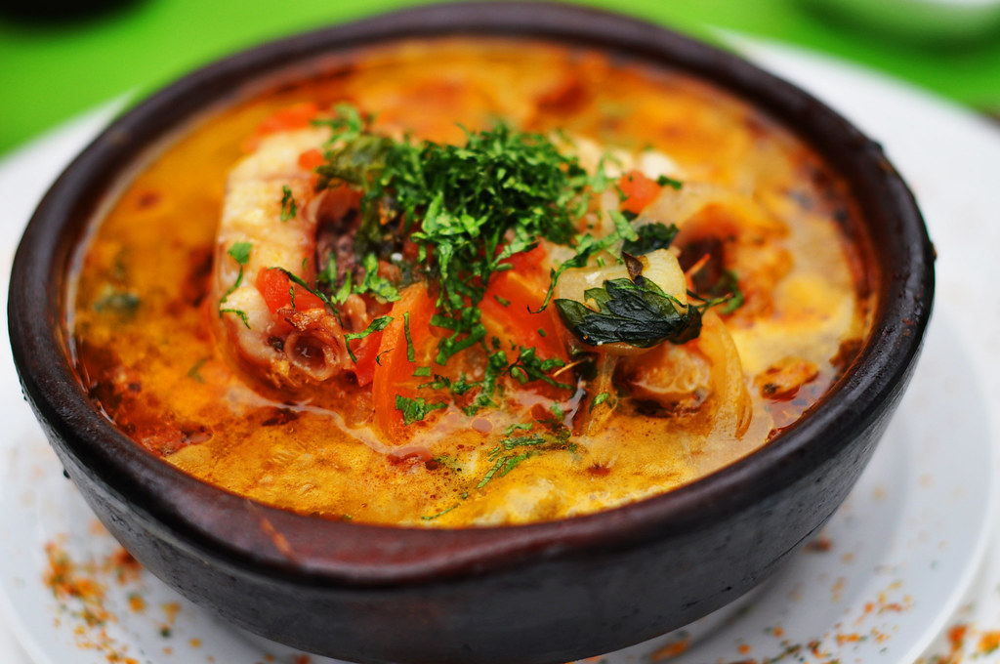

# Caldillo de Congrio

*Chile's "conger eel soup": Pablo Neruda's famous Ode-to-fish broth - thick slices of firm white fish (originally conger eel; substituted with cod or hake outside Chile) slow-simmered in a base of onion, garlic, tomato, white wine and a generous handful of fresh coriander into a thick savoury fish soup. The Chilean coastal classic immortalised in a poem by the country's Nobel laureate.*

**Serves:** 4

**Prep Time:** 20 minutes

**Cook Time:** 35 minutes

## Overview
Caldillo de congrio is one of Chile's most iconic fish soups, famously immortalised in a poem ("Oda al Caldillo de Congrio") by Chilean Nobel laureate Pablo Neruda in his Odes Elementales. Thick slices of conger eel (the traditional Chilean fish, firm-fleshed and from cold Pacific waters) slow-simmered in a base of onion, sliced potato, garlic, tomato, white wine, fish stock and a generous amount of fresh chopped coriander till the fish is just cooked and the broth has reduced to a thick aromatic soup. Outside Chile, where conger eel is hard to find, use cod, hake, monkfish or any firm white fish; flaky fish like salmon or tuna breaks down too far. Coriander goes in twice (half during cooking, half at the end), and Chilean sauvignon blanc gives the proper acidic backbone. Often described as the Chilean equivalent of bouillabaisse. Served in deep bowls with marraqueta bread for sopping.

## Ingredients

### Fish
- 600 g firm white fish (conger eel if available; otherwise cod, hake, monkfish, or sea bass; cut into 4 thick steaks)
- 1 ½ teaspoons fine sea salt
- 1 teaspoon ground black pepper
- 1 teaspoon ground cumin
- Juice of 1 lemon

### Cooking base
- 4 tablespoons olive oil
- 2 large onions (finely chopped)
- 6 garlic cloves (crushed)
- 2 medium ripe tomatoes (chopped)
- 1 medium red bell pepper (finely diced; optional)
- 2 medium carrots (peeled and finely sliced)
- 2 medium potatoes (peeled and cubed)
- 2 tablespoons tomato paste

### Liquid
- 250 ml dry white wine (Chilean sauvignon blanc)
- 1 litre hot fish stock (or chicken stock)
- 2 bay leaves
- 1 tablespoon dried oregano
- 1 teaspoon Aleppo pepper or merkén
- 1 ½ teaspoons fine sea salt
- 1 teaspoon ground black pepper

### Herbs (traditional)
- 1 large bunch fresh coriander (about 40 g; chopped; half for cooking, half for finishing)
- 1 small bunch fresh parsley (chopped)

### To finish
- Lemon wedges
- Extra olive oil for drizzling

### To serve
- Marraqueta bread (or crusty white bread)
- Pebre
- Cold Chilean white wine

## Method

### Stage 1 - Season the fish
1. Pat the fish steaks dry.
2. Sprinkle with salt, pepper, cumin and lemon juice.
3. Set aside while you make the base.

### Stage 2 - Build the soup base
1. Heat the olive oil in a wide heavy pot over medium heat.
2. Add the chopped onions; cook 8 minutes till soft.
3. Add the crushed garlic; cook 30 seconds.
4. Add the chopped tomatoes; cook 4 minutes till they break down.
5. Add the tomato paste; cook 2 minutes till deepened.
6. Add the diced red pepper (if using), carrots and cubed potatoes; cook 3 minutes.

### Stage 3 - Add liquid and simmer
1. Pour in the white wine; let bubble 2 minutes.
2. Add the fish stock.
3. Add the bay leaves, oregano, Aleppo pepper, salt and pepper.
4. Bring to a simmer.
5. Cover partially; cook 15-20 minutes till the potatoes and carrots are tender.

### Stage 4 - Add fish and coriander
1. Add half the chopped coriander to the broth.
2. Slip the fish steaks gently into the simmering broth.
3. Spoon broth over the fish to keep moist.
4. Simmer 6-8 minutes till the fish is just cooked through (flesh flakes easily with a fork).

### Stage 5 - Finish
1. Take off the heat.
2. Stir in the remaining chopped coriander and the parsley.
3. Taste; adjust salt.

### Stage 6 - Serve
1. Ladle into deep bowls; each bowl gets a piece of fish, plus broth, vegetables and herbs.
2. Drizzle with olive oil.
3. Lemon wedges.
4. Marraqueta bread alongside, pebre on the table.

## Notes
- **Firm white fish:** must hold together in simmer.
- **Two-stage coriander:** half during cooking, half at the end.
- **White wine essential:** for the proper Chilean character.
- **Don't overcook the fish:** 6-8 minutes max.
- **Marraqueta for sopping:** the broth is the best bit.

## Variations
**With clams (caldillo de almejas):** add 500 g of clams to the broth in the last 5 minutes; gives a more Mediterranean-leaning version.
**With shrimp:** add 200 g of shrimp in the last 3 minutes; more substantial.
**Cazuela-style (with corn and potato):** add corn on the cob and double the potato; gives a heartier Chilean-cazuela hybrid.
**Spicier:** add 1 chopped fresh chilli to the base; common southern Chilean variation.

## Serving
In deep bowls. Marraqueta or crusty bread for sopping. Glass of cold Chilean sauvignon blanc (the traditional wine pairing - Neruda himself drank Chilean white wine with this soup). Pebre and lemon on the table.

## Storage
- Best eaten fresh; the fish doesn't reheat well.
- The broth keeps refrigerated 3 days and freezes 3 months; cook fresh fish in the reheated broth.
- Don't freeze with the fish.
