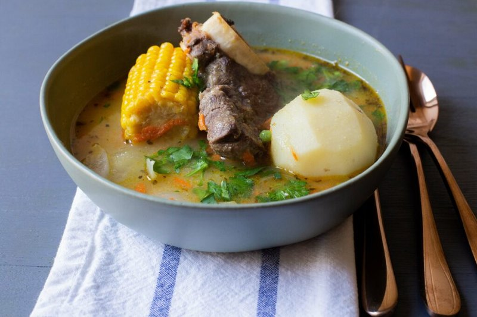

# Cazuela de Vacuno

*The Chilean Sunday-lunch one-pot: bone-in beef shin slow-simmered in a clear broth with a generous chunk of pumpkin, a section of corn-on-the-cob, a whole potato, green beans and rice (sometimes noodles), eaten in deep bowls with a sprinkle of coriander and a wedge of lime. Plain but deep - the broth is the soul.*

**Serves:** 4

**Prep Time:** 15 minutes

**Cook Time:** 2 hours

## Overview
The Chilean Sunday-lunch one-pot, the soup-stew that turns up on every kitchen table from Santiago to Patagonia. You brown bone-in beef shin to colour, then drop it into a simple broth of onion, garlic, oregano and cumin and simmer slowly for ninety minutes until the meat is tender and the broth has built depth. The vegetables go in for the last twenty-five minutes - a thick chunk of pumpkin, a section of corn-on-the-cob, a whole potato, a handful of green beans - each piece kept whole because the cazuela is meant to arrive in the bowl looking like a still life. Rice or vermicelli cooks separately in a ladle of the broth and joins at the very end. Served in deep bowls with chopped coriander and a wedge of lime, the steam rising while you eat. Comfort food at its plainest and deepest.

## Ingredients

- 1 kg beef shin (bone-in, in 4-6 large pieces)
- 2 tablespoons vegetable oil
- 1 onion (large, chopped)
- 4 garlic cloves (crushed)
- 1 teaspoon ground cumin
- 1 teaspoon dried oregano
- 1 teaspoon ground black pepper
- 1 ½ teaspoons salt
- 2 ½ litres hot beef stock
- 1 pumpkin (small, or butternut wedge, 4 chunks of 200 g each)
- 2 corn-on-the-cob (each cut in half)
- 4 potatoes (medium, peeled, whole)
- 200 g green beans (trimmed)
- 1 carrot (cut into 4 chunks)
- 100 g long-grain rice (or fine vermicelli)
- 3 tablespoons fresh coriander (chopped)
- 1 lime (cut into wedges)

## Method

### Stage 1 - Brown
1. Heat oil in a wide tall pot over medium-high.
1. Season the shin; brown hard on all sides, 4-5 minutes per side. Set aside.

### Stage 2 - Base
1. In the same pot, soften the onion 8 minutes.
1. Add garlic, cumin, oregano, pepper; cook 1 minute.

### Stage 3 - Slow cook
1. Return the beef. Pour in hot stock and salt.
1. Bring to a simmer; skim any scum.
1. Cover; cook on low 1 hour 15 minutes, until the meat is tender.

### Stage 4 - Vegetables
1. Add pumpkin chunks, corn, potatoes, carrot to the broth; bring back to a simmer.
1. Cover; cook 20 minutes.
1. Add green beans; cook 5 more minutes.

### Stage 5 - Rice
1. While the vegetables cook, ladle 400 ml of broth into a small pan; add rice (or vermicelli); cook to packet time.

### Stage 6 - Plate
1. In each deep bowl, place a piece of beef, a chunk of pumpkin, ½ corn cob, a potato, some green beans and carrot.
1. Top with a spoonful of cooked rice (or vermicelli).
1. Ladle generous broth over.
1. Scatter coriander; lime wedge alongside.

## Notes
- **Whole chunks:** The Chilean way is whole vegetables in each bowl - the diner picks them up with the spoon. Don't dice.
- **Beef shin:** The cut. Marrow bone enriches the broth; the meat shreds when tender.
- **Rice / vermicelli separately:** Cooking them in the main pot makes the broth cloudy and starchy. Cooked in a side ladleful of broth, they stay bright.

## Storage
- Refrigerate 4 days. Reheats well.
- Freezes 3 months (without the rice - cook fresh).
