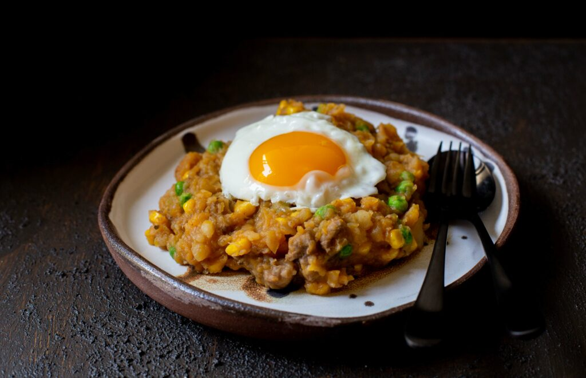

# Charquicán

*Chile's jerky-and-pumpkin hash: dried beef (charqui) rehydrated and chopped, slow-cooked with cubed pumpkin, potatoes, corn kernels, peas, onion, garlic and merkén into a thick mahogany-orange hash. The Andean Chilean home-cook dish that uses dried-beef preservation, topped with a fried egg and served with bread.*

**Serves:** 4-6

**Prep Time:** 25 minutes (plus 30 minutes charqui soaking)

**Cook Time:** 1 hour

## Overview
Charquicán is one of Chile's most distinctively Andean dishes, a slow-cooked hash that originated as a way to use dried beef (charqui, the Andean cured meat that pre-dates refrigeration) in a substantial winter meal. Rehydrated and chopped charqui slow-cooks with cubed pumpkin, potato, sweet corn kernels, green peas, onion, garlic, merkén (Chilean smoked-chilli spice), cumin and oregano in a heavy pot till the pumpkin half-breaks down into the broth, the meat goes tender, and the whole pot reduces to a thick mahogany-orange hash. Mashing some of the cooked pumpkin against the side of the pot thickens the broth. Outside South America, substitute with traditional Western-style beef jerky, or use fresh ground beef for a modern version. Served in deep bowls topped with a sunny-side-up fried egg (the canonical Chilean touch), with marraqueta bread and pebre on the side. What Andean home cooks make on cold winter evenings; also a school-canteen classic.

## Ingredients

### Meat
- 200 g charqui (dried beef; or beef jerky); OR 400 g minced beef (fresh; for the modern version)
- 500 ml hot water (for rehydrating the charqui; not needed for ground beef)

### Vegetables
- 600 g pumpkin/zapallo/butternut squash (peeled and cubed)
- 4 medium potatoes (peeled and cubed)
- 200 g sweet corn kernels (fresh or frozen)
- 200 g frozen peas
- 2 medium carrots (peeled and diced; optional)

### Cooking
- 4 tablespoons olive oil (or lard for traditional flavour)
- 2 large onions (finely chopped)
- 6 garlic cloves (crushed)
- 1 tablespoon merkén (or 1 tablespoon smoked paprika + 1/2 teaspoon cayenne)
- 1 tablespoon ground cumin
- 1 tablespoon dried oregano
- 1 ½ teaspoons fine sea salt
- 1 teaspoon ground black pepper
- 400 ml hot beef stock (or vegetable stock)
- 2 bay leaves

### Eggs (the canonical topping)
- 6 large eggs (one per serving)
- 1 tablespoon vegetable oil (for frying eggs)

### To finish
- 2 tablespoons fresh parsley (chopped)
- 1 fresh red chilli (sliced, optional)

### To serve
- Marraqueta bread
- Pebre
- Fresh salad

## Method

### Stage 1 - Prepare the meat
1. If using charqui or jerky: soak in 500 ml hot water for 30 minutes till rehydrated. Drain, reserve liquid. Chop finely or shred.
2. If using minced beef: skip the soak; use raw.

### Stage 2 - Sweat aromatics
1. Heat the olive oil in a large heavy pot over medium heat.
2. Add the chopped onions; cook 8 minutes till deeply soft.
3. Add the crushed garlic; cook 30 seconds.
4. Add the merkén, cumin and oregano; cook 1 minute.

### Stage 3 - Brown the meat
1. Add the rehydrated charqui (or fresh minced beef); cook 4-5 minutes till deepened in colour.

### Stage 4 - Add vegetables and liquid
1. Add the cubed pumpkin, potatoes and carrots (if using).
2. Pour in the hot stock (plus the reserved charqui-soaking liquid if used).
3. Add the bay leaves, salt and pepper.
4. Bring to a simmer.

### Stage 5 - Simmer
1. Cover with the lid slightly ajar.
2. Cook 35-40 minutes till the pumpkin is breaking down into the broth and the potatoes are tender.
3. Stir occasionally; mash some pumpkin against the side of the pot to thicken.

### Stage 6 - Add corn and peas
1. Add the corn kernels and frozen peas.
2. Cook 5 more minutes.

### Stage 7 - Finish
1. Take off the heat.
2. Lift out the bay leaves.
3. Taste; adjust salt.

### Stage 8 - Fry the eggs
1. In a separate pan, heat the oil over medium heat.
2. Crack the eggs; fry sunny-side up for 3-4 minutes till the whites are set but the yolks are still soft-runny.

### Stage 9 - Serve
1. Ladle hot charquicán into deep bowls.
2. Top each bowl with a fried egg (yolk side up).
3. Scatter chopped parsley and sliced chilli (if using).
4. Marraqueta bread, pebre and salad on the side.
5. Eat immediately; break the yolk into the hash.

## Notes
- **Charqui gives the dish its name:** if you can find it, use it. Beef jerky is the workable substitute.
- **Mash some pumpkin for body:** half-dissolves naturally; help with a spoon.
- **Merkén is the Chilean spice:** smoked paprika + cayenne is the substitute.
- **Fried egg on top:** canonical Chilean home presentation.
- **Don't rush:** 40 minutes of simmering develops proper flavour.

## Variations
**Pure pumpkin charquicán:** vegetarian version with just pumpkin, potato, corn, peas - no meat. Common Chilean Lent dish.
**With white wine:** add 100 ml of dry white wine after the meat browning; gives extra depth.
**With chard:** add 200 g of chopped chard to the pot in the last 10 minutes; gives extra colour and freshness.
**Mashed version (charquicán machucado):** mash everything together at the end with a potato masher; gives a more uniform mash-style texture. Common Chilean variation.

## Serving
In deep bowls topped with a fried egg, marraqueta on the side. Drink: Chilean red wine, Cristal beer, or a glass of mote con huesillos. Comforting Chilean winter dinner.

## Storage
- Keeps refrigerated 4 days; flavour deepens.
- Reheat gently; fry fresh egg.
- Freezes 3 months.
- Day-old charquicán is even better.
