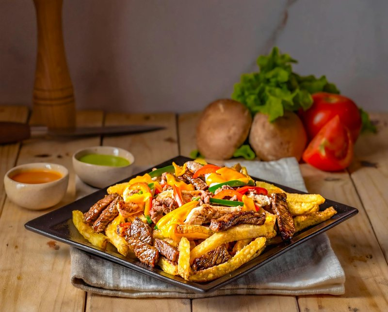

# Chorrillana

*The Valparaíso bar classic: a giant platter of fries topped with thinly-sliced grilled steak, sautéed onion, fried eggs on top, sometimes chorizo, served with a beer at the centre of the table for sharing with hands and forks reaching from every side. Born in the port bars of Valparaíso, now Chile-wide.*

**Serves:** 4 (sharing)

**Prep Time:** 20 minutes

**Cook Time:** 45 minutes

## Overview
The Valparaíso bar classic, the giant shareable platter that lands in the middle of the table at every port-city watering hole. You deep-fry thick-cut chips until they're crisp and gold, sear thinly-sliced sirloin (lomo) hot in a wide pan, soften and lightly char onion in the same fat, and fry eggs sunny-side up. Everything piles into a single wide platter: chips on the bottom, steak and onion on top, eggs cracked over the lot so the yolks can run down. Some versions add slices of chorizo. Eat communally with forks reaching from every side and a cold beer doing the rounds.

## Ingredients

- 800 g floury potatoes (cut into 1 ½ cm thick chips)
- 1 ½ litres vegetable oil for frying
- 1 tablespoon salt (for chips)

### Topping
- 500 g sirloin (or rump steak, sliced thin against the grain)
- 200 g cured chorizo (sliced thin, optional)
- 2 onions (large, sliced thin)
- 4 tablespoons vegetable oil (split)
- 1 teaspoon salt
- 1 teaspoon ground black pepper
- 1 teaspoon dried oregano
- 1 teaspoon paprika

### To plate
- 4 eggs (large)
- 3 tablespoons fresh parsley (chopped)
- [Pebre](side-dishes/pebre.md) (or chilli sauce on the side)

## Method

### Stage 1 - Chips
1. Rinse the potato in cold water; pat dry.
1. Heat oil to 140°C in a deep pan. First fry: 6-7 minutes per batch - pale and soft. Lift onto a rack.
1. Raise oil to 180°C. Second fry: 3-4 minutes per batch until deep gold and crisp.
1. Drain; salt; keep warm in a low oven.

### Stage 2 - Steak
1. Heat 2 tablespoons of oil in a wide heavy pan over high heat.
1. Sear the steak in batches, 1 minute per side (it's sliced thin, cooks fast).
1. Sprinkle with salt, pepper, oregano, paprika.
1. Lift onto a tray.

### Stage 3 - Chorizo and onion
1. Add chorizo to the same pan; cook 2 minutes until fat releases.
1. Add the remaining 2 tablespoons of oil; add the onion.
1. Cook 8 minutes, stirring, until soft and lightly gold.

### Stage 4 - Eggs
1. Wipe a second pan; add a little oil; fry the eggs sunny-side up.

### Stage 5 - Assemble
1. On a giant warmed platter (or two), pile the chips.
1. Top with seared steak, chorizo and onion, mixing slightly.
1. Lay the fried eggs over the top.
1. Scatter parsley.

### Stage 6 - Serve
1. Bring to the table immediately, with pebre on the side.
1. Eat together with cold beer.

## Notes
- **Double-fry the chips:** Essential. Single-fried chips go soggy under the steak's juices. Double-fried hold up.
- **Slice the steak thin:** Sirloin sliced 5 mm thin cooks in seconds and stays tender. Thick steak on top is wrong.
- **Sharing dish:** Plate generously; pile it tall. Chorrillana is meant to be communal.

## Storage
- Best eaten fresh. Doesn't reheat well.
