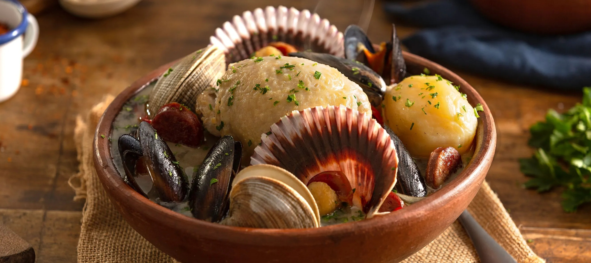

# Curanto

*Chile's Chiloé clambake: a layered slow-cooked one-pot of mussels, clams, smoked pork ribs, sausages, chicken, potato, milcao (potato bread) and nalca (Chilean rhubarb), traditionally cooked in an earthen pit covered with leaves. The Chiloé island specialty, adapted here for a Dutch oven home version.*

**Serves:** 8-10

**Prep Time:** 45 minutes

**Cook Time:** 2 hours

## Overview
Curanto is the iconic dish of Chiloé, the rainy archipelago off Chile's southern coast, and one of the most distinctive regional dishes in South America. Traditionally a deep earthen pit is dug, lined with hot stones, and filled with successive layers of mussels and clams directly on the stones, pork ribs, smoked longanizas, chicken pieces, cubed potatoes, milcao (Chiloé potato bread) and chapaleles (boiled potato dumplings), covered with giant nalca leaves (Chilean rhubarb) and earth; the whole thing slow-cooks in the residual heat for two or three hours. Outside Chiloé the home version ("curanto en olla") layers everything in a heavy Dutch oven with a small amount of broth and slow-cooks covered for two hours; the result is excellent though without the smoky earth-pit flavour. Layer in the right order: shellfish on the bottom (their released liquid becomes the broth), then meats, then potatoes, then milcao. Served family-style with each diner getting a sampling of every protein and a small bowl of broth for sipping.

## Ingredients

### Shellfish layer
- 1 kg fresh mussels (cleaned, debearded)
- 1 kg clams (cleaned)

### Meats
- 500 g pork ribs (cut into 4-cm sections; smoked if available)
- 4 longanizas (Chilean smoked sausages; or chorizo, or any smoked pork sausage)
- 400 g bone-in chicken pieces (thighs and drumsticks)

### Vegetables
- 8 medium potatoes (peeled and halved)
- 4 medium onions (quartered)
- 6 carrots (peeled and halved lengthwise)
- 1 large head of cabbage (cored, leaves separated; or large pieces)

### Milcao (simplified version; or use leftover potato dough)
- 600 g raw potatoes (peeled, grated)
- 400 g cooked mashed potatoes
- 4 tablespoons plain flour
- 3 tablespoons lard or vegetable oil
- 1 teaspoon fine sea salt
- 1 small onion (finely chopped, sautéed; optional)
- 100 g chicharrón (crispy pork rinds, crumbled; optional but very Chiloé)

### Cooking liquid
- 400 ml white wine
- 200 ml hot chicken stock
- 4 bay leaves
- 1 tablespoon dried oregano

### To finish
- 1 large bunch fresh parsley (chopped)
- Lemon wedges
- Pebre

### To serve
- Marraqueta bread
- Pebre
- Fresh salad

## Method

### Stage 1 - Make the milcao
1. Grate the raw potatoes finely; squeeze out excess liquid in a clean cloth.
2. Combine with the cooked mashed potato, flour, lard, salt and sautéed onion and chicharrón (if using).
3. Mix to a dough.
4. Shape into 8-10 small flat patties about 6 cm across.

### Stage 2 - Build the curanto pot
1. Use a very large heavy Dutch oven or pot (8 litre capacity).
2. Layer in order (mussels and clams stay out for now - they go in late so they don't overcook):
   - Bottom: half the cabbage leaves (as a base).
   - Next: pork ribs and chicken pieces.
   - Next: longaniza sausages.
   - Next: potatoes, onions, carrots.
   - Next: milcao patties.
   - Top: remaining cabbage leaves.

### Stage 3 - Add liquid
1. Pour the white wine and chicken stock over the layers (around the edges).
2. Add the bay leaves and oregano.

### Stage 4 - Slow-cook
1. Cover the pot tightly with the lid.
2. Place over medium-low heat on the stovetop (or in a 160°C / 320°F oven).
3. Cook 1 hour 40 minutes; don't lift the lid much.
4. Lift the lid and nestle the mussels and clams into the top layer (under the cabbage leaves). Replace the lid; cook another 15-20 minutes until the shells open.
5. The shellfish release their liquid into the steam-bath that cooks everything; longer than 20 minutes and they go rubbery.

### Stage 5 - Serve
1. Bring the pot to the table.
2. Open with ceremony.
3. Distribute layers onto plates: each diner gets some shellfish, some meat, some sausage, some potato, some milcao.
4. Ladle a small bowl of the cooking broth for each diner (the traditional "caldo" is sipped alongside).
5. Lemon wedges, pebre, parsley garnish.

## Notes
- **Layer order matters:** meats at the bottom (longest cook), potatoes and milcao on top; shellfish join only in the last 15-20 minutes so they don't toughen.
- **Don't lift the lid:** the steam does the cooking.
- **Multiple proteins traditional:** variety is the point.
- **Milcao is the Chiloé signature:** the potato bread distinguishes the dish.
- **Family-style serving:** each diner gets a sampling.

## Variations
**Simpler curanto without milcao:** skip the milcao if making for the first time; the dish still works.
**Chapaleles (boiled potato dumplings):** the traditional accompaniment alongside milcao; make from grated raw potato + flour + lard; boil for 15 minutes; add to the pot in the last 30 minutes.
**Larger feast version:** scale everything up; cook in a giant pot for a true family feast.
**Vegetarian-leaning:** skip the meats; focus on shellfish + potatoes + cabbage + milcao; still excellent.

## Serving
At the centre of a large family table, the pot opened with ceremony. White wine, Chiloé beer, pisco sour. A long lazy Sunday lunch. The proper experience takes 3 hours of eating and drinking.

## Storage
- Best eaten immediately.
- Shellfish doesn't reheat well; eat all the seafood on day 1.
- Leftover meats and potatoes keep refrigerated 3 days; reheat gently.
- The broth keeps and freezes 2 months.
