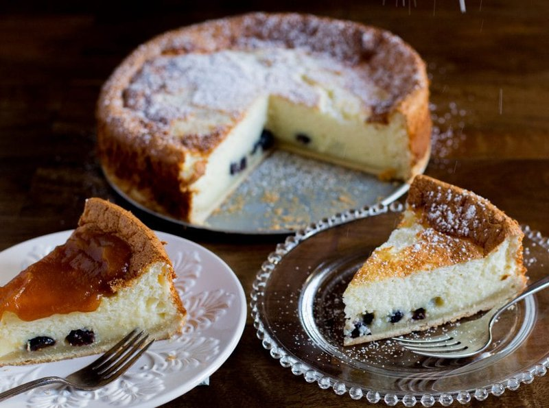

# Kuchen Alemán

*The German-Chilean fruit cake from the Lakes Region: a butter-cake base topped with seasonal fruit and a streusel crumble. Eaten with afternoon coffee.*

**Serves:** 8

**Prep Time:** 30 minutes

**Cook Time:** 45 minutes

## Overview
Cake base: butter creams with sugar, eggs in one at a time, flour and baking powder fold in. Spreads into a 23 cm tin. Sliced apples or stoned plums press into the surface. Streusel topping (flour, butter, sugar, cinnamon) crumbles over. Bakes for 45 minutes at 180°C till the topping is gold and a skewer comes out clean. Dusts with icing sugar.

## Ingredients

### Cake base
- 150 g unsalted butter (softened)
- 150 g caster sugar
- 3 eggs (large)
- 250 g plain flour
- 2 teaspoons baking powder
- ½ teaspoon salt
- 80 ml whole milk
- 1 teaspoon vanilla extract
- 1 lemon (zest)

### Fruit topping (choose one or mix)
#### Apple
- 500 g apples (peeled, cored, sliced 5 mm)
- 1 tablespoon lemon juice

#### Plums
- 400 g plums (stoned, halved)

#### Raspberry
- 400 g raspberries

#### Rhubarb
- 350 g rhubarb (cut into 2 cm pieces) 
- 30 g extra sugar

### Streusel
- 80 g plain flour
- 60 g unsalted butter (cold, cubed)
- 60 g caster sugar
- ½ teaspoon ground cinnamon

### To finish
- 1 tablespoon icing sugar

## Method

### Stage 1 - Cake batter
1. Heat the oven to 180°C (160°C fan).
1. Butter a 23 cm springform tin; line the base with parchment.
1. Cream the butter and sugar with electric beaters 4 minutes till pale and fluffy.
1. Add eggs one at a time, beating well after each.
1. Sift in flour, baking powder and salt; fold gently.
1. Add the milk, vanilla and lemon zest; mix to a thick batter.

### Stage 2 - Streusel
1. Rub the cold butter into the flour with your fingertips till breadcrumb-like.
1. Stir in the sugar and cinnamon.

### Stage 3 - Assemble
1. Spread the cake batter evenly in the tin.
1. Arrange the fruit on top (apple slices fanning out, plum halves cut-side up, etc.).
1. Scatter the streusel evenly over the fruit.

### Stage 4 - Bake
1. Bake 45-50 minutes till the streusel is deep gold and a skewer inserted in the cake (avoiding fruit) comes out clean.
1. If the top browns too fast, cover loosely with foil after 30 minutes.

### Stage 5 - Cool and serve
1. Cool in the tin 20 minutes.
1. Release the springform; transfer to a serving plate.
1. Dust with icing sugar.
1. Serve warm or at room temperature with coffee.

## Notes
- **German-Chilean heritage:** kuchen recipes vary by family - some use a yeasted base, others a quark filling under the fruit. This is the most common Chilean homestyle version.
- **Fruit acidity balances the sweet:** lemon juice on apples; extra sugar on rhubarb; plums and berries usually fine as-is.
- **Don't undercook the centre:** the fruit weeps moisture as it bakes; underdone cake stays soggy. Test with a skewer.

## Storage
- Keeps 3 days at room temperature in a sealed tin.
- The streusel softens slightly on day 2 but improves in flavour.
- Freezes 2 months; thaw at room temperature; refresh in a 150°C oven 10 minutes.
