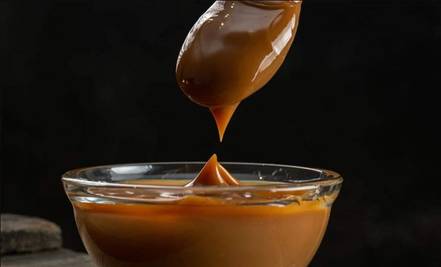

# Manjar (Chilean Dulce de Leche)

*Chile's dulce de leche: whole milk and sugar slow-simmered with a vanilla pod and a pinch of bicarb until it reduces to a thick, glossy caramel spread.*

**Serves:** Makes about 600 g

**Prep Time:** 5 minutes

**Cook Time:** 2 hours 30 minutes (mostly hands-off)

## Overview
Chile's version of dulce de leche, the slow-simmered milk caramel that turns up in alfajores, kuchen fillings and the breakfast spread on a thick slice of bread. You combine whole milk, sugar, a split vanilla pod and a pinch of bicarbonate of soda in a heavy wide pan, then simmer slowly for two to three hours, stirring more frequently as the mixture thickens. The bicarb is the trick - it accelerates the Maillard reaction and is what gives manjar its iconic deep brown colour, where unaided dulce de leche stays paler. You're done when the mixture has reduced by two-thirds and turned the colour of dark caramel. Cool, store in a jar. Spread on toast, sandwich in alfajores, or eat by the spoonful when nobody's looking.

## Ingredients
- 2 litres whole milk
- 500 g caster sugar
- 1 vanilla pod (split lengthways)
- ½ teaspoon bicarbonate of soda
- A pinch of salt

## Method

### Stage 1 - Combine
1. In a wide heavy-bottomed saucepan (a Dutch oven works), combine the milk, sugar, split vanilla pod, bicarbonate of soda and salt.
1. Place over medium heat; whisk until the sugar dissolves.

### Stage 2 - Slow simmer
1. Bring to a gentle simmer; reduce heat to low.
1. Cook uncovered, stirring occasionally, for the first hour.
1. As the mixture thickens (after about 90 minutes), stir more frequently to prevent it scorching at the bottom.
1. Continue simmering until the mixture has reduced by about two-thirds and turned a deep caramel-amber colour - total 2-3 hours.

### Stage 3 - Test
1. Drop a teaspoon on a cold plate; let it cool 30 seconds.
1. Run your finger through; the manjar should hold a clear line.
1. If too runny, cook another 10 minutes; if too thick, whisk in a splash of warm milk off the heat.

### Stage 4 - Finish
1. Remove the vanilla pod (scrape any seeds out and stir them back in).
1. Pour into clean jars while still warm.
1. Cool to room temperature; seal; refrigerate.

## Notes
- **Wide heavy pan:** narrow pans don't evaporate efficiently and you'll cook for hours longer. A wide-mouth Dutch oven is ideal.
- **Bicarb is the colour trick:** without it the manjar stays pale; with it the Maillard reaction goes faster and you get the iconic deep caramel.
- **Stir constantly in the last 30 minutes:** the sugar concentration is high enough to scorch easily. Use a long wooden spoon and scrape the bottom corners.
- **Don't rush with high heat:** boiling instead of simmering breaks the milk proteins and gives a grainy result.

## Storage
- Keeps 6 weeks refrigerated in a sealed jar.
- Spreads colder; warm gently to make pourable.
- Doesn't freeze well - texture goes grainy.
- Use as filling for alfajores, layer cakes, panqueques (Chilean crepes), or just spread on toast.
