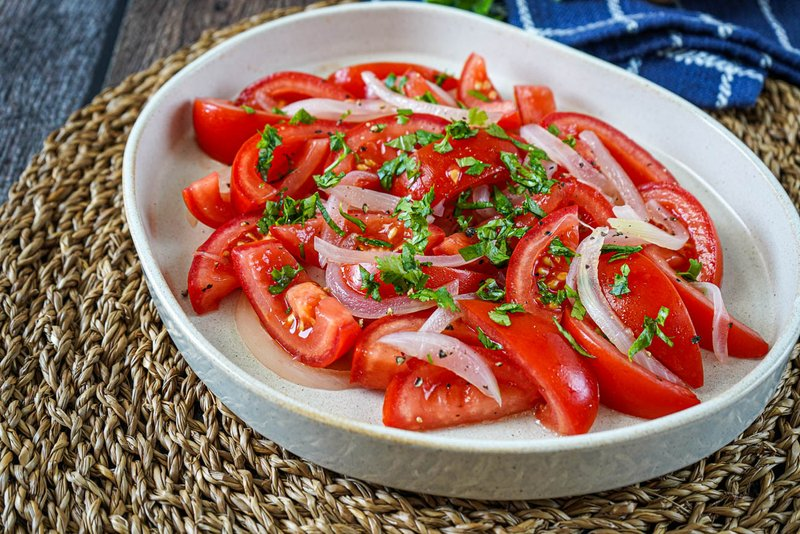

# Ensalada Chilena

*The Chilean table salad: ripe tomatoes, sweet onion soaked to take its bite off, fresh coriander, olive oil and lime. Three ingredients, properly handled. Eats next to roast meat, pastel de choclo, or anything off the grill; the soaked-onion technique is the difference between this and any other tomato salad.*

**Serves:** 4

**Prep Time:** 15 minutes (plus 15 min onion soak)

**Cook Time:** 0 minutes

## Overview
The Chilean table salad, three ingredients done properly. The defining technique is what you do with the onion: you slice sweet white onion thin and soak it in cold salted water for fifteen minutes, which draws out the harsh sulphurous bite and leaves a clean, mild allium that doesn't punish the rest of the salad. Ripe tomatoes slice into half-moons, everything tosses with olive oil, lime and salt, and a generous scatter of fresh coriander goes on top. That's it. Eaten alongside roast meat, empanadas, pastel de choclo, or anything off the grill. The soaked-onion technique is the difference between this and any other tomato salad.

## Ingredients

- 1 sweet white onion (large, or red onion; thinly sliced)
- 1 teaspoon salt (for the soaking water)
- 4 ripe tomatoes (large, around 600 g; cut into 1 cm half-moons)
- 4 tablespoons extra-virgin olive oil
- 2 limes (juice)
- ½ teaspoon flaky sea salt
- ½ teaspoon black pepper
- A small bunch of fresh coriander (chopped)
- 1 long green chilli (finely sliced, optional)

## Method

### Stage 1 - Soak the onion
1. Place the sliced onion in a bowl; cover with cold water and the 1 teaspoon salt.
1. Soak 15 minutes; drain; rinse briefly.
1. Pat dry between paper towels.

### Stage 2 - Slice the tomatoes
1. Cut tomatoes in half through the equator; lay flat-side down; slice into 1 cm half-moons. Catch any juice on the board.

### Stage 3 - Combine
1. Arrange the tomato slices on a wide platter.
1. Scatter the drained onion across.
1. Drizzle with olive oil and lime juice (and any tomato juice from the board).
1. Sprinkle with flaky salt and black pepper.
1. Top with chopped coriander and chilli if using.

### Stage 4 - Serve
1. Eat immediately. Don't refrigerate; the texture suffers.

## Notes
- **Don't skip the onion soak:** The whole point of ensalada chilena versus any other tomato salad is the mild, sweet onion. Raw onion swamps the dish.
- **Ripe tomatoes only:** Pale, hard tomatoes give a thin, sour salad. The dressing is barely there; the tomato is the dish.
- **Coriander, not parsley:** Chilean specifically. Parsley is fine if you must, but the dish is "with coriander" by tradition.

## Storage
- Best within an hour of mixing.
