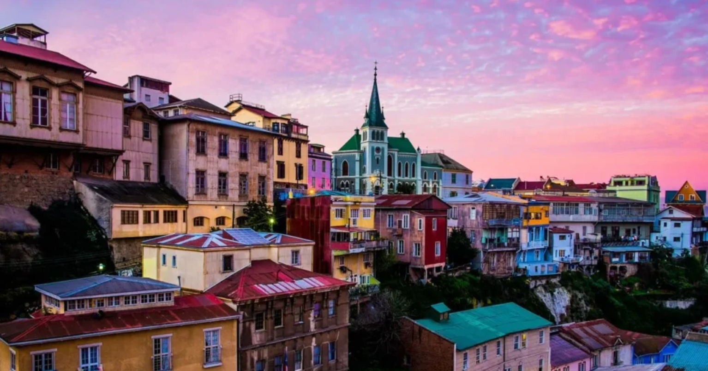

# Chilean Cuisine

A long thin country between desert and Antarctica gives a kitchen built on Pacific seafood (loco, jaibas, machas), Andean potatoes and corn, and a deep tradition of slow-cooked stews. Cazuela, pastel de choclo, empanadas de pino, ceviche and a national obsession with avocado define the everyday plate. Pebre (the table salsa of tomato, onion, coriander and ají) appears with almost every meal; pisco sour and mote con huesillos handle the drinks.
