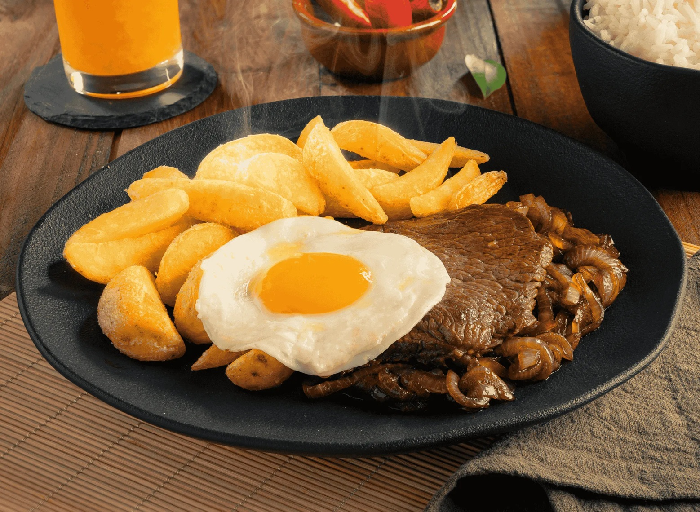

# Lomo a lo Pobre

*Chile's pork-loin "poor man's plate": thick slices of pork loin pan-fried till deep golden, plated with hand-cut fried potatoes, two sunny-side-up eggs and a heap of sautéed sliced onions. The pork variation of bife a lo pobre, slightly lighter than the beef version but just as substantial.*

**Serves:** 2 (large portions)

**Prep Time:** 20 minutes

**Cook Time:** 25 minutes

## Overview
Lomo a lo pobre is the pork-loin variation of Chile's iconic "poor man's plate" (bife a lo pobre uses beef; lomo a lo pobre uses pork): thick slices of pork loin pan-fried till deep golden and just cooked through, plated alongside a heap of hand-cut fried potatoes, two sunny-side-up fried eggs, and a heap of sautéed sliced onions. The four-element pile is the dish. The pork version is sometimes considered slightly lighter than the beef version, since pork loin is leaner than ribeye, though both are substantial enough to feed a working person for the full afternoon. Use boneless pork loin sliced thick (bone-in chops give a different result), and pull it at 65 °C internal so the centre stays slightly pink; over-cooking gives dry tough pork.

## Ingredients

### Pork
- 2 thick slices boneless pork loin (about 300 g each; 2 cm thick; or use 4 thinner slices if you prefer)
- 1 teaspoon fine sea salt
- 1 teaspoon ground black pepper
- 1 teaspoon dried oregano
- 1 tablespoon olive oil

### Fries
- 6 large potatoes (peeled, cut into 1 cm × 8 cm batons)
- Vegetable oil for deep-frying
- 1 teaspoon flaky sea salt

### Onions
- 2 large white onions (sliced into thin half-moons)
- 3 tablespoons olive oil
- 1 teaspoon fine sea salt
- ½ teaspoon ground black pepper

### Eggs
- 4 large eggs
- 1 tablespoon oil

### To finish
- Fresh parsley (chopped)
- Pebre
- Lemon wedges

## Method

### Stage 1 - First-fry the potatoes
1. Soak cut potatoes in cold water for 10 minutes; drain; pat dry.
2. Heat oil to 160°C (320°F).
3. Fry potatoes 4-5 minutes till pale gold; drain.

### Stage 2 - Sauté the onions
1. Heat olive oil in a wide pan over medium heat.
2. Cook onions 12-15 minutes till deeply soft.

### Stage 3 - Cook the pork
1. Pat dry; season with salt, pepper, oregano.
2. Heat olive oil in a heavy pan over medium-high heat.
3. Cook pork loin 4-5 minutes per side till deep golden (internal 65°C for medium).
4. Rest 5 minutes; slice thick.

### Stage 4 - Second-fry potatoes
1. Heat oil to 190°C; fry potatoes 2-3 minutes till crispy.
2. Drain; sprinkle salt.

### Stage 5 - Fry eggs
1. Sunny-side up for 3-4 minutes till whites set, yolks runny.

### Stage 6 - Plate
1. Pork on each plate; pile of fries alongside; 2 eggs on top; onions over.
2. Parsley, pebre, lemon.

## Notes
- **Pork loin medium:** 65°C internal; pink centre.
- **Twice-fried potatoes:** essential.
- **All four components:** the traditional combination.
- **Onions deeply soft:** 12-15 minutes minimum.

## Variations
- **Chuleta (chops) a lo pobre:** use bone-in pork chops instead.
- **Pollo a lo pobre:** chicken version.
- **Lomo a lo pobre completo:** add a grilled sausage to the plate.
- **With mushrooms:** add sautéed mushrooms with the onions.

## Serving
- On wide plates with all components. Chilean red wine or beer. As a Chilean diner lunch.

## Storage
- Eat immediately.
- Pork leftover 3 days; reheat briefly.
- Don't reheat assembled.
