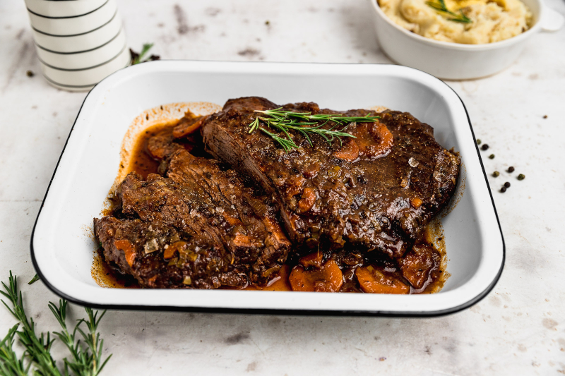

# Plateada

*Chile's slow-cooked beef brisket: a whole beef brisket marinated in olive oil, garlic and merkén (Chilean smoked chilli), slow-cooked at low heat for 6 hours till the meat shreds with a fork, served sliced thick at the centre of the Chilean Sunday family table with mashed potato and fresh salad.*

**Serves:** 8-10

**Prep Time:** 20 minutes (plus overnight marinating)

**Cook Time:** 6 hours

## Overview
Plateada is Chile's beloved slow-cooked beef brisket and a Sunday-family-lunch centrepiece across the country: a whole beef brisket (the canonical cut; the well-marbled cut from between the chuck and the short rib that braises beautifully into fall-apart tender meat) is marinated overnight in a paste of crushed garlic, olive oil, dried oregano, merkén (the Chilean smoked-pepper spice blend), ground cumin and salt, then slow-cooked at low heat in a heavy Dutch oven with sliced onions, carrots, garlic, beef stock and red wine for 5-6 hours till the meat is so tender it shreds with a fork. Sliced thick (or shredded) at the carving board and served at the centre of the Chilean Sunday table with mashed potato (puré de papas), ensalada chilena (tomato-onion salad), and a glass of Chilean red wine. The dish is what every Chilean home cook makes for major family lunches, weekend gatherings and Sunday dinners. Three details define proper plateada. First, the cut. Brisket (specifically the "tapabarriga" or "plateada" cut in Chilean butchery) gives the right fat-to-meat ratio for the long braise. Second, merkén. The Chilean smoked-chilli spice blend (made from smoked goat-horn chilli, salt and coriander seeds) is canonical; substitute with smoked paprika + a pinch of cayenne if unavailable. Third, slow cook properly. 5-6 hours at low temperature (140°C / 285°F) is essential; rushing gives tough chewy results.

## Ingredients

### Beef
- 2 kg beef brisket (with some fat cap)

### Marinade (overnight)
- 12 garlic cloves (crushed)
- 4 tablespoons olive oil
- 2 tablespoons merkén (Chilean smoked chilli blend; or 2 tablespoons smoked paprika + 1/2 teaspoon cayenne)
- 2 tablespoons dried oregano
- 2 tablespoons ground cumin
- 2 teaspoons fine sea salt
- 1 teaspoon ground black pepper
- Juice of 2 lemons

### Cooking
- 3 tablespoons olive oil
- 2 large onions (sliced)
- 2 large carrots (sliced into rounds)
- 1 stalk celery (sliced; optional)
- 6 garlic cloves (whole, crushed)
- 4 tablespoons tomato paste
- 400 ml dry red wine (Chilean carmenere or cabernet sauvignon)
- 600 ml beef stock
- 2 bay leaves
- 1 cinnamon stick (small)
- 1 tablespoon dried oregano
- 1 tablespoon ground cumin
- 1 ½ teaspoons fine sea salt
- 1 teaspoon ground black pepper

### To finish
- 2 tablespoons fresh parsley (chopped)
- Lemon wedges

### To serve
- Puré de papas (Chilean mashed potato)
- Ensalada chilena (tomato-onion salad)
- Pebre
- Marraqueta bread

## Method

### Stage 1 - Marinate the brisket (overnight)
1. Pat the brisket dry.
2. Combine all marinade ingredients into a paste.
3. Rub thoroughly all over the brisket.
4. Cover and refrigerate 12-24 hours.

### Stage 2 - Brown the brisket
1. Preheat the oven to 140°C (285°F).
2. Heat the olive oil in a heavy Dutch oven over medium-high heat.
3. Brown the brisket on all sides for 12-15 minutes total.
4. Lift out.

### Stage 3 - Sweat the vegetables
1. Reduce heat to medium.
2. Add the sliced onions, carrots, celery (if using) and garlic to the pot.
3. Cook 8 minutes till soft.
4. Add the tomato paste; cook 2 minutes.

### Stage 4 - Build the braise
1. Pour in the red wine; let bubble 2 minutes.
2. Add the beef stock.
3. Add the bay leaves, cinnamon stick, oregano, cumin, salt and pepper.
4. Return the brisket to the pot, fat-side-up.

### Stage 5 - Slow-cook
1. Cover with the lid.
2. Transfer to the 140°C oven.
3. Cook 5-6 hours; turn the brisket once at the halfway mark.
4. The brisket is done when a fork slides through easily and the meat is fork-tender.

### Stage 6 - Rest
1. Take out of the oven; let rest covered for 30 minutes.

### Stage 7 - Reduce the sauce
1. Lift the brisket out; place on a board.
2. Strain the cooking liquid; press the vegetables through the sieve to extract flavour.
3. Skim off excess fat.
4. Bring the strained liquid to a boil in a clean pan; reduce by half (about 10 minutes) till the sauce is glossy.

### Stage 8 - Slice and serve
1. Slice the brisket thickly (1 cm) across the grain.
2. Arrange on a wide platter.
3. Pour the reduced sauce over.
4. Scatter chopped parsley.
5. Serve with puré de papas, ensalada chilena, pebre, lemon wedges and bread.

## Notes
- **Brisket is the cut:** "plateada" is the Chilean butcher's name for this specific brisket cut.
- **Merkén is the Chilean spice:** smoked paprika + cayenne is the substitute.
- **Slow-cook at 140°C properly:** 5-6 hours is essential.
- **Rest before slicing:** 30 minutes for proper redistribution.
- **Slice across the grain:** for tender slices.

## Variations
**Pulled plateada:** shred the brisket with two forks instead of slicing; serve over rice or in arepas.
**With chestnuts:** add 200 g of peeled chestnuts in the last 90 minutes; gives autumn richness.
**Pressure-cooker plateada:** pressure-cook on high for 75 minutes instead of 5-6 hours in the oven. Quicker but less flavour development.
**With wine-soaked prunes:** add 100 g of prunes (soaked in 100 ml extra red wine) in the last hour; gives a fruity richness.

## Serving
On a wide platter at the centre of the table. Puré de papas, ensalada chilena, pebre alongside. Drink: Chilean red wine (carmenere is canonical), or Cristal beer.

## Storage
- Keeps refrigerated 5 days; flavour deepens overnight.
- Reheat covered in a 160°C oven for 25 minutes.
- Freezes 3 months in portions.
- Day-old plateada is excellent for lunch sandwiches.
