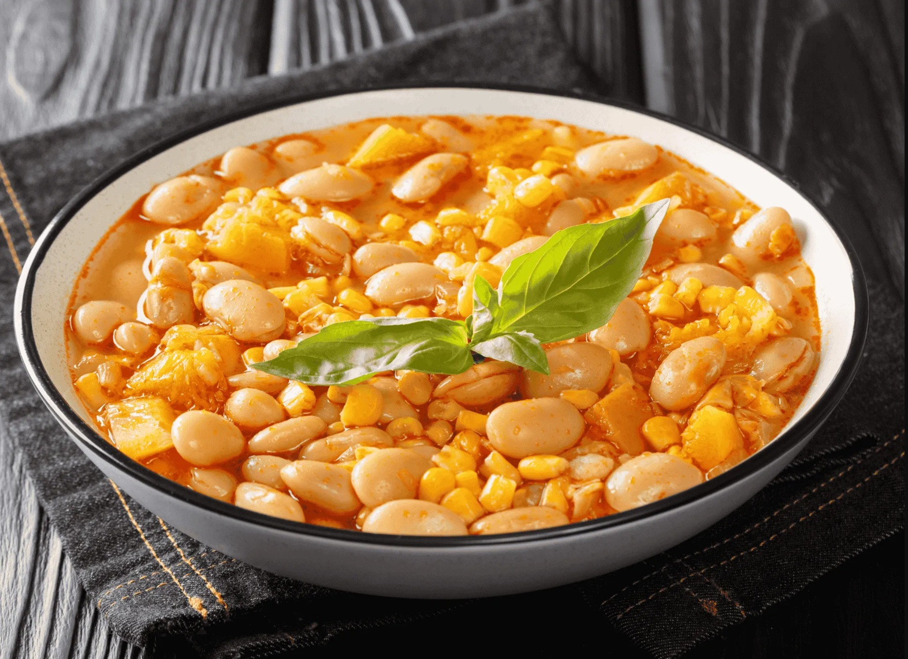

# Porotos Granados

*Chile's vegetarian cranberry bean stew: fresh cranberry beans (or dried) slow-cooked with cubed pumpkin, sweet corn kernels, onion, garlic, basil and a touch of paprika into a thick savoury orange-flecked stew. The Chilean national vegetarian dish, the absolute hearth of Andean Chilean home cooking, eaten in deep bowls with bread.*

**Serves:** 6

**Prep Time:** 25 minutes (plus overnight bean soaking if dried)

**Cook Time:** 1 hour 15 minutes

## Overview
Porotos granados is Chile's most iconic vegetarian dish and one of the absolute staples of Chilean home cooking, particularly across the country's Andean heartland: fresh cranberry beans (porotos granados; the speckled red-and-cream legume; also called "borlotti beans" in Italy) - or dried cranberry beans soaked overnight - slow-cooked with cubed sweet pumpkin (zapallo; the canonical orange Andean pumpkin), sweet corn kernels (the Chilean criollo corn variety; or regular sweet corn), finely chopped onion, crushed garlic, fresh basil, sweet paprika and a touch of olive oil till the beans are tender, the pumpkin has half-broken down into the broth giving it body, and the whole pot reduces into a thick savoury orange-flecked stew. Served in deep bowls with a piece of fresh marraqueta bread (the iconic Chilean bread) on the side and a small drizzle of olive oil on top. The dish is one of Chile's three "national" dishes (alongside pastel de choclo and cazuela), entirely vegetarian, deeply seasonal (made with fresh summer cranberry beans, summer pumpkin, summer corn), and absolutely Chilean in flavour. Three details define proper porotos granados. First, fresh cranberry beans in season. If you can find them (June-August in Chile; August-October in the Northern Hemisphere), use them. Outside season, dried cranberry beans soaked overnight are the substitute. Don't substitute with kidney beans; the flavour is different. Second, the pumpkin matters. The canonical Chilean zapallo is the sweet orange-fleshed Andean pumpkin; outside Chile, butternut squash is the best substitute. The pumpkin should half-dissolve into the broth giving body. Third, fresh basil. The Chilean version uses fresh basil (albahaca) generously; this is what distinguishes it from generic bean stews.

## Ingredients

### Beans
- 500 g fresh cranberry beans (shelled; about 1.2 kg unshelled); OR 350 g dried cranberry beans (soaked overnight, drained)

### Vegetables
- 500 g pumpkin/zapallo/butternut squash (peeled and cubed)
- 200 g sweet corn kernels (fresh from 2 ears of corn; or frozen)
- 2 large onions (finely chopped)
- 6 garlic cloves (crushed)
- 1 large green bell pepper (chopped)

### Aromatics
- 4 tablespoons olive oil
- 1 tablespoon sweet paprika
- 1 tablespoon ground cumin
- 1 large bunch fresh basil (about 30 g; chopped)
- 2 bay leaves
- 1 ½ teaspoons fine sea salt
- 1 teaspoon ground black pepper
- 1 teaspoon Aleppo pepper or merkén (Chilean smoked chilli)

### Liquid
- 1.2 litres hot vegetable stock (or water)

### To finish
- 2 tablespoons fresh basil (chopped, for garnish)
- 2 tablespoons olive oil (drizzled)
- 1 tablespoon fresh parsley (chopped)

### To serve
- Marraqueta bread (or any crusty white bread)
- Pebre (Chilean coriander salsa)
- Fresh salad

## Method

### Stage 1 - Pre-cook the beans
1. If using fresh beans: place in a saucepan; cover with water; bring to a boil; simmer 20 minutes till just tender.
2. If using soaked dried beans: place in a saucepan; cover with water; bring to a boil; simmer 45 minutes till just tender.
3. Drain; reserve the cooking liquid.

### Stage 2 - Build the base
1. Heat the olive oil in a large heavy pot over medium heat.
2. Add the chopped onions and bell pepper; cook 10 minutes till deeply soft.
3. Add the crushed garlic; cook 30 seconds.
4. Add the paprika, cumin and Aleppo pepper; cook 1 minute.

### Stage 3 - Add pumpkin and beans
1. Add the cubed pumpkin; cook 3 minutes.
2. Add the pre-cooked beans.
3. Pour in the vegetable stock; the liquid should just cover.
4. Add the bay leaves, salt and pepper.

### Stage 4 - Simmer
1. Bring to a simmer; partially cover with the lid.
2. Cook 30-40 minutes; the pumpkin should half-dissolve into the broth, giving it body.
3. Stir occasionally; mash some of the pumpkin against the side with the back of a wooden spoon to thicken.

### Stage 5 - Add corn and basil
1. Add the sweet corn kernels.
2. Add most of the chopped basil; reserve some for garnish.
3. Cook 5 minutes more.

### Stage 6 - Finish
1. Take off the heat.
2. Lift out the bay leaves.
3. Taste; adjust salt.

### Stage 7 - Serve
1. Ladle into deep bowls.
2. Scatter the reserved basil and parsley.
3. Drizzle with olive oil.
4. Marraqueta bread alongside, pebre on the table.

## Notes
- **Fresh cranberry beans in season:** the canonical Chilean version. Dried soaked overnight is the substitute.
- **Mash some pumpkin for body:** half-dissolves naturally; help with the spoon.
- **Lots of fresh basil:** the Chilean signature.
- **Corn at the end:** kept slightly crisp.
- **Marraqueta bread:** the canonical accompaniment.

## Variations
**With pork:** add 200 g of diced pork shoulder browned at the start; gives a meaty version (less canonical).
**Spicier:** double the merkén; common southern Chilean variation.
**With chard or spinach:** add 200 g of chopped greens in the last 5 minutes; adds extra colour and freshness.
**Bean-only purist version:** skip the corn; use only beans + pumpkin + basil. The Andean traditional version.

## Serving
In deep bowls with marraqueta or crusty bread, pebre on the table, a fresh salad. Drink: cold Chilean beer (Cristal, Escudo), or a glass of carmenere wine. As a Sunday vegetarian lunch or hearty weeknight meal.

## Storage
- Keeps refrigerated 5 days; flavour deepens overnight.
- Reheat gently with a splash of stock.
- Freezes 3 months.
- Day-old porotos granados are even better.
