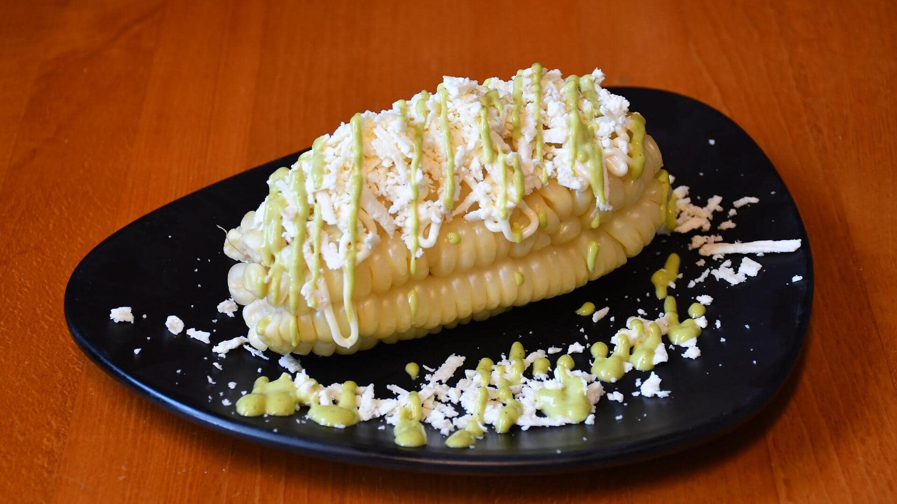

# Choclo con Queso

*Chile's corn-and-cheese gratin: kernels of sweet Chilean corn stewed with butter, milk, basil and a small handful of grated Parmesan, finished with melted cheese on top and a grill-blast. The simple summer gratin that uses peak-season corn and turns into a deeply comforting side for any Chilean main.*

**Serves:** 4-6

**Prep Time:** 15 minutes

**Cook Time:** 25 minutes

## Overview
Choclo con queso is a Chilean summer corn gratin that uses the country's sweet, slightly starchy criollo corn (similar to South American maize varieties; sweeter and more substantial than American sweet corn): kernels cut from the cob (or thawed frozen kernels) stewed in butter, milk and a small amount of cream with chopped fresh basil, salt and pepper, finished with a generous handful of grated Parmesan and a layer of melted mozzarella on top, blasted briefly under a hot grill for the cheese to crust. Served alongside grilled meats, charquicán, or any Chilean main; particularly common as a summer side when corn is at its peak. Three details define proper choclo con queso. First, fresh corn in season if possible. The sweetness and texture of fresh-from-the-cob corn beats frozen. Second, fresh basil. The Chilean touch; not optional. Third, the cheese topping. A two-cheese approach (Parmesan stirred in + mozzarella on top) gives the proper gratin character.

## Ingredients

- 800 g fresh sweet corn kernels (from 5-6 ears of corn; or frozen corn kernels, thawed)
- 40 g unsalted butter
- 1 medium onion (finely chopped)
- 4 garlic cloves (crushed)
- 200 ml whole milk
- 100 ml double cream
- 50 g grated Parmesan
- 120 g grated mozzarella (or Pecorino, or aged kashar)
- 1 large handful fresh basil (chopped)
- 1 ½ teaspoons fine sea salt
- 1 teaspoon ground black pepper
- ½ teaspoon ground nutmeg
- 1 tablespoon plain flour (for thickening)

## Method

### Stage 1 - Sauté the base
1. Melt the butter in a wide saucepan over medium heat.
2. Add the chopped onion; cook 6 minutes till soft.
3. Add the crushed garlic; cook 30 seconds.
4. Sprinkle the flour over; stir for 1 minute to make a light roux.

### Stage 2 - Add liquid and corn
1. Pour in the milk and cream; whisk till smooth.
2. Add the corn kernels.
3. Add the salt, pepper and nutmeg.
4. Cook 6-8 minutes, stirring occasionally, till the mixture thickens and the corn is tender.

### Stage 3 - Add Parmesan and basil
1. Stir in the grated Parmesan and chopped basil.
2. Cook 1 minute till the Parmesan melts.
3. Taste; adjust salt.

### Stage 4 - Transfer to a baking dish
1. Tip the mixture into a wide shallow ovenproof dish.
2. Scatter the grated mozzarella over the top.

### Stage 5 - Grill the cheese
1. Place under a hot grill (broiler) for 3-4 minutes till the mozzarella is melted, bubbly and starting to crust.

### Stage 6 - Serve
1. Let rest 5 minutes (the gratin is molten when first out of the grill).
2. Scatter extra fresh basil.
3. Serve hot.

## Notes
- **Fresh corn in season:** the dish depends on corn quality.
- **Two-cheese approach:** Parmesan stirred in + mozzarella on top for the proper gratin.
- **Don't over-thicken:** the dish should be creamy not solid.
- **Fresh basil:** the Chilean touch.

## Variations
**With chillies:** add 1 finely chopped chilli with the garlic; gives a properly warm Chilean version.
**With chorizo:** add 100 g of crumbled cooked chorizo before baking; richer version.
**Vegan:** swap butter for olive oil, milk for cashew cream, cheese for nutritional yeast + vegan cheese; less canonical but works.
**With diced bacon:** add 80 g of cooked diced bacon to the corn mixture; gives smoky depth.

## Serving
Alongside Chilean grilled meats (asado, lomo a lo pobre), or as part of a vegetarian dinner with bread and salad.

## Storage
- Keeps refrigerated 3 days; reheat in a covered oven dish.
- Don't freeze; the texture suffers (the cream splits).
