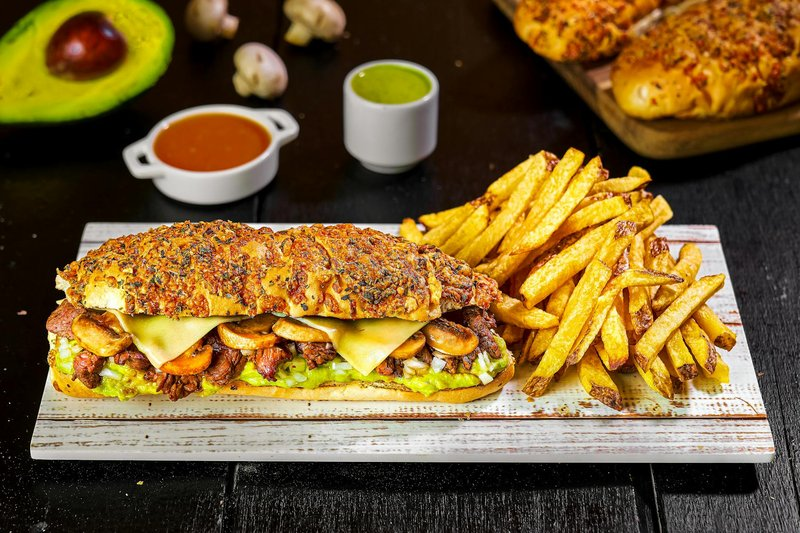

# Completo

*The Chilean street hot dog: a long roll, a frankfurter and a heroic layering of mashed avocado, diced tomato, sauerkraut, mayonnaise and mustard.*

**Serves:** 4

**Prep Time:** 15 minutes

**Cook Time:** 10 minutes

## Overview
The Chilean street hot dog and the proper night-out food after a few drinks in any city in the country. You start with a long soft frankfurter roll, poach the frankfurter in barely-simmering water for five minutes, dice tomato fine and salt it to draw out the water, and mash avocado with lime and salt to a thick paste. The build is bottom-up: split roll, frankfurter, diced tomato, sauerkraut, a heroic layer of smashed avocado, mayonnaise piped generously over the top, a squiggle of mustard if you like. Wrap in paper, hand it over, eat with both hands while walking down a Santiago street.

## Ingredients

- 4 long soft hot dog rolls (pan de hot dog - softer and longer than American ones)
- 4 good-quality frankfurters (or German-style sausages)
- 2 ripe avocados
- ½ lime (juice)
- 1 teaspoon salt (for avocado)
- 4 ripe tomatoes (small, very finely diced, seeds removed)
- ½ teaspoon salt (for tomato)
- 150 g sauerkraut (drained well)
- 4 tablespoons mayonnaise (Chilean-style, very thick)
- 2 tablespoons American yellow mustard (optional)
- Optional: pebre (or ají sauce)

## Method

### Stage 1 - Tomato and avocado
1. Dice tomato 4 mm small; salt; leave 10 minutes; drain off the water that pools.
1. Mash the avocado with lime juice and 1 teaspoon salt to a chunky-smooth purée.

### Stage 2 - Sausages
1. Bring 2 litres of water to a low simmer (not boiling - boiling splits the casings).
1. Drop the frankfurters in; cook 5-6 minutes.
1. Lift onto a tray.

### Stage 3 - Buns
1. Lightly toast or warm the buns (split lengthways but don't cut all the way through).

### Stage 4 - Build
1. Place a frankfurter in each bun.
1. Pile 2 tablespoons of drained diced tomato along one side.
1. Pile 2 tablespoons of sauerkraut along the other side.
1. Spoon 3-4 tablespoons of mashed avocado generously along the top.
1. Squiggle 1 tablespoon of mayonnaise over the avocado.
1. Drizzle mustard if using.

### Stage 5 - Wrap and eat
1. Wrap each completo halfway up in paper or foil.
1. Eat immediately, with both hands.

## Notes
- **Avocado is non-negotiable:** It's the centre of the dish, not a garnish. A completo without avocado is not a completo.
- **Drain everything:** Wet tomato and wet sauerkraut give a soggy bun fast. Both need draining well.
- **Frankfurter, not hot dog:** The Chilean frank is a meatier sausage with a softer texture than American supermarket hot dogs. Good German bratwurst or Polish kielbasa is closer.

## Storage
- Eat fresh.
